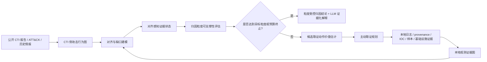

# Project05 Research Dashboard

## 当前定位

Project05 当前主线已经从“证据不完整场景下的 APT 归因粒度门控 / 拒答解释”进一步收束为：

> 面向 APT 归因的对齐感知证据状态建模与主动取证规划。

**2026-07-10 技术主轴冻结**：默认规划器为 **M3a（action–gap compatibility）**；logistic M3b 仅作冻结对照（无稳定独立胜出）。贡献边界与结果总表见 [contribution-boundary-and-results-brief-v0.1.md](../08-writing/contribution-boundary-and-results-brief-v0.1.md)。

更具体地说，项目不再把“CTI-日志 / CTI-provenance 对齐算法”本身作为主创新，因为这一块已经被 POIROT、DeepHunter、MEGR-APT、ActMiner、CLIProv、APT-CGLP、ProHunter 等工作覆盖。Project05 的更安全位置是把这些对齐结果作为“证据状态”，进一步判断当前证据能支撑的归因粒度，并规划下一步最值得获取的证据。

## 当前主 RQ

> 在证据不完整的 APT 归因场景中，如何以“CTI 侧攻击行为图与本地观测证据的对齐状态”为证据画像，估计各候选取证动作对归因粒度可提升性的期望增益，并在成本约束下规划取证动作序列，使系统通过“对齐-评估-补证-再对齐”闭环，以最小取证成本达到证据可支撑的最高归因粒度？

G1 通过版详见：[topic-rq-brief-v2.1-g1-final-20260706.md](../03-ideas/topic-rq-brief-v2.1-g1-final-20260706.md)

## 当前技术路线

## 创新点边界

保留空间：

- 对齐状态不是终点，而是主动取证规划的状态输入。
- 输出不是单一 actor label，而是“当前可支撑的最高归因粒度 + 下一步证据获取策略”。
- 方法目标不是让 LLM 直接归因，而是让 LLM 参与证据语义规范化、缺口解释、动作说明和最终可审计表达。
- AFA / POMDP 提供形式化基础：部分观测证据、取证动作、成本、停止动作、目标粒度收益。

红线：

- 不能把“多源证据融合 + LLM APT 归因解释”作为宽泛创新点。
- 不能把“CTI 图与 provenance/local evidence 对齐”作为单独主创新。
- 不能只产出“缺失证据 list”，否则贡献偏弱。
- 不能写成泛化的“置信度不足 -> 让 LLM 拉更多数据 -> 循环调查”，这会撞 US12530469 的大范围思路。

## 新增关键材料

| 类别 | 文件 | 作用 |
|---|---|---|
| 理论基座 | [2025-Aronsson-AFA-Survey.md](../02-literature-notes/2025-Aronsson-AFA-Survey.md) | Active Feature Acquisition / POMDP 形式化基础 |
| 撞题红线 | [2025-Li-CLIProv.md](../02-literature-notes/2025-Li-CLIProv.md) | 日志到情报语义对齐 / provenance 分析红线 |
| 撞题红线 | [2025-Qiu-APT-CGLP.md](../02-literature-notes/2025-Qiu-APT-CGLP.md) | provenance graph 与 CTI report 图语言预训练红线 |
| 专利红线 | [2026-Varonis-US12530469-LLM-Alert-Investigation.md](../02-literature-notes/2026-Varonis-US12530469-LLM-Alert-Investigation.md) | LLM 多阶段告警调查循环的专利风险 |
| 主线修正 | [deep-collision-scan-alignment-20260706.md](../04-progress/deep-collision-scan-alignment-20260706.md) | 说明为什么单独做对齐已经不安全 |
| RQ v2.1 | [topic-rq-brief-v2.1-g1-final-20260706.md](../03-ideas/topic-rq-brief-v2.1-g1-final-20260706.md) | G1 通过版研究问题定义 |

## 当前 Gate 状态

| Gate | 状态 | 说明 |
|---|---|---|
| G1 RQ 清晰性 | 通过 | RQ v2.1；主线为证据状态 + 主动取证 |
| G2 撞题扫描 | 进行中 | 对齐谱系与 WinRegRL 红线已记；仍需补中文专利侧、APTChaser/GAPT 正文 |
| G3 创新强度 | 可写边界已收紧 | 主张表示+规划+停止，不主张可学习效用打赢规则 |
| G4 专利权利要求 | 骨架更新 | [v0.3](../08-writing/patent-claims-draft-v0.3-20260710.md) 对齐 M3a；正式检索与措辞待补 |
| G5 实验可执行性 | C07 首轮完成 | C01–C06 + 通道可靠性 + STOP/M4 压力；E5 THEIA C07 已跑，**缺第二独立留出复现** |

## 下一步

1. 按 [C07 真留出协议](../08-writing/c07-true-holdout-protocol-v0.1-20260710.md) 接入 OpTC 或 E5 第二异构 performer；不调 M3a 参数，做第二独立留出复现。
2. 完成专利 v0.3 的中文专利补检与独立权利要求措辞审阅。
3. 可选：按 [intended 标注规范](../08-writing/intended-cti-node-annotation-protocol-v0.1-20260710.md) 清理 C01–C06 的 intended==OR 债务；为新动作写离线映射规范（不进在线效用）。
4. **明确不做**：继续堆 logistic/GNN/RL，或再做同构 decoy/离线压力。
