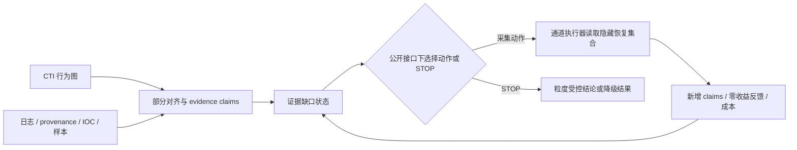

# P05-L1 Research Dashboard

更新：2026-07-13

研究线：P05-L1，不完整证据下、信息边界约束的 APT 调查控制。Project05 总入口见 [Research Lines](../10-research-lines/README.md)，多模态新论文线见 [P05-L2 Dashboard](../10-research-lines/02-multimodal-threat-attribution/00-dashboard/research-dashboard.md)。

权威入口：[AUTHORITATIVE-DOCUMENTS-20260713.md](../08-writing/AUTHORITATIVE-DOCUMENTS-20260713.md)

## 当前定位

> 不完整证据下、信息边界约束的 APT 调查控制框架。

Project05 不直接提出新的攻击者分类器，也不把 M3a、XGBoost、AFA 或 DQN 写成主创新。项目把 CTI—本地证据部分对齐转化为可更新的证据缺口状态，在规划器不知道动作实际恢复内容时选择下一取证动作或 STOP，并用预算、通道反馈和可支撑结论粒度约束输出。

当前论文题目：

> 不完整证据下的 APT 调查控制：信息边界约束的证据缺口驱动取证

## 当前研究问题

1. 部分对齐能否被构造成可更新、可审计的调查状态，而不是静态缺失列表？
2. 在公开意图与隐藏恢复集合隔离后，何种策略能以较低成本达到内部目标？
3. STOP 能否区分达标、预算不足、结构不可达和过早放弃？
4. 当前结论是否依赖 M2 权重、粒度阈值或 OR 覆盖语义？

## 技术路线

信息边界：规划器只能读取公开意图、通道、成本、当前缺口和执行历史；`recoverable_claim_ids` 只对执行器与 Oracle 可见。

## 方法角色

| 组件 | 当前角色 | 冻结判断 |
|---|---|---|
| M2 | 透明部署策略 | C07-C10 所评估非 Oracle 策略内最佳折中；C11 成本并非最低，不是全局最优 |
| M3a | action-gap 机制消融 | C10 有过早停止，成本优势不成立 |
| XGBoost | 非线性监督对照 | C07-C10 未超过 M2；C11 冻结迁移低 0.6000 成本，不外推为跨域优势 |
| AFA-VOI | 通用 AFA 的同接口领域适配 | C07-C10 平均比 M2 多 0.4389；C11 Myopic 少 0.1111、Rollout-H3 多 0.0222 |
| Depth-2 | 冻结有限前瞻 | C07-C10 未降成本；C11 出现一次成功退化，不升级 |
| DP/DQN | 受控上界/关闭支线 | Gate A 通过、Gate B 不通过，不启动 DQN |
| LLM | 待验证离线编译/解释接口 | 主实验未调用，不进入当前因果贡献 |

## 当前证据

| 项目 | 结果 | 边界 |
|---|---|---|
| C07-C10 M2 | 180/180 内部达标，均成本 4.5333 | 只有 4 个独立案例、2 个主要家族 |
| XGBoost | success 1.0，cost 4.8278 | 未超过 M2 |
| AFA Myopic/Rollout-H3 | success 1.0，cost 4.9722 | 领域适配，不是官方 NOCTA/WinRegRL 复现 |
| Depth-2 Public | success 1.0，cost 4.5556 | 未通过冻结升级门槛 |
| M2 权重敏感性 | 16/16 变体保持 success 1.0 | 仅支持 ±25% 局部稳定 |
| C11 OTRF AND | M2 success 1.0、cost 3.6667；Oracle cost 3.0000 | 单个 APT29 仿真链，目标/ceiling 为 G2；不与 C07-C10 G3 均值合并 |
| C11 冻结策略迁移 | XGBoost/Logistic cost 3.0667；AFA Myopic 3.5556；Depth-2 success 0.9778 | 单案例排序反转；XGBoost 仍只由 C01-C06 训练且模型哈希未变 |
| OR/AND | C11 中 M2 cost 由 AND 3.6667 降至 OR 1.0222 | 仅改覆盖语义；OR 是乐观敏感性，AND 为内部冻结主分析 |
| 外部 AFA 源码/接口审计 | AFABench、WinRegRL、AACO 冻结 commit 通过；C07-C12 动作族 5/5 映射 | 状态/端点/转移不等价，禁止称官方同任务复现 |
| C12 生产 SOC 压力 | 13,119→5→2；Depth-2/Oracle cost 0.8889，XGBoost/Logistic/Rollout-H3 0.9778，M2 1.4222 | 单 incident、G1 ceiling、无 actor truth；不并入既有均值 |

## Gate 状态

| Gate | 状态 | 说明 |
|---|---|---|
| RQ/贡献边界 | 通过 | 调查控制与信息边界，不再包装新归因器 |
| 四案例工程闭环 | 通过 | 可执行、无 ceiling violation |
| 新算法性能创新 | 不通过 | C07-C10 与 C11 的策略排序反转，未形成跨案例稳定赢家 |
| 非短视结构存在性 | 通过 | 合成 Gate A |
| DQN 工程必要性 | 不通过 | Gate B，DP 仍可接受 |
| 人工粒度效度 | 未完成 | C07-C11 v0.2 共 114 个空白 item，`awaiting_annotations`；27/27 Claim 来源摘录已就绪 |
| 外部泛化 | 部分通过 | C11 为仿真链；C12 新增 1 个生产 SOC 多 stream G1 压力，但无独立 actor/campaign truth |
| 正式外部 AFA | 映射通过、数值未完成 | 源码与动作族审计完成；同任务声明被 Gate 拒绝，endpoint contract 待冻结 |
| 专利可正式提交 | 未完成 | 中文补检、权属、公开日和代理师审查待办 |

## 下一步

1. 确认两名独立标注者并分发 A/B 包；Claim 任务同时提供本地 canonical excerpts，公开意图和粒度任务按原盲法执行。
2. 两名标注者独立完成后，先计算 A/B 一致性，再由第三人裁决分歧，最后比较最终人工标签与 compiled intended/G0-G3 代理。
3. 以 [论文 v0.7](../08-writing/paper-main-draft-v0.7-c12-operational-stress-20260713.md) 为唯一母本；C11 G2、C12 G1 与外部 AFA 映射均已分层入正文，在盲标前不再升级归因主张。
4. C12 已完成正文独立压力与扩展策略冻结迁移；下一步优先补第二个独立运营 incident 或分析师效用终点，不把重复条件重计为样本。
5. 若目标 venue 坚持外部 AFA 数值，先冻结静态 endpoint contract，再选择“跨任务复现”或“显式 adapter”路径；不得把任务转换隐藏掉。
6. 不再堆 DQN、LLM agent、GNN 或新的内部模型，除非新的可证伪 Gate 先通过。

## 红线

- 180 个重复条件不得写成 180 个独立攻击样本。
- 内部 G0-G3 success 不得写成 actor/campaign 归因准确率。
- M2 不得写成全局最优；AFA 适配负结果不得外推整个 AFA 方法族。
- C12 的 45 个重复条件不得写成 45 个生产攻击；`Disrupted` 和厂商相关图不得写成独立 actor truth。
- LLM 不得在无独立编译实验时进入标题、摘要或核心贡献。
- 旧 v0.1 文件仅是历史档案，不能覆盖当前权威索引。
