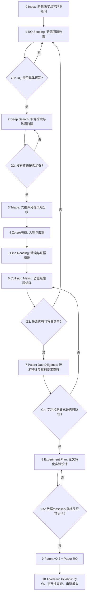

# Project05 Skill-Driven Research Workflow v2

日期：2026-07-06

## 0. 设计目标

Project05 以后不再按“临时搜索 -> 临时精读 -> 临时判断方向”的方式推进。

新的 workflow 采用四条原则：

1. 先问研究问题，再写题名。
2. 先做撞题尽调，再写专利。
3. 每篇材料必须进入 Zotero/RIS 和本地精读记录，不能只留在聊天记录。
4. 每个阶段必须有 gate，没过 gate 不进入下一阶段。

当前主线暂定为：

> 面向证据不完整场景的 APT 归因粒度门控、可判定性评估与可拒答解释。

## 1. Skill 路由表

| 阶段 | 主要问题 | 使用的 skill/方法 | 产物 |
|---|---|---|---|
| RQ 收束 | 我到底在研究什么问题 | `academic-research-suite / deep-research` 的 Socratic + RQ Brief | 研究问题卡片 |
| 检索与防漏 | 有没有别人做过 | `nature-literature-pipeline` 的 multi-source search + gap-analysis | 搜索日志、候选 RIS、撞题报告 |
| 元数据/Zotero | 材料如何入库 | `citation-management` + RIS/BibTeX 规则 | Zotero 导入清单、去重表 |
| 精读 | 论文/专利到底做了什么 | `nature-reader` 思路 + Project05 精读模板 | 单篇精读笔记 |
| 批判审查 | 它和我撞在哪里 | `scientific-critical-thinking` | 红线、白名单、风险等级 |
| 专利前尽调 | 能不能写专利 | `nature-paper-to-patent` 的 source grounding + stage gates | 技术特征台账、权利要求支持表 |
| 实验设计 | 能不能转论文 | `experiment-agent` plan/validate | 实验方案、指标、baseline |
| 论文流水线 | 如何转成论文 | `academic-pipeline` | RQ -> 实验 -> 写作 -> integrity -> review |

说明：这些 skill 不是替代判断，而是阶段化约束。凡是涉及“最新”“是否有人做过”“专利是否撞题”，必须联网或查权利要求，不能凭记忆。

## 2. 总体状态机

## 3. 阶段定义

### Stage 0：Inbox 捕获

触发输入：

- 新论文、PDF、专利、网页、关键词；
- 新 idea；
- 用户疑问；
- 搜索中发现的高风险材料；
- Zotero 中新增条目。

必须落点：

- 新材料：`07-zotero-exports/` 或 `02-literature-notes/`。
- 新疑问：`04-progress/research-progress.md`。
- 新 idea：`03-ideas/`。

不得只留在聊天记录里。

### Stage 1：RQ Scoping

目标：把题名改写为可检验研究问题。

Project05 当前推荐 RQ：

> 在证据不完整、证据冲突或候选行为体不可区分的场景下，如何判断当前证据最多支持哪一层 APT 归因结论，并生成可审计的拒答/降级解释与缺失证据需求？

输出文件：

- `04-progress/final-topic-boundary-YYYYMMDD.md`
- `03-ideas/topic-rq-brief-YYYYMMDD.md`

Gate G1：

- RQ 是否有明确输入、输出、场景、评价指标？
- 是否避免了宽泛词：多源融合、LLM 归因框架、KG 归因系统？
- 是否能区分“归因模型”和“归因控制层”？

### Stage 2：Deep Search 防漏扫描

使用 `nature-literature-pipeline` 的检索思想：

1. exact phrase search；
2. 功能词 search；
3. 同义词 search；
4. 中文专利 search；
5. 英文 patent search；
6. 邻域工作 search。

Project05 固定检索簇：

| 簇 | 英文关键词 | 中文关键词 |
|---|---|---|
| APT 归因 | APT attribution, threat actor attribution, cyber threat attribution | APT 归因, 攻击组织归因, 威胁行为体归因 |
| 证据不完整 | incomplete evidence, insufficient evidence, evidence sufficiency | 证据不完整, 证据不足, 证据充分性 |
| 拒答/开放集 | abstention, reject option, open-set, out-of-scope, selective classification | 拒答, 开放集, 未知攻击者, 暂缓归因 |
| KG/图归因 | knowledge graph, heterogeneous graph, GNN, RGCN, IOC graph | 知识图谱, 异构图, 图注意力, 图神经网络 |
| LLM 归因 | LLM attribution, LLM threat intelligence, GraphRAG attribution | 大语言模型, RAG, 攻击归因框架 |
| 专利 | patent, claims, information gap, confidence level | 专利, 权利要求, 置信度, 信息缺口 |

输出文件：

- `04-progress/deep-collision-scan-YYYYMMDD.md`
- `07-zotero-exports/zotero-import-candidates-YYYYMMDD.ris`

Gate G2：

- 至少覆盖论文、预印本、中文专利、英文专利四类来源；
- 每个检索簇至少记录命中材料；
- 对所有红色风险项给出来源链接；
- 不把摘要级材料假装成全文精读。

### Stage 3：Triage 六维评分

采用 `nature-literature-pipeline` 的 100 分制，但 Project05 做安全方向改造：

| 维度 | 权重 | 含义 |
|---|---:|---|
| 主题贴合 | 30 | 是否直接触及 APT attribution / evidence sufficiency |
| 撞题风险 | 25 | 是否覆盖我们的核心技术特征 |
| 方法价值 | 15 | 是否提供可借鉴 baseline / dataset / metric |
| 证据质量 | 10 | 全文、摘要、专利权利要求、博客的可靠性差异 |
| 实验可复现价值 | 10 | 是否能作为实验对比或数据来源 |
| 归档价值 | 10 | 是否应长期进入 Zotero 和综述 |

分级：

- A：必须全文精读；
- B：必须纳入撞题矩阵；
- C：暂存，后续补读；
- D：只做背景；
- E：排除。

### Stage 4：Zotero/RIS 入库

规则：

- 所有 A/B 级材料必须进入 RIS；
- PDF 可以本地保存，但不推 GitHub；
- 抽取全文不推 GitHub；
- 笔记、RIS、扫描文档可以推 GitHub；
- 专利必须记录公开号、申请日、公开日、申请人、权利要求风险。

输出文件：

- `07-zotero-exports/zotero-import-candidates-YYYYMMDD.ris`
- `07-zotero-exports/zotero-batch-triage-YYYYMMDD.md`

### Stage 5：Fine Reading 精读

采用 `nature-reader` 的约束：不能把全文阅读降级成摘要。Project05 允许两级记录：

| 类型 | 条件 | 标记 |
|---|---|---|
| 全文精读 | 拿到 PDF/HTML/专利全文 | `已全文精读` |
| 风险精读 | 只有摘要、题录、新闻、引用线索 | `摘要级高风险占位，全文待获取` |

每篇笔记至少回答：

1. 它的输入是什么？
2. 它的输出是什么？
3. 它的核心模块是什么？
4. 它是否做证据权重？
5. 它是否做不完整证据？
6. 它是否做 open-set / abstention？
7. 它是否做 false flag / mimicry？
8. 它是否生成缺失证据建议？
9. 它的 LLM 是决策层还是解释层？
10. 它对 Project05 的红线是什么？

输出文件：

- `02-literature-notes/YYYY-Author-ShortTitle.md`

### Stage 6：Collision Matrix 功能级撞题

每次新增 A/B 级材料，必须更新：

- `04-progress/collision-matrix-YYYYMMDD.md`
- `04-progress/deep-collision-scan-YYYYMMDD.md`

固定功能列：

| 功能 | 说明 |
|---|---|
| 多源/异构证据 | 是否融合 CTI、IOC、TTP、样本、日志等 |
| KG/RAG/GraphRAG | 是否用 KG/RAG 图检索 |
| evidence path | 是否显式构证据路径 |
| LLM reasoning | LLM 是否参与推理 |
| LLM explanation | LLM 是否只解释 |
| confidence | 是否输出置信度 |
| calibration | 是否校准 |
| incomplete/noisy evidence | 是否处理缺失/噪声 |
| abstention/refusal | 是否拒答 |
| open-set/unknown | 是否处理未知 actor |
| false flag/mimicry | 是否处理模仿/伪旗 |
| granularity gate | 是否控制归因粒度 |
| missing evidence request | 是否生成缺失证据需求 |

Gate G3：

- 如果白名单只剩“把别人系统加保护层”，退回 RQ；
- 如果核心创新能被一个已有工作完整覆盖，退回 RQ；
- 如果只剩实现细节创新，不能进入专利。

### Stage 7：Patent Due Diligence

采用 `nature-paper-to-patent` 的 stage gate：

1. 建立 source ID；
2. 建立 evidence ledger；
3. 建立技术特征台账；
4. 建立权利要求支持表；
5. unsupported 特征不得进入独立权利要求；
6. claims 先写，说明书后对齐。

Project05 当前 v0.1 草案已标记为偏宽，v0.2 必须改为：

> APT 归因粒度门控、证据充分性画像、可拒答解释和缺失证据生成。

禁止作为独立权利要求主语：

- 多源证据融合；
- KG/GraphRAG 归因；
- LLM 归因框架；
- IOC 图归因；
- TTP 相似度归因；
- open-set 拒答本身。

Gate G4：

- 每个权利要求特征都有来源或明确设计理由；
- 独立权利要求不覆盖已知红线组合；
- LLM 的作用被限定为受控解释，不是自由裁决 actor；
- “缺失证据生成”明确服务于归因粒度升级，不是泛泛 information gap。

### Stage 8：Experiment Plan

采用 `experiment-agent` plan 模式。

实验任务不是“提高 actor accuracy”，而是验证：

1. 证据不足时是否减少过度归因；
2. 证据充分时是否保持合理覆盖率；
3. 是否能正确降级到 technique / intent / campaign；
4. 是否能识别 unknown actor / false flag 风险；
5. 缺失证据建议是否有用。

最低实验包：

- 数据：公开 CTI 报告或已有 APT attribution 数据集；
- 构造：evidence ablation；
- baseline：direct LLM、RAG+LLM、KG/GraphRAG、TAA-EPLMR-like、open-set classifier；
- 指标：selective accuracy、coverage、over-attribution rate、correct abstention rate、open-set rejection、ECE、Brier、evidence grounding。

Gate G5：

- 有可获得数据；
- 有可运行 baseline；
- 有能计算的指标；
- 有 ablation 场景；
- 有人工评估方案或自动 proxy。

### Stage 9：Patent v0.2 + Paper RQ

当 G4/G5 通过，才进入：

- `08-writing/patent-claims-draft-v0.2-YYYYMMDD.md`
- `08-writing/experiment-plan-v0.1-YYYYMMDD.md`
- `08-writing/paper-rq-and-outline-v0.1-YYYYMMDD.md`

### Stage 10：Academic Pipeline

当实验方案稳定后，才进入 `academic-pipeline`：

1. RESEARCH：最终 RQ 和文献综述；
2. WRITE：论文结构；
3. INTEGRITY：引用、数据、claim 检查；
4. REVIEW：模拟审稿；
5. REVISE：修改；
6. FINAL INTEGRITY：最终查验；
7. FINALIZE：格式化。

## 4. 周期性维护

### 每次会话开始

必须先检查：

- `git status -sb`
- `00-dashboard/research-dashboard.md`
- `04-progress/research-progress.md`
- 最新 `deep-collision-scan`
- 最新 `collision-matrix`

### 每新增一篇材料

必须完成：

1. RIS 或 Zotero 记录；
2. 精读或风险精读笔记；
3. 撞题矩阵更新；
4. 进度日志更新。

### 每周

产物：

- 一份 `weekly-research-status-YYYYMMDD.md`
- 一次 Git commit/push；
- 一次“红线是否变化”的复核。

## 5. 当前 Project05 的下一步

当前不应继续扩写专利说明书。

下一步顺序：

1. 把二次深扫新增材料导入 Zotero；
2. 获取 APT-ATT、APTChaser、GAPT、AARGS 的全文；
3. 对所有“摘要级高风险占位”升级为全文精读；
4. 生成 `patent-claims-draft-v0.2`，删除偏宽的“多源融合”主语；
5. 同步生成实验方案 v0.1。

