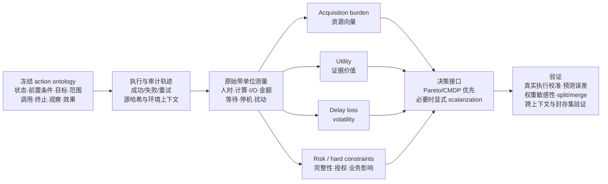

# Project05 action/cost 构念综合 v0.1

状态：内部实验治理结论，不是论文或专利文本；不修改任何实验结果。

日期：2026-07-18（Asia/Shanghai）

证据入口：`source-evidence-matrix.csv` 与其逐字段一致的 JSON 镜像。

## 1. 结论先行

不存在一个由数字取证、安全或整个计算机学界共同认可的“每种取证动作应取 1、2、3、4 中哪个数”的通用表。权威来源能够提供的是：

1. 动作必须怎样定义，才能成为可比较的决策单位；
2. 哪些物理量、组织量和后果应被记录；
3. 哪些量属于资源负担，哪些属于收益、时效损失、风险或硬约束；
4. 在什么假设下可以把多维量压成标量；
5. 标量成本模型必须怎样用真实执行进行校准和验证。

因此，两名专家即使高度一致，也只能证明“对同一份说明书给出了稳定评分”，不能证明评分尺度就是学界真实成本。专家判断可以用于定义非物理的政策边界、风险情景和先验分布，但不能替代人时、计算时间、I/O、金额、等待时间、停机和证据扰动的测量。

## 2. 旧 cost 口径哪里不成立

`cost-assignment-standard-v0.1-20260714.md` 的主要问题不是专家级别不够，而是构念混合：

- NIST SP 800-86 把 `likely value`、`volatility`、`amount of effort` 列为三个并列的采集优先级因素，并没有给出 `V+E+A` 或等权公式 [DF-02]。
- `volatility` 描述等待造成证据消失的紧迫性，是 delay loss、deadline 或 priority，不是执行动作时消耗的正向资源 [DF-01, DF-02]。
- 人员时间、法律顾问时间、设备和外部服务才属于 NIST 明示的 effort；停机与货币损失在 operational impact 中另行讨论 [DF-02]。
- RFC 3227 要求最小扰动、透明、可复现和逐步记录，没有定义任何数字成本 [DF-01]。
- AFA 和规划论文通常假定 cost 已由数据集或领域作者给定；它们验证的是“给定 cost 后怎样规划”，不是“cost 怎样获得学界权威值” [PLAN-02, AFA-01]。

由此，旧的 `V/E/D/A/R -> 等权 -> 1..4` 不能作为正式构念。当前合同把 V 移到 `separate_delay_loss` 是正确方向，但 E/D/A/R 仍不能依靠 360 个双人评分值直接成为正式 cost。

## 3. Project05 的 action 应怎样冻结

### 3.1 决策单位

Project05 的一个“证据获取动作”应定义为：

> 规划器在一个决策时点发出的、在当前状态和授权条件下可执行的证据获取请求；它具有唯一的目标、范围、调用边界和完成条件，并产生可审计的观察、状态变化与资源轨迹。

动作记录至少包含：

| 字段 | 含义 |
|---|---|
| `action_id` / `semantic_type` | 稳定身份与取证活动类型 |
| `abstraction_level` | `planner_acquisition`、`macro` 或 `primitive_operation` |
| `actor` / `authority_context` | 执行者以及当时有效的授权条件 |
| `target` / `scope` | 主机、数据源、时间窗、字段或证据类型 |
| `preconditions` | 当前状态中必须为真的可执行条件 |
| `invocation` | 可复现的工具、查询或程序入口及参数 |
| `completion` / `termination` | 成功、失败、取消、超时的判定边界 |
| `observations` | 返回给规划器的信息及其缺失状态 |
| `state_effects` | 已获取证据、权限、可用动作和证据状态如何改变 |
| `resource_trace` | 人时、计算、I/O、金额、等待与操作影响的原始记录 |
| `failure_retry_link` | 重试与原规划决策的对应关系 |

这继承了 PDDL 的参数、前置条件和效果 [PLAN-01]，LaValle 的 `u∈U(x)` 与 `x'=f(x,u)` [PLAN-03]，以及 MDP 中“选择动作后得到下一状态与观察/回报”的决策时点语义 [RL-01]。

### 3.2 三种计数必须分开

一个高层 option 可以封装多个底层时间步 [RL-01]；一个下层计划也可以被包装成上层动作 [PLAN-03]。所以单独的“平均动作数”可被拆分或合并操纵。正式报告必须分开：

- `planner_decision_count`：规划器发出了多少次高层获取决策；
- `execution_attempt_count`：实际调用了多少次，包括失败和重试；
- `primitive_operation_count`：查询、工具调用或底层 I/O 操作总数。

平均动作数只能在同一个冻结的 action ontology 版本、同一个 action catalog 和同一 abstraction level 内比较。它是过程复杂度的一个描述量，不是 cost 的替代物。

### 3.3 split/merge invariance 检验

对每种动作至少构造一组等价拆分/合并表示：物理执行轨迹、获得证据、成功判定和总资源量不变，只改变动作包装。检查：

1. 成功率与证据结果应不变；
2. 原始资源总量应在允许误差内不变；
3. 若算法排名因包装方式显著改变，必须报告 action-granularity sensitivity，而不能把动作数优势写成算法本质优势。

这是本项目基于层级动作/option 文献提出的验证协议，不冒充某个标准已经规定的固定阈值。

## 4. cost 不应先成为一个数

### 4.1 原始资源向量

每次执行尝试先记录带单位的向量，而不是评分：

```text
b(s,a,s',ω) = [
  analyst_seconds_by_role,
  compute_seconds,
  peak_memory_byte_seconds,
  bytes_read_or_transferred,
  records_scanned,
  external_service_currency,
  authorization_wait_seconds,
  service_downtime_seconds,
  evidence_perturbation_events
]
```

`host_count`、时间窗宽度、数据源类型、缓存状态和权限状态应作为工作负载/上下文协变量记录，而不是天然与成本等价。数据库领域的经典做法就是先预测页面读取和 CPU 代理量，再公开权重并用实际运行时间校准 [DB-01, DB-02]。

### 4.2 五类决策量必须分离

| 决策角色 | Project05 含义 | 进入方式 |
|---|---|---|
| acquisition burden | 人员、机器、I/O、金额等实际资源使用 | 原始向量；必要时用经校准模型标量化 |
| utility / evidence value | 不确定性下降、归因成功、证据相关性与可用性 | 单独的收益模型 |
| delay loss / volatility | 等待导致证据过期或丢失的损失 | 状态与时间相关的损失或 deadline |
| operational risk / impact | 停机、扰动证据、暴露调查、业务损害 | 分布化风险或单独影响目标 |
| hard constraints | 无授权、完整性不可接受、预算/停机上限 | 可行性门；不应用任意权重买通 |

Altman 的 CMDP 正式区分主目标成本 `c(x,a)` 与 K 维约束成本 `d(x,a)`，问题是最小化 C 且满足 `D≤V` [CMDP-01]。Roijers 等人则说明，当权重未知时应保留向量并计算 coverage/Pareto 集，而不是暗中采用等权 [MOO-01]。

### 4.3 固定可加 c(a) 只是特例

Turney 明确列出美元、秒、CPU 时间和效用单位，并指出测试成本可依赖先前测试、测试结果、个体、真实类别和执行时间；共享采血等 setup cost 会使组合成本小于单项之和 [COST-01]。因此正式接口至少允许：

```text
c = c(context, state, action, outcome)
```

并记录：

- setup/shared/group cost；
- 失败、部分完成、取消和重试的成本；
- 测量误差与预测分布；
- 缓存、批处理和复用导致的边际成本变化。

## 5. 什么时候才允许生成 planner scalar cost

若核心算法必须读取单标量，只允许从以下三类有明确解释的模型中选择，并把选择作为治理参数，而不是学界真理：

1. **单一可观测单位**：例如仅优化 analyst seconds 或 elapsed seconds；解释最清楚，但忽略其他资源。
2. **货币或组织资源等价模型**：用公开费率、硬件/服务价格和停机估价换算；适合特定机构，不跨机构通用。
3. **多属性效用/代价模型**：由明确决策者和使用场景给出 scalarization `φθ(b)`；必须公开 θ、独立于 planner 结果冻结，并做权重敏感性分析。

默认路径应是向量/Pareto。线性 `w·b` 只是特例 [MOO-01]；数据库模型也表明默认权重必须用真实运行校准，不能假定跨工作负载有效 [DB-01, DB-02]。

硬约束不得因为给了一个有限权重就被违反。若使用 Lagrangian，乘子是求解/政策参数，不是资源维度之间的自然换算率 [CMDP-01]。

## 6. 测量、校准和验证协议

### 6.1 数据边界保持不变

- C01-C06：建立动作本体、仪器、成本预测器与 scalarization 的训练/校准；
- C07-C12：可重复开发验证、敏感性分析和 action split/merge 检验；
- C13+：继续封存，不参与构念选择和权重调整。

legacy cost 只用于历史回放，不参与新构念训练、标签生成或权重选择。

### 6.2 采集协议

对每个 execution attempt 记录原始时间戳、工具日志、源哈希、机器与缓存状态、执行者角色、授权状态、返回量和失败原因。失败/取消不能从建模数据中消失；它们可以不计入“完成覆盖门”，但必须进入失败概率与实际资源分布。

合同中的“每动作至少 3 个完成重复”只能视为管线连通性和初步重复性门，不足以自动支持统计稳定性。正式重复数应根据方差、上下文分层和所需置信区间决定。

### 6.3 模型验证

成本预测器至少报告：

- 原始维度的 MAE/MedAE 与预测区间覆盖；
- 对数尺度误差或适合零值的相对误差，避免在零附近滥用 MAPE；
- 计划间成本排序的 Spearman/Kendall 一致性；
- 预测成本与真实执行资源的校准图；
- 使用预测模型后相对真实资源 oracle 的 decision regret；
- 跨案件、机器、缓存、权限和数据规模的分层误差。

这对应查询优化领域“先建透明模型、再与真实运行比较并报告预测误差”的范式 [DB-01, DB-02]。

### 6.4 专家评分仍可做什么

专家只在无法直接测量的部分发挥限定作用：

- 确认 action ontology、前置条件、完成条件与合法授权边界；
- 构造 operational-risk 情景与后果范围；
- 确认哪些约束绝不能由成本权重抵消；
- 对模型解释和内容效度进行审查。

若保留 E/D/A/R 双人评分，它只能作为探索性 ordinal annotation 或测量缺失时的辅助特征。Kappa/ICC 证明 reliability，不证明这些维度完整、权重正确或标量具有 construct validity [MEAS-01；MEAS-02 仍待全文]。

## 7. 概念图



图的核心不是流程美观，而是强制阻断两条错误捷径：`人工分数 -> cost`，以及 `volatility/risk/utility -> 未声明权重的同一标量`。

## 8. 对当前实验治理的直接决议

1. 继续暂停 360 个 E/D/A/R 双人评分值的正式收集；先完成 ontology 与仪器化。
2. `planner_visible_cost_meaning=acquisition_burden` 可以保留，但其正式实现改为测量向量或经校准预测值。
3. `V=separate_delay_loss` 保持；不得回流为正向 burden。
4. authorization、证据完整性和不可接受业务影响优先表达为约束，不默认进入加权和。
5. 现有最少 3 次重复只作为 coverage gate；另设统计充分性与预测校准门。
6. 同时记录 planner decision、execution attempt 和 primitive operation 三种计数。
7. 在 C01-C12 完成 scalarization/constraint 敏感性、action split/merge 和真实资源校准之前，不宣称任何方法“成本更优”。
8. 不改论文、专利和 C13+；待完整实验验证后再决定文字主张。

## 9. 证据范围与未完成项

本轮核心矩阵共 24 个唯一来源：16 条全文级纳入、3 条 ISO 官方范围页纳入、5 条待主全文。Semantic Scholar 因 429 未采用；OpenAlex DOI 覆盖不稳定；IEEE 三个全文入口返回 418；Elsevier 文本挖掘入口返回 400；Unpaywall 因未提供真实联系邮箱未使用。没有把任何失败接口或二手摘要伪装成全文证据。

仍需补齐的原文是 Howard 1966、Greiner et al. 2002、Ji & Carin 2007、Elbaum et al. 2001、Kitchenham et al. 1995。补齐前，它们只能作为书目候选，不能承担精确公式或赋值规则。

## 10. 当前可回答 reviewer 的一句话

Project05 不主张两名专家定义了整个学界的成本。学界可辩护的部分是动作语义、测量过程和决策建模原则；项目的数值成本将来自冻结动作本体下的真实资源轨迹，并在具体运行环境中校准。收益、易失性损失、运营风险与硬约束分开建模；任何标量化权重都作为情境化决策参数公开，并接受敏感性、Pareto、split/merge 和封存集验证。
