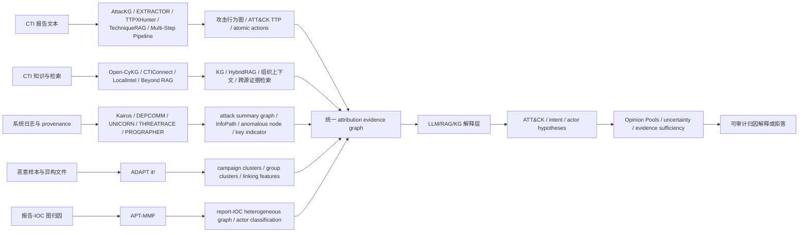

# Project05 主线收束图：LLM 增强威胁溯源 / 攻击归因

## 1. 当前主线结论

截至 2026-07-05，Project05 的核心阅读主线已经完成一轮沉淀。

当前最稳的研究主线不应是“再做一个 CTI -> TTP 抽取器”或“再做一个 actor 分类器”，而应聚焦：

```text
多源证据
  -> 结构化证据图 / 证据单元
  -> ATT&CK / intent / actor hypothesis
  -> evidence sufficiency + uncertainty + refusal
  -> 可审计归因解释
```

## 2. 主线关系图



## 3. 五类证据底座

| 证据来源 | 代表文献 | 可提供什么 | 仍缺什么 |
|---|---|---|---|
| CTI 文本 | AttacKG, EXTRACTOR, TTPXHunter, TechniqueRAG, Multi-Step Pipeline | 攻击行为、TTP、ATT&CK 技术、atomic threat actions | 证据充分性、日志对齐、actor 不确定性 |
| CTI KG / RAG | Open-CyKG, CTIConnect, LocalIntel, Beyond RAG | 结构化知识、跨源检索、组织上下文、HybridRAG | 图幻觉、拒答、跨源冲突处理 |
| 日志 provenance | Kairos, DEPCOMM, UNICORN, THREATRACE, PROGRAPHER | attack summary graph、InfoPath、异常节点、key indicators | ATT&CK/intent/actor 语义解释 |
| CTI/IOC 图归因 | APT-MMF | report-IOC graph、metapath、known actor classification | unknown actor、false flag、证据不足 |
| 样本侧归因 | ADAPT it! | campaign/group clustering、linking features、异构文件证据 | 混淆、共享工具、动态行为、证据可靠性 |

## 4. 最关键的创新空隙

1. Evidence alignment：
   - CTI 文本中的 attack action / TTP；
   - APT-MMF 的 report-IOC graph；
   - ADAPT 的 sample linking features；
   - Kairos/DEPCOMM/THREATRACE/PROGRAPHER 的日志侧 evidence。

2. Semantic elevation：
   - 把 anomalous node、InfoPath、RSG、sample cluster feature 提升到 ATT&CK tactic/technique、attack intent、campaign objective。

3. Attribution uncertainty：
   - 不把 actor label 当成唯一答案；
   - 输出候选 actor PMF；
   - 支持 insufficient evidence / unknown actor / false flag risk。

4. Auditable explanation：
   - 每个结论必须能回指证据：
     - CTI sentence；
     - IOC edge；
     - sample feature；
     - provenance node/path；
     - retrieved KG/RAG source。

## 5. 当前不宜作为主创新点的方向

- 单纯 CTI -> ATT&CK/TTP extraction：已有 TTPXHunter、TechniqueRAG、Multi-Step Pipeline。
- 单纯 graph-level anomaly detection：已有 UNICORN、PROGRAPHER。
- 单纯 node-level anomaly detection：已有 THREATRACE。
- 单纯 actor classification：已有 APT-MMF。
- 单纯样本聚类：已有 ADAPT it!。
- 单纯 GraphRAG：Beyond RAG 已指出结构性幻觉、拒答失败和延迟问题。

## 6. 更稳的候选研究表述

可以暂时把 Project05 收束为这个问题：

> 如何融合 CTI 文本、IOC 图、恶意样本特征和系统 provenance evidence，生成带证据引用、置信度和拒答能力的 ATT&CK / intent / actor attribution explanation？

更短的论文方向名：

```text
Evidence-grounded and uncertainty-aware LLM-assisted APT attribution
```

## 7. 下一步工作

1. 暂不急着生成 3 个最终题目。
2. 先把上述主线整理成开题报告的“相关工作分类表”和“研究空隙图”。
3. 再设计一个最小可行实验：
   - 输入：一篇 CTI report + 若干 IOC/sample/provenance evidence；
   - 输出：ATT&CK / intent / actor hypotheses + evidence citations + confidence/refusal；
   - 指标：accuracy/F1、evidence grounding、calibration、refusal correctness。
