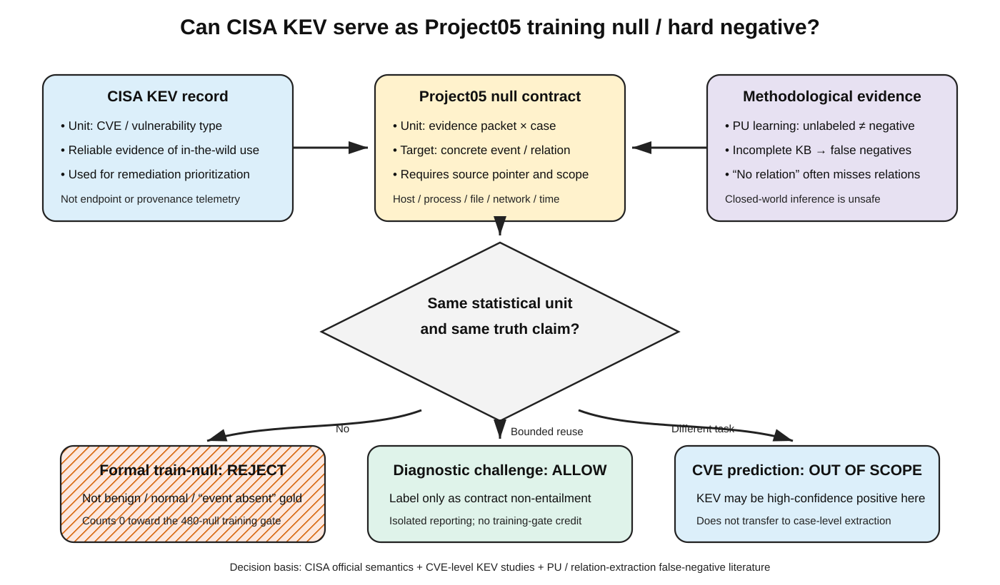

# CISA KEV 作为 Project05 训练 null / hard-negative 的快速证据审查 v0.1

日期：2026-07-18  
审查类型：预注册 rapid evidence review（非 meta-analysis）  
状态：`completed_kev_rejected_for_formal_train_null_diagnostic_only`  
适用主线：Project05 “原始安全证据 → 可执行溯源图” LLM 证据编译层

## 1. 裁决先行

**CISA KEV 在许可层面可以用于训练研究，但在 Project05 的标签语义层面不能充当正式 train-null。**

| 问题 | 裁决 |
|---|---|
| KEV 数据能否被下载、处理、派生训练样本？ | **可以**。固定仓库根目录声明 CC0-1.0，允许合法用途；第三方链接内容不随之授权，且不得使用 CISA/DHS 标识或暗示背书。 |
| KEV 条目能否证明某个案件中的 host/process/file/network 事件没有发生？ | **不能**。KEV 的统计单位是 CVE/漏洞类型，官方目的为漏洞修复优先级；它不是案件级 endpoint/provenance telemetry。 |
| 能否将 KEV 计入正式训练集所需的 480 条 null？ | **不能，计数为 0**。这会把“来源未蕴含具体案件事件”偷换成“真实世界事件未发生”。 |
| 能否保留为 hard-negative？ | **仅允许独立的诊断挑战集**，名称必须是 `non-entailing contract-negative`；不得写 benign/normal，不参与训练数据 Gate，不用于声称真实事件不存在。 |
| 是否还需要用户完成 50 条单人 feasibility 审核？ | **不需要**。文献已暴露统计单位和真值来源的结构性不匹配；单人勾选不能修复外部效度。原队列保留为空的历史工件，不再等待个人裁决。 |

本裁决区分了两个常被混淆的问题：`license-permitted` 不等于 `scientifically valid label`。本报告不是法律意见；许可判断只针对已钉死的 CISA 仓库根目录数据和许可证文本。

## 2. 审查问题与方法

预注册问题、检索式、纳排标准和 fail-closed 判据见 [search-protocol.md](search-protocol.md)。2026-07-18 在 CISA/NIST 官方网页、ACM、IEEE、ACL Anthology、Springer、ScienceDirect、arXiv、DBLP 和通用学术索引中执行五组发现检索，共返回 85 条记录；按 URL 去重后为 82 条。另执行一组定向书目核验，不把它重复计入发现样本。

经标题/摘要筛查，11 个唯一全文或权威详情页进入全文核对；9 个证据源进入最终矩阵。未纳入的材料主要是重复的官方/预印本页面，或只讨论漏洞优先级而未提供额外负标签语义。原始搜索和全文提取保存在 `sources/`，最终去重证据见 [paper-evidence-matrix.csv](paper-evidence-matrix.csv)。

本审查是目标明确的快速证据审查，不声称穷尽全部学术数据库。结论中的“未找到直接先例”只指：**在冻结检索协议和检索日期内，未找到把 KEV 条目作为案件级 observation-extraction null 的同行评审研究**，不写成绝对不存在。

图 1. CISA Known Exploited Vulnerabilities（KEV）的 CVE 级利用状态与 Project05 案件级 observation-null 不处于同一统计单位。Positive–Unlabeled（PU）学习和关系抽取文献进一步表明，目录缺失、知识库不完整或未标关系不能自动转成真实负例。因此 KEV 不进入正式训练 null，只能隔离为“不蕴含目标案件事件”的合同诊断集。图的可复现质量记录见 [quality-check-v0.1.md](figures/quality-check-v0.1.md)。

## 3. 官方语义：KEV 记录什么、不记录什么

CISA 将 KEV 定位为被在野利用漏洞的权威目录，并建议把它作为漏洞管理优先级框架的输入。收录至少要求 CVE ID、明确修复措施和可靠的在野利用证据；“active exploitation”同时覆盖尝试利用与成功利用。其主体是漏洞或 CVE，而不是某个 Project05 案件中的主机、进程、文件、网络端点或时间范围。[CISA, 2026a](https://www.cisa.gov/known-exploited-vulnerabilities)

CISA 还明确解释：有可靠利用证据的漏洞仍可能因为没有 CVE ID 或明确修复指引而缺席 KEV。因此 `not in KEV` 不能解释为“没有被利用”，更不能解释为“某案件没有发生某事件”。[CISA, 2026b](https://www.cisa.gov/news-events/directives/bod-22-01-reducing-significant-risk-known-exploited-vulnerabilities)

这意味着 KEV 对以下命题可提供证据：

> 某个漏洞类型已有可靠的在野利用证据。

它不能直接证明以下 Project05 命题：

> 在给定案件、给定可见证据范围内，某个具体主体没有执行/访问/连接某个具体对象。

即使 `shortDescription` 没写出具体案件事件，也只能说明文本没有蕴含该事件，不能说明事件在真实世界没有发生。

## 4. 学术先例：找到的是 CVE 级用法，不是案件级 null

在冻结检索范围内，没有找到同行评审研究将 KEV 条目用于与 Project05 相同的“案件级 observation extraction null/hard-negative”任务。现有 KEV 机器学习用法主要以 CVE 为统计单位：KEV inclusion 被当作已有利用证据的高置信 positive、风险特征或漏洞优先级信号。

Kausar 等在漏洞利用预测中明确把 KEV inclusion 作为 CVE 已被在野利用的高置信标签，同时承认 KEV “not comprehensive or real-time”，并说明真实标签仍有不确定性（Kausar et al., 2026）。Iannone 等研究的是 CVE 刚披露时的 exploitability prediction，同样不是 endpoint/provenance 事件抽取（Iannone et al., 2024）。这些工作能够为“KEV 是 CVE 级 positive evidence”背书，却不能为“KEV 是案件级 null”背书。

Al Debeyan 等证明 hard/easy negative 的选择会影响代码漏洞预测性能（Al Debeyan et al., 2024）。这支持“hard negative 必须按任务构造”的一般原则，但其负例单位是软件版本/代码，不是 KEV 文本对案件事件的蕴含关系。因此该论文只能作为相邻方法证据，不能直接授权 V3-BN-01。

## 5. 方法学反证：未观察或未链接不等于负例

Bekker 与 Davis 的 PU learning 综述把“所有未标注样本都属于负类”称为最简单、最朴素且显然不成立的 closed-world assumption（Bekker & Davis, 2020）。这一原则直接反对用目录缺失、文本未提及或未给出 pointer 推断真实事件不存在。

与 Project05 的语义编译任务更接近的关系抽取研究也得到同一结论。Xie 等指出知识库不完整会制造 missing relations 和 false negatives，并把任务改写为 PU learning（Xie et al., 2021）。Tan 等重新标注 DocRED 后发现文档级关系抽取中 false-negative 普遍存在（Tan et al., 2022）。安全领域内，Wen 等指出常用漏洞数据集中 negative label 往往不可靠，而 positive label 更确定，因此使用 positive-and-unlabeled 学习（Wen et al., 2023）。

这些论文没有直接研究 KEV-to-provenance 编译，但共同提供高质量的方法学约束：

1. 未报告、未链接、目录不完整或文本不蕴含，不能自动成为世界状态的真实负例；
2. hard negative 必须明确它否定的是哪个任务合同，而不是把未知事实改写成未发生事实；
3. 若只需检验模型能否拒绝把漏洞能力描述升级为案件事实，可以构造 `contract-negative`；但它必须与 world-negative 分开命名、分开统计。

## 6. 对 V3-BN-01 的正式处置

### 6.1 正式训练

V3-BN-01 从 `approved_bounded_feasibility` 变更为 `rejected_for_formal_train_null_after_literature_audit`。已下载的固定 CC0 工件、完整性审计、排除扫描和空白 50 行队列作为历史审计证据保留；不删除、不回填，也不再要求用户审核。

KEV 对正式 train-null Gate 的贡献固定为 **0**。当前旧候选仍只有 2 条 train-null；1200-packet 正式训练集至少需要 480 条，因此缺口仍为 **478**，不是假设 KEV 通过后的 238。

### 6.2 允许的诊断用途

若后续需要检验编译器的 abstention/ceiling 行为，KEV 可作为独立 challenge set，但必须同时满足：

- 任务标签只写 `non_entailing_contract_negative`；
- 目标命题必须是具体案件事件，且 KEV 输入本身不提供相应 case/host/process/file/network/time pointer；
- 不声称 benign、normal、未攻击或真实事件未发生；
- 不进入 QLoRA 训练，不参与 480-null 数量 Gate，不用于 checkpoint 选择；
- 与正式测试分离报告，防止来源类型 shortcut；
- 仍不得跟随第三方链接，不引入 actor/TTP/campaign/remediation 标签。

这是一种由任务合同定义的诊断构造，不是已被文献直接验证的 KEV 同任务范式。论文必须如实写成“methodologically constrained diagnostic reuse”，不能写“prior work established KEV hard negatives for provenance extraction”。

## 7. 下一步数据策略

KEV 被否决后，不应再让单人意见承担来源合法性。新的正式 null 来源必须先满足以下任一可核验真值路径：

1. **显式配对非蕴含**：同一来源同时提供 premise、候选事件和可审计的 non-entailment 构造；
2. **有覆盖保证的良性窗口**：数据采集协议能证明目标传感器在线、时间窗完整且目标事件可被该传感器观察；“没告警”本身不够；
3. **受控反事实**：从有 pointer 的正例只改变一个受约束关系，并通过实体/时间/来源规则证明新目标与输入不相容；不得用路径名或标签字段造答案。

候选必须先过许可、来源独立性、近重复排除和标签真值审查；找不到可辩护来源时，科学上正确的结果是 adapter 保持 `smoke_only` 或回退 QWEN-GENERAL / REUSE-HYBRID，而不是降低 null Gate。

## 8. 局限

- 本审查是 rapid evidence review，不是双人系统综述；它通过冻结检索式、保留原始结果、DOI 核验和证据分层控制偏差。
- 未找到同任务直接先例不等于绝对不存在；任何新发现的直接论文都应按预注册判据重新审查。
- CC0 判断只覆盖钉死仓库根目录数据；第三方链接、商标、隐私、出口管制或具体部署场景仍需各自合规判断。
- 允许诊断集不意味着其具备跨来源泛化效度；来源格式 shortcut 必须单列报告。

## 参考文献

Al Debeyan, F., Madeyski, L., Hall, T., & Bowes, D. (2024). The impact of hard and easy negative training data on vulnerability prediction performance. *Journal of Systems and Software, 211*, 112003. https://doi.org/10.1016/j.jss.2024.112003

Bekker, J., & Davis, J. (2020). Learning from positive and unlabeled data: A survey. *Machine Learning, 109*(4), 719–760. https://doi.org/10.1007/s10994-020-05877-5

Iannone, E., Sellitto, G., Iaccarino, E., Ferrucci, F., De Lucia, A., & Palomba, F. (2024). Early and realistic exploitability prediction of just-disclosed software vulnerabilities: How reliable can it be? *ACM Transactions on Software Engineering and Methodology, 33*(6), 1–41. https://doi.org/10.1145/3654443

Kausar, F., Batiste, L., Muallem, A., & Hussain, S. (2026). Integrated risk scoring and exploit prediction for cyber-physical power system vulnerabilities. *Energy Informatics, 9*(1). https://doi.org/10.1186/s42162-026-00640-x

Tan, Q., Xu, L., Bing, L., Ng, H. T., & Aljunied, S. M. (2022). Revisiting DocRED—Addressing the false negative problem in relation extraction. In *Proceedings of EMNLP 2022* (pp. 8472–8487). https://doi.org/10.18653/v1/2022.emnlp-main.580

Wen, X.-C., Wang, X., Gao, C., Wang, S., Liu, Y., & Gu, Z. (2023). When less is enough: Positive and unlabeled learning model for vulnerability detection. In *Proceedings of the 38th IEEE/ACM International Conference on Automated Software Engineering* (pp. 345–357). https://doi.org/10.1109/ASE56229.2023.00144

Xie, C., Liang, J., Liu, J., Huang, C., Huang, W., & Xiao, Y. (2021). Revisiting the negative data of distantly supervised relation extraction. In *Proceedings of ACL-IJCNLP 2021* (pp. 3572–3581). https://doi.org/10.18653/v1/2021.acl-long.277

### 官方来源

- [CISA — Reducing the Significant Risk of Known Exploited Vulnerabilities](https://www.cisa.gov/known-exploited-vulnerabilities)
- [CISA — BOD 22-01 FAQ and KEV criteria](https://www.cisa.gov/news-events/directives/bod-22-01-reducing-significant-risk-known-exploited-vulnerabilities)
- [CISA KEV data repository license (CC0-1.0)](https://github.com/cisagov/kev-data/blob/87ba74fc7c502adcf482fc7b06e65ce9ea4d9ef2/LICENSE)

## Sources

Academic / peer-reviewed:

- [Bekker & Davis, 2020 — Learning from positive and unlabeled data](https://doi.org/10.1007/s10994-020-05877-5)
- [Xie et al., 2021 — Revisiting the Negative Data of Distantly Supervised Relation Extraction](https://doi.org/10.18653/v1/2021.acl-long.277)
- [Tan et al., 2022 — Revisiting DocRED](https://doi.org/10.18653/v1/2022.emnlp-main.580)
- [Wen et al., 2023 — When Less is Enough](https://doi.org/10.1109/ASE56229.2023.00144)
- [Al Debeyan et al., 2024 — Hard and easy negative vulnerability data](https://doi.org/10.1016/j.jss.2024.112003)
- [Iannone et al., 2024 — Early and Realistic Exploitability Prediction](https://doi.org/10.1145/3654443)
- [Kausar et al., 2026 — Integrated risk scoring and exploit prediction](https://doi.org/10.1186/s42162-026-00640-x)

Official / primary:

- [CISA KEV catalog and criteria](https://www.cisa.gov/known-exploited-vulnerabilities)
- [CISA BOD 22-01 FAQ](https://www.cisa.gov/news-events/directives/bod-22-01-reducing-significant-risk-known-exploited-vulnerabilities)
- [Pinned CISA KEV CC0 license](https://github.com/cisagov/kev-data/blob/87ba74fc7c502adcf482fc7b06e65ce9ea4d9ef2/LICENSE)
