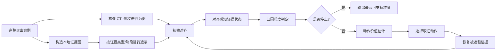

# Project05 实验方案 v0.1

日期：2026-07-07  
状态：Stage 5 / Experiment Design 草案  
对应 RQ：[topic-rq-brief-v2.1-g1-final-20260706.md](../03-ideas/topic-rq-brief-v2.1-g1-final-20260706.md)

## 1. 实验目标

本实验不是验证“LLM 能不能做 APT 归因”，也不是验证“新图对齐算法是否优于 POIROT / DeepHunter / CLIProv / APT-CGLP”。Project05 的实验目标是验证：

> 在证据不完整的 APT 归因场景中，把 CTI-local alignment 的输出建模为证据状态，并基于该状态规划下一步取证动作，是否能以更低成本达到更可靠的归因粒度。

核心问题拆成三件事：

1. 对齐感知证据状态是否比简单证据计数或单一匹配分数更能判断“当前能归因到哪一层”。
2. 主动取证规划是否比随机、固定顺序、简单贪心补证更快达到目标归因粒度。
3. LLM 作为受控证据编译器和解释器，是否比 LLM 直接归因更少产生无证据支撑的结论。

## 2. 最小可行实验总览

第一版实验采用 evidence ablation。思路是先构造“完整证据案例”，再人为遮蔽其中一部分证据，模拟现实调查中证据不完整的状态。系统每一步选择一个取证动作，该动作会恢复一类被遮蔽证据。最后比较不同策略用多少成本恢复到目标归因粒度。



## 3. 实验对象与独立重复单位

### 3.1 实验单位

一个独立实验单位是：

> 一个攻击案例 / campaign scenario / attack trace 与其对应的 CTI 行为描述。

同一个攻击案例下的多个遮蔽版本是重复测量，不应当被当成完全独立样本。统计汇总时要按案例聚合，避免把同一案例的多个 ablation run 当作独立证据。

### 3.2 分层因素

实验需要按以下因素分层报告：

- 攻击阶段：initial access、execution、persistence、credential access、lateral movement、exfiltration 等；
- 证据类型：provenance/log、network、IOC、malware/sample、infrastructure、CTI text；
- 缺失机制：随机缺失、按证据类型缺失、按攻击阶段缺失、现实可观测性缺失；
- 归因目标粒度：technique、intent/tactic、campaign、actor-cluster、named actor。

## 4. 数据设计

### 4.1 第一版推荐数据组合

第一版采用公开数据 + 可控构造：

| 数据部分 | 作用 | 第一版处理方式 |
|---|---|---|
| DARPA TC / OpTC 类 provenance 或日志数据 | 本地证据图 | 作为本地行为证据来源，先使用其中可映射到 ATT&CK 的攻击 trace |
| 公开 CTI 报告 / ATT&CK procedure examples | CTI 侧攻击行为图 | 抽取攻击行为序列和 technique claims |
| 已知 campaign / actor 标签 | 高层归因标签 | 若不可稳定获得，第一版可退到 campaign / technique 粒度 |
| IOC / infrastructure / sample 描述 | 高区分度证据 | 可从公开报告中手工结构化少量案例 |

### 4.2 第一版可接受的简化

为了让实验先跑起来，v0.1 允许以下简化：

- 对齐器先用规则化或简化模拟对齐器，而不是复现完整 POIROT / CLIProv。
- CTI 行为图可以先是行为序列或小型有向图，不必一开始就是复杂异构图。
- named actor-level 可以作为扩展目标；第一版重点验证 technique / intent / campaign 粒度。
- LLM 参与可以先离线生成 evidence claim，不进入在线规划循环。

### 4.3 不可接受的简化

以下简化会让实验失去意义：

- 只比较最终 actor accuracy。
- 只让 LLM 读完整材料后直接输出 actor。
- 取证动作只是自然语言“建议补证”，没有对应到可恢复的证据集合。
- 缺失证据由模型自己编造，而不是从完整案例中遮蔽再恢复。

## 5. 证据状态表示

每个时间步 `t` 的状态记为 `S_t`，由以下字段构成。

### 5.1 覆盖状态

| 字段 | 含义 | 示例 |
|---|---|---|
| `cti_node_coverage` | CTI 行为节点被本地证据覆盖比例 | 5/8 |
| `cti_edge_coverage` | CTI 行为关系被本地证据覆盖比例 | 3/7 |
| `stage_coverage` | 各攻击阶段覆盖情况 | credential access 缺失 |
| `critical_gap_count` | 关键缺口数量 | 2 |

### 5.2 对齐质量

| 字段 | 含义 |
|---|---|
| `alignment_score_mean` | 已匹配节点/边平均对齐分数 |
| `alignment_score_min` | 最弱匹配分数 |
| `conflict_count` | 本地证据与 CTI 假设冲突数量 |
| `unmatched_cti_nodes` | 未被本地证据支持的 CTI 节点 |
| `unexplained_local_nodes` | 本地可疑但无法映射到 CTI 的证据 |

### 5.3 归因区分度

| 字段 | 含义 |
|---|---|
| `candidate_entropy` | 候选 campaign/actor 分布熵 |
| `top2_margin` | 前两名候选假设分数差 |
| `shared_ttp_ratio` | 当前证据中共享 TTP 比例 |
| `unique_evidence_count` | 对某候选具有专属性的证据数量 |

### 5.4 成本与历史

| 字段 | 含义 |
|---|---|
| `budget_used` | 已用取证成本 |
| `actions_taken` | 已执行取证动作 |
| `evidence_recovered` | 已恢复证据集合 |
| `remaining_action_mask` | 仍可执行的动作 |

## 6. 归因粒度定义

实验中采用层级标签：

```text
G0: unknown / no attribution
G1: technique-level
G2: tactic / intent-level
G3: campaign-level
G4: actor-cluster / actor-family-level
G5: named actor-level
```

第一版可以只评估 `G0-G3`，因为公开数据中 named actor ground truth 往往不稳定。若有足够公开报告支持，再扩展到 `G4-G5`。

### 6.1 粒度判定规则 v0.1

第一版先采用规则化判定，便于解释和消融：

- `G1 technique-level`：至少一个关键攻击行为被本地证据支持，并能映射到 ATT&CK technique。
- `G2 tactic/intent-level`：多个 technique 覆盖同一战术阶段或形成局部行为链。
- `G3 campaign-level`：攻击链关键阶段形成连续证据，且存在时间线、基础设施、样本或过程关系中的至少一种 campaign-level 支撑。
- `G4/G5`：需要高区分度证据，如基础设施复用、样本族、历史报告关联、专属工具链或多事件一致性。

规则化版本不是最终方法，而是用于建立可审计 baseline。后续可替换为学习式粒度分类器。

## 7. 取证动作空间

每个动作 `a` 具有：

```text
action_id
action_type
target
cost
recoverable_evidence_set
expected_evidence_type
applicable_condition
```

### 7.1 动作类型

| 动作 | 实验含义 | 成本初值 |
|---|---|---:|
| `extend_log_window` | 恢复某时间窗口内被遮蔽的日志/provenance 证据 | 2 |
| `query_host_subgraph` | 恢复某主机/进程相关 provenance 子图 | 3 |
| `recover_network_summary` | 恢复网络会话或外联摘要 | 2 |
| `ioc_enrichment` | 恢复 IOC 富集结果，如 IP/domain/hash 关系 | 1 |
| `malware_analysis` | 恢复样本静态/动态分析特征 | 4 |
| `infrastructure_history` | 恢复基础设施历史复用关系 | 3 |
| `ttp_local_probe` | 恢复某 ATT&CK technique 的局部证据 | 2 |
| `human_review` | 人工复核冲突证据或低置信证据 | 5 |

成本初值可在敏感性实验中调整。

## 8. 动作价值函数

### 8.1 基础定义

候选动作价值：

```text
V(a | S_t) =
  w1 * E[granularity_gain]
  + w2 * E[uncertainty_reduction]
  + w3 * E[over_attribution_risk_reduction]
  + w4 * E[conflict_resolution]
  - lambda * cost(a)
```

其中：

- `granularity_gain`：执行动作后可支撑粒度是否提升；
- `uncertainty_reduction`：候选假设熵是否降低；
- `over_attribution_risk_reduction`：是否减少在证据不足时输出高粒度结论；
- `conflict_resolution`：是否能解决当前冲突证据；
- `cost(a)`：动作成本。

### 8.2 v0.1 三档方法

| 方法 | 名称 | 说明 |
|---|---|---|
| M1 | rule-value greedy | 手写价值函数，按 `V/cost` 贪心选择 |
| M2 | oracle-informed greedy | 用完整证据构造 oracle ranking，用于上界或监督信号 |
| M3 | AFA-style CMI greedy | 近似条件互信息，选择最能降低候选假设不确定性的动作 |

v0.1 不强制实现 RL 或 MCTS。先证明 greedy planning 已经比随机/固定顺序强，再考虑非短视规划。

## 9. Baseline 设计

| Baseline | 说明 | 目的 |
|---|---|---|
| B0 no-acquisition | 不补证，直接做粒度判定 | 测初始证据上限 |
| B1 random | 随机选择可用动作 | 随机下界 |
| B2 fixed-order | 固定顺序补证，如 log -> network -> IOC -> sample | 模拟人工固定流程 |
| B3 cheapest-first | 总是选最低成本动作 | 检验是否只是成本优势 |
| B4 coverage-greedy | 选能恢复最多 CTI 节点覆盖的动作 | 简单结构贪心 |
| B5 uncertainty-greedy | 选降低候选熵最多的动作 | 信息增益 baseline |
| B6 direct LLM | 给 LLM 当前可见证据，让其直接输出归因与缺失证据 | 验证受控框架优于自由 LLM |
| B7 full-evidence upper bound | 直接给完整证据 | 理论上界 |

Project05 方法至少需要超过 B1/B2/B3，并力争超过 B4/B5。

## 10. LLM 实验设计

LLM 不参与最终动作选择的自由裁决，只参与三个受控环节。

### 10.1 证据编译

输入：

```text
CTI 句子 / 日志摘要 / IOC 描述 / 样本分析摘要
```

输出：

```json
{
  "claim_id": "c001",
  "claim_type": "process_execution",
  "subject": "powershell.exe",
  "predicate": "downloaded",
  "object": "payload",
  "mapped_ttp": "T1059.001",
  "source_pointer": "report paragraph 3 or log row id",
  "confidence": "medium"
}
```

### 10.2 缺口解释

LLM 根据结构化状态生成解释，但不能新增状态中不存在的证据。

### 10.3 最终说明

最终说明必须引用：

- 当前最高可支撑粒度；
- 支撑证据；
- 缺失证据；
- 已执行动作；
- 为什么不能输出更高粒度。

### 10.4 LLM 对照

| 条件 | 说明 |
|---|---|
| `LLM-direct` | LLM 直接读当前证据并输出归因 |
| `LLM-structured` | LLM 只输出 evidence claims |
| `LLM-explanation-only` | LLM 只在最终解释阶段参与 |
| `No-LLM` | 全部使用规则化 evidence claim |

关键比较：

- `LLM-direct` 是否更容易过度归因；
- `LLM-structured` 是否提升 evidence grounding；
- `LLM-explanation-only` 是否足以支持论文叙事。

## 11. Evidence Ablation 设计

### 11.1 遮蔽策略

| 遮蔽策略 | 含义 | 对应现实场景 |
|---|---|---|
| random mask | 随机遮蔽证据 | 普通日志缺失 |
| type mask | 遮蔽某类证据，如 network 或 sample | 数据源不可用 |
| stage mask | 遮蔽某攻击阶段 | 攻击阶段不可观测 |
| discriminative mask | 遮蔽最能区分 actor/campaign 的证据 | 关键归因证据缺失 |
| conflict injection | 注入冲突或噪声证据 | false flag / noisy telemetry |

### 11.2 遮蔽强度

建议三档：

```text
low: 20% evidence hidden
medium: 40% evidence hidden
high: 60% evidence hidden
```

### 11.3 随机化与重复

每个完整案例生成多个遮蔽版本，但分析时按案例聚合。

建议：

- 每个案例每种遮蔽策略生成 5 个随机种子；
- 每个策略和强度组合都运行全部方法；
- run order 随机化，避免某种方法总是在同一批案例上先运行。

## 12. 评价指标

### 12.1 取证效率

| 指标 | 定义 |
|---|---|
| `cost_to_target` | 达到目标归因粒度所需成本 |
| `steps_to_target` | 达到目标归因粒度所需动作数 |
| `AUC_granularity_cost` | 成本-粒度曲线下面积 |
| `budget_success_rate` | 给定预算内达到目标粒度的比例 |

### 12.2 归因可靠性

| 指标 | 定义 |
|---|---|
| `granularity_selection_accuracy` | 选择正确最高可支撑粒度的准确率 |
| `over_attribution_rate` | 证据不足时输出过高粒度的比例 |
| `correct_downgrade_rate` | 正确降级到较低粒度的比例 |
| `correct_abstention_rate` | 应拒答/unknown 时正确拒答比例 |
| `open_set_rejection_rate` | unknown actor 场景下拒绝 named actor 的比例 |

### 12.3 动作价值质量

| 指标 | 定义 |
|---|---|
| `next_best_evidence_ndcg` | 动作排序与 oracle 排序的一致性 |
| `top1_action_hit` | 第一动作是否命中 oracle top action |
| `marginal_gain_error` | 预测收益与实际收益差 |

### 12.4 LLM 解释质量

| 指标 | 定义 |
|---|---|
| `evidence_grounding_correctness` | 解释中的证据回指是否真实存在 |
| `unsupported_claim_rate` | 无证据支持的归因/事实声明比例 |
| `missing_evidence_precision` | 提出的缺失证据是否确实缺失且相关 |
| `explanation_consistency` | 同一状态多次解释是否一致 |

## 13. 实验条件矩阵

v0.1 最小矩阵：

| 维度 | 取值 |
|---|---|
| 遮蔽策略 | random, type, stage, discriminative |
| 遮蔽强度 | 20%, 40%, 60% |
| 方法 | B0-B7 + Project05-M1/M2/M3 |
| 目标粒度 | G1, G2, G3 |
| 预算 | low, medium, high |

第一版不必全部跑满。最小可行组合：

```text
遮蔽策略：random + stage + discriminative
遮蔽强度：40%
方法：random / fixed-order / coverage-greedy / Project05-M1 / full-evidence
目标粒度：G1-G3
```

## 14. 结果表设计

### 14.1 主表

| 方法 | cost_to_target ↓ | steps_to_target ↓ | over_attr ↓ | correct_downgrade ↑ | granularity_acc ↑ |
|---|---:|---:|---:|---:|---:|
| random | | | | | |
| fixed-order | | | | | |
| coverage-greedy | | | | | |
| Project05-M1 | | | | | |
| Project05-M3 | | | | | |
| full evidence | | | | | |

### 14.2 消融表

| 变体 | 去掉模块 | 预期影响 |
|---|---|---|
| no-alignment-state | 不使用缺口/冲突/覆盖结构 | 粒度判定下降 |
| no-cost | 不考虑动作成本 | 成本效率下降 |
| no-discriminativeness | 不考虑候选区分度 | campaign/actor 粒度下降 |
| no-LLM-claims | 不用 LLM 编译 evidence claims | 语义一致性下降 |
| LLM-direct | LLM 直接归因 | over-attribution 上升 |

## 15. 预期结果与可证伪条件

### 15.1 预期支持结果

若方法有效，应观察到：

- Project05-M1/M3 比 random/fixed-order 更低 `cost_to_target`；
- Project05-M1/M3 比 coverage-greedy 更低 `over_attribution_rate`；
- 对齐状态消融后，`granularity_selection_accuracy` 下降；
- LLM-direct 的 `unsupported_claim_rate` 高于受控 LLM 条件；
- discriminative mask 场景中，考虑候选区分度的方法明显优于只看覆盖率的方法。

### 15.2 失败条件

若出现以下结果，需要回到 RQ 或方法设计：

- Project05 方法只比 random 好，但不如 fixed-order；
- 只看 coverage 的 baseline 已经达到同等效果；
- 动作成本建模对结果没有任何影响；
- 归因粒度判定与 evidence state 几乎无关；
- LLM 结构化 evidence claims 没有提升 grounding，反而增加错误。

## 16. 第一版实现计划

### Phase 0：案例表整理

产物：

- `08-writing/experiment-case-inventory-v0.1-20260708.md`
- 每个案例记录：攻击阶段、可用证据类型、可映射 technique、是否有 campaign/actor 标签。

### Phase 1：数据 schema

产物：

- `data_schema/evidence_claim.schema.json`
- `data_schema/alignment_state.schema.json`
- `data_schema/acquisition_action.schema.json`

### Phase 2：最小模拟器

实现：

```text
完整证据集合
-> 遮蔽器
-> 当前可见证据
-> 动作恢复证据
-> 状态更新
-> 粒度判定
```

### Phase 3：baseline

实现：

- random；
- fixed-order；
- cheapest-first；
- coverage-greedy；
- Project05-M1 rule-value greedy；
- full-evidence upper bound。

### Phase 4：LLM 受控模块

先离线处理：

- CTI 句子到 evidence claim；
- 日志摘要到 evidence claim；
- 最终解释生成。

避免第一版把在线 LLM 调用放进规划循环，降低不可控性。

## 17. 文件与代码组织建议

```text
08-writing/
  experiment-plan-v0.1-20260707.md
  experiment-case-inventory-v0.1-20260708.md

09-experiments/
  README.md
  data_schema/
    evidence_claim.schema.json
    alignment_state.schema.json
    acquisition_action.schema.json
  scripts/
    build_cases.py
    ablate_evidence.py
    run_planners.py
    evaluate.py
  configs/
    mvp.yaml
  results/
    tables/
    figures/
```

PDF、原始日志、全文抽取和大体量数据不进入 GitHub；只提交 schema、配置、脚本、小样例和结果表。

## 18. 当前 v0.1 结论

Project05 的下一步不应继续扩写专利，而应先完成最小可行实验：

> 用 evidence ablation 构造不完整证据场景，让不同取证策略在同一案例上逐步恢复证据，比较达到目标归因粒度的成本、步数、过度归因率和解释证据回指质量。

若 v0.1 结果显示主动取证规划确实比 random/fixed-order/coverage-greedy 更有效，则可以进入：

1. 更真实的 provenance/CTI 对齐器接入；
2. 非短视规划或 POMDP 方法；
3. 专利 v0.3；
4. 论文方法章节草稿。

若 v0.1 失败，应优先检查：

- evidence state 是否过于粗糙；
- 取证动作是否没有真实收益差异；
- 归因粒度标签是否不可稳定定义；
- 是否需要把主线进一步收缩到 campaign-level 而非 actor-level。
