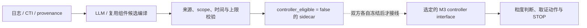

# Project05 主线证据编译层：CTI 文本工件 Amendment v0.1

日期：2026-07-17  
状态：`pending_user_source_review`  
授权：仅元数据研究、并行边界、来源目录与校验器；未授权下载 CTI 正文、组件 runtime、模型、embedding、训练或正式推理  
产品归属：Project05 主论文前端编译层，不恢复独立 Paper B

## 1. 并行裁决

M3 系列方法与 LLM 证据编译层可以同时推进，但二者不能同时修改同一个运行接口。冻结前采用以下结构：

LLM 线只写 `llm_evidence_compiler_mainline`、compiler scripts/tests 与对应 Markdown；不修改 `run_mvp.py`、`run_m3star*.py`、M3Star results、C07–C12 real cases 或旧 EvidenceClaim/alignment schemas。M3 可以继续改规划器，LLM sidecar 在集成 Gate 前始终不可被控制器消费。

## 2. 本 amendment 解决什么

WP3 已证明 clean-room adapter 能执行来源句恢复和 fail-closed，但 WP2 没有 `cti_text`，因此真实 component performance 不可评估。本 amendment 只回答三个前置问题：

1. 哪些 CTI 文本可以合法、可复现地取得；
2. 如何按 publisher/document family 分包，避免把同一报告切成大量“独立样本”；
3. 如何在不碰 C07–C12 的前提下做 payload exclusion scan。

它不授权运行 CTINexus，不把 schema-valid 称为语义正确，也不创建新的论文结果。

## 3. 实验单位与分包

独立单位是**来源文档或 external-reference 文档族**，不是句子、triplet 或同一报告的多个段落。句子只作为同一文档内的重复测量。

| 角色 | 来源族 | 用途 | 是否形成统计主张 |
|---|---|---|---|
| `unit` | CTID Blueprints 自有 Intrusion Analysis 示例 | schema、pointer、reject/abstain 单元路径 | 否 |
| `development` | MITRE ATT&CK malware/tool procedure descriptions | adapter/prompt 调试 | 否 |
| `component_validation` | TRAM 中逐文档核验后的 CISA 第一方通告 | held-out component interface pilot | 仅文档宏平均、条件化 |
| C07–C12 | 无 | 保持冻结测试 | 不运行 |

publisher family 不得跨角色。抽取后即使一篇报告产生数十条边，统计上仍是一个文档单位。固定抽样种子为 `20260717`；任何改样本或阈值必须先 amendment，不能看模型输出后修改。

## 4. 来源裁决

### 4.1 待用户有条件批准

1. **CTID Blueprints 示例**：官方仓库为 Apache-2.0，固定 revision `c412b54a...aca4`；只取项目自有的 `An Example Intrusion Analysis Report.json`，排除 PDF、模板、actor/campaign/executive 示例。[官方仓库](https://github.com/center-for-threat-informed-defense/cti-blueprints)
2. **MITRE ATT&CK procedure 文本**：固定 revision `a6c36643...5956`；仓库许可允许研究、开发和商业用途，但要求复制 MITRE 的版权声明和许可。只取 malware/tool → procedure 描述，排除 intrusion-set、campaign、actor attribution、APT29 别名与所有 protected-family 匹配。[固定 LICENSE](https://github.com/mitre-attack/attack-stix-data/blob/a6c366439edee3a87b79cf90dc0b93f5d7975956/LICENSE.txt)
3. **TRAM 中 CISA 第一方通告子集**：TRAM 仓库自身为 Apache-2.0，但其中包含多家厂商报告，因此仓库许可证不能自动当作每篇报告的再许可。本轮仅列出 7 个 CISA 标题；取得后还必须逐条确认原始 `cisa.gov` URL、政府作者身份和第三方嵌入物，任何一项不明即删除。[TRAM 官方仓库](https://github.com/center-for-threat-informed-defense/tram)

### 4.2 reserve

MISP Galaxy JSON 明确为 CC0 1.0 或其许可证文本中的 BSD 风格替代，但它主要是结构化 galaxy 描述，不是自然 threat report；只保留为未来非归因字段的诊断来源，不用于当前 3-role Gate。[固定 LICENSE](https://github.com/MISP/misp-galaxy/blob/5d3d5f44d6ece36b36204f57cb21f9de3be5720f/LICENSE.md)

### 4.3 明确拒绝

- **TRAM 全量 mjson**：目录含商业厂商报告副本和 APT29 文本；Apache 代码许可不能证明每份第三方报告的再发布权，且会与 C11 发生家族污染。
- **CISA CSAF 全仓库**：README 明确说明既有 CISA 自有 advisory，也有 vendor partner republication；仓库根目录未见统一 LICENSE，不能整库纳入。[CSAF README](https://github.com/cisagov/CSAF/blob/7697117e077389d667db86bed3efa45f4ec634cf/README.md)
- **CTID adversary emulation library**：虽为 Apache-2.0，但属于合成 emulation procedure，并含 APT29 路径，与 C11 OTRF 家族重叠，不作为 CTI 文本来源。[官方仓库](https://github.com/center-for-threat-informed-defense/adversary_emulation_library)

## 5. 四级 Gate

### S1：来源元数据 Gate（当前）

- revision、publisher family、license evidence、eligible/excluded path 齐全；
- `unit/development/component_validation` 三个角色来自三个 publisher families；
- 用户逐项批准前 `retrieval_authorized=false`；
- 通过只授权**有界检索和 payload scan**。

### S2：逐文档许可与来源 Gate（检索后）

- 保存原始 URL、revision/blob SHA、原始字节 SHA-256、许可证据与归属声明；
- TRAM CISA 条目必须回到原始 CISA URL；仅凭文件名或 TRAM Apache LICENSE 不得准入；
- 商业厂商、许可 unknown、网页仅供阅读、第三方图片/表格无法分离的文档删除。

### S3：泄漏与内容 Gate

- 对 `darpa_tc_e3`、`darpa_tc_e5`、`darpa_optc`、`otrf_apt29`、`witfoo_precinct6` 的 protected signature 做 exact + normalized 5-gram Jaccard 扫描；
- 阈值固定为 `0.85`，最短保护文本 16 字符；
- APT29、OTRF、C07–C12 canonical ID、private/gold/oracle 字段全部硬拒绝；
- 通过后才允许生成 `cti_text` public artifacts，仍不得运行组件。

### S4：runtime Gate（以后单独授权）

只有 S1–S3 全部通过，才讨论 CTINexus/等价组件环境、模型或 embedding。runtime 输出先在独立 component bench 上运行；没有 G1 语义参考时只能报告机械指标，不能报告 extraction recall 或“幻觉下降”。

## 6. 指标与主张上限

当前预注册机器指标只有：schema-valid、pointer resolution、same-record support、forbidden-conclusion rejection、explicit abstention。所有结果按文档宏平均；同一文档的多句、多边不能扩大 n。

本阶段不需要双人审计。若后续要声称“语义关系正确”“无支撑断言更少”或使用人工 unsupported 标签，再单独决定最小语义审计；机械 Gate 不能替代它。

## 7. 当前授权与审阅项

当前 catalog 保持 `pending_user_source_review`，正文语料为 0。请只审：

1. 是否有条件批准 CTID Blueprints → unit；
2. 是否有条件批准 MITRE ATT&CK software procedure → development；
3. 是否允许只检索 TRAM 中 7 个 CISA 候选的元数据/正文，并逐文档 fail closed → component validation；
4. 是否同意 MISP reserve、TRAM 全量/CSAF 全量/emulation library 拒绝。

批准 S1 不等于批准 S2/S3 通过，更不等于批准组件 runtime、模型、训练、C07–C12 或控制器集成。

## Sources

- [MITRE ATT&CK STIX Data, fixed revision](https://github.com/mitre-attack/attack-stix-data/tree/a6c366439edee3a87b79cf90dc0b93f5d7975956)
- [CTID Blueprints, fixed revision](https://github.com/center-for-threat-informed-defense/cti-blueprints/tree/c412b54af6473d49b43863fa094f3a9d0febaca4)
- [CTID TRAM, fixed revision](https://github.com/center-for-threat-informed-defense/tram/tree/f29793d8d665f7f552898696e00065ef24a29a20)
- [MISP Galaxy, fixed revision](https://github.com/MISP/misp-galaxy/tree/5d3d5f44d6ece36b36204f57cb21f9de3be5720f)
- [CISA CSAF, fixed revision](https://github.com/cisagov/CSAF/tree/7697117e077389d667db86bed3efa45f4ec634cf)
- [CTID Adversary Emulation Library, fixed revision](https://github.com/center-for-threat-informed-defense/adversary_emulation_library/tree/4467a6eed6e67d25009704130e1d27d1a8007f57)
