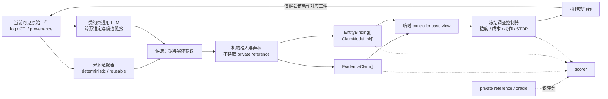

# Project05 主线 LLM 证据编译层融合与实验设计 v0.1

日期：2026-07-17  
状态：`design_ready_for_user_review`  
依据：`llm-provenance-compiler-prior-art-review-v0.1-20260717`  
实施授权：**无**；本稿通过审阅前，不修改冻结实验、不下载模型、不安装运行环境、不训练、不运行正式推理  
路线裁决：原“独立 Paper B + QLoRA 编译器”路线暂停；LLM 改为 Project05 主线的前端证据编译层

## 0. 结论先行

本研究不再把 LLM 单独包装成一篇与主线平行的论文。新的完整方法链为：

```text
原始日志 / CTI 文本 / provenance 事件
  -> 可复用的来源适配器
  -> LLM 候选证据编译与跨源语义对齐
  -> 来源指针、schema、实体、时间与语义上限校验
  -> EvidenceClaim[] + claim-to-node links
  -> Project05 既有 alignment state
  -> 可支持溯源粒度判断
  -> 成本约束下的下一取证动作或 STOP
```

LLM 的职责是把异构、散乱、半结构化安全证据编译为主线可以消费的、可回指的原子证据图边；Project05 既有控制器仍负责判断“当前证据能支持到什么粒度”“下一步取什么证据”“何时停止”。LLM 不直接决定 actor、campaign、取证动作或 STOP，也不得读取隐藏证据、oracle 恢复集合或预期动作收益。

前人工作调研的结论是 `fragmented_prior_art`：日志构图、CTI 抽取、CTI—provenance 匹配和来源校验均已有强前作，不能分别宣称首次；但在已检索材料中，没有系统把“逐边来源可验证的案件证据编译”与“可支持粒度、证据获取成本、动作顺序和 STOP”形成同一个可执行闭环。

因此，本研究真正需要验证的不是“LLM 能不能输出 JSON”，而是：

> 带来源约束和弃权机制的语义编译层，能否把原始证据可靠地转换为调查控制状态，并使编译误差对溯源路径、越界归因、取证成本和 STOP 的影响可测、可控。

只有端到端 Gate 通过后，这一层才进入主论文核心贡献。若未通过，它只作为已知工具的工程适配器，不改写主论文标题或摘要。

## 1. 与旧路线的关系

### 1.1 立即生效的路线变化

1. `llm-apt-provenance-research-design-v0.1/v0.2`、Qwen2.5 QLoRA amendment 和训练来源工作保留为历史探索材料，不再作为当前执行权威。
2. 已完成的 public/private 分包、ID 隔离、pointer 校验、stub、来源许可和排除锁思想可以复用；其独立 Paper B 叙事、训练规模 Gate 和 QLoRA 默认路线不继承。
3. 已获取的外部训练语料不得因为本次合并而自动获得训练授权。
4. QLoRA 仅作为失败后的条件分支，见 §16；不是主线开工前提。
5. Paper A 的冻结 CSV、summary、trace、`run_mvp.py` 和现有 `evidence_claims.json` 不就地覆盖。

### 1.2 统一论文叙事

合并后的主线对象是“从原始证据到成本约束调查控制的完整链路”，而不是“一个 LLM 模型”和“一个规划算法”的机械拼接：

- 前端语义层解决原始安全工件不能直接进入控制器的问题；
- 中间证据合同保证每条图边可回到来源，并对未知或不充分证据弃权；
- 后端控制层根据证据覆盖、可支持粒度和成本选择取证动作或 STOP；
- 实验显式测量前端错误如何传导到后端决策。

## 2. 可辩护贡献与禁止主张

### 2.1 候选贡献

以下贡献均为“待实验成立”的候选贡献，不在出结果前写成既成事实。

**C1：来源可验证的证据—控制接口。** 定义原始日志、CTI 和 provenance 到 `EvidenceClaim[]`、实体绑定和目标节点支持链接的版本化合同，使编译结果能被既有调查控制器直接消费，而非止于摘要、告警或解释文本。

**C2：带弃权与语义上限的控制前编译。** 将 schema、来源指针、字面落地、实体作用域、时间窗口、允许谓词和支持上限放在 LLM 与控制器之间；无法满足合同的候选边被拒绝或弃权，不能因模型自信而升级归因粒度。

**C3：编译误差到调查决策的端到端测量。** 在同一批案件、同一可见工件、同一成本配置和同一控制器下，测量漏边、错边、错链接和错误弃权如何改变路径质量、越界归因、动作序列、总获取成本和 STOP 正确性。

**C4：复用优先的模块化实现证据。** 用可执行的已知组件和强规则基线替代已完成的子问题；只有剩余的案件级跨源锚定和控制接口由 LLM 补足。该项是研究纪律，不单独作为算法创新。

### 2.2 明确禁止的主张

无论实验结果如何，均不得声称：

1. 首次用 LLM 从日志构建 provenance graph；
2. 首次从 CTI 抽取知识图谱或三元组；
3. 首次做 CTI 与 provenance 的语义匹配；
4. 首次进行来源句或来源字段验证；
5. 解决了通用 actor attribution 或获得真实 actor-level ground truth；
6. 在只有 6 个测试案件时证明了普遍有效或跨所有 APT 数据集泛化；
7. 将 schema-valid、pointer 存在或相对作者参考的一致率称为“人类验证的无幻觉”。

## 3. 研究问题与可证伪假设

### RQ1：编译质量

在相同公开输入和相同机械准入器下，受约束通用 LLM 或复用混合管线是否比最强确定性规则基线产生更完整、且不增加无效来源指针和表面无支撑边的案件级证据图？

**H1**：至少一个非 oracle 编译条件相对最强规则基线，测试案件 case-macro 的“冻结参考 claim+link F1”提高至少 0.05，且 6 个案件中至少 4 个差值非负；同时 invalid-pointer rate 与 surface-unsupported rate 不升高。

### RQ2：端到端传导

在控制器、预算、成本 profile、可用动作和初始可见工件全部固定时，更好的证据编译是否改善最终可支持路径或在同等路径质量下降低证据获取成本，并保持正确 STOP 和语义上限？

**H2**：相对规则基线，候选编译条件满足至少一种预注册 Pareto 改善：

- 最终路径 edge macro-F1 提高至少 0.05，平均/中位获取成本增幅不超过 10%；或
- 最终路径 edge macro-F1 差异绝对值不超过 0.02，总获取成本降低至少 10%。

同时 ceiling violation 不增加，correct STOP 不得少于规则基线超过 1 个案件。

### RQ3：架构约束的安全价值

同一通用模型下，“候选编译 → 机械准入 → 冻结控制器”是否比“原始证据 → LLM-direct 结论/动作建议”更少出现无来源输出、越过支持上限和错误 STOP？

**H3**：受约束管线的机器可判 invalid pointer、ceiling violation 和不可执行输出均不高于 direct；若没有独立人工语义审计，只能作上述机械安全陈述，不能写“幻觉显著降低”。

### 3.1 非研究问题

- 不比较新的异常检测器或 provenance detector SOTA；
- 不让 LLM 学习或替代 Project05 的动作策略；
- 不做多模态图像或原始 PCAP 全文输入；
- 不把 tactic/technique/actor 名称生成准确率设为主终点；
- 不把模型品牌或 QLoRA 本身当作论文贡献。

## 4. 系统边界与信息流



### 4.1 LLM 可以读取

- 当前步骤已经可见的原始工件或其无损、可回指窗口；
- request-scoped 的 artifact、record 和 span ID；
- 公开的 source type、字段说明、允许实体类型、允许谓词和 JSON schema；
- 公开 CTI/行为目标节点的描述、来源片段和临时 node ID；
- 当前步骤允许使用的时间范围与 host/tenant scope；
- “无法支持时必须 abstain”的合同说明。

### 4.2 LLM 不得读取

- 冻结 `claim_id`、`required_claim_ids`、`discriminative_claim_ids`；
- future/hidden artifact 内容和其哈希可反查字典；
- `recoverable_claim_ids`、动作真实恢复量、旧 planner 结果和预期收益；
- private claim-to-node gold、目标答案、人工标签和 scorer 输出；
- 运行后才能知道的 support ceiling、正确 STOP 或最优动作序列；
- 测试案件 canonical claim ID 或可编码答案的 sample ID。

LLM 只编译证据，不读取控制器的 oracle 侧执行字段。控制器可使用冻结政策上限，但该上限不作为模型生成提示。

## 5. 精确接口合同

### 5.1 保持不变的主接口：`EvidenceClaim[]`

正式进入控制器的每条原子边必须继续通过现有：

`09-experiments/data_schema/evidence_claim.schema.json`

其中最关键字段为：

- `case_id`；
- 原子 `subject–predicate–object`；
- `source_type`；
- 可选 `time_window`；
- `source_pointer.artifact_id` 与 record/line/location/hash；
- `observable_status`。

编译器不得改变该 schema 的语义。模型输出的 `confidence`、`evidence_strength`、`mapped_tactic` 和 `mapped_technique` 不直接提升控制器覆盖或归因粒度；除非另有独立验证，它们只作诊断字段。

### 5.2 候选信封：`CandidateClaimEnvelope`

模型不能直接写入正式 `EvidenceClaim[]`。候选层至少记录：

| 字段 | 约束 |
|---|---|
| `compiler_run_id` | 冻结模型、prompt、解码和工件 manifest 的哈希 |
| `candidate_id` | request-scoped；与 private claim ID 无对应编码 |
| `artifact_id` / `record_id` / `span` | 必须来自当前可见 artifact catalog |
| `subject` / `predicate` / `object` | 单一可观察关系，不得混入结论性长句 |
| `entity_scope` | host、process instance、tenant 或 unknown；不得仅靠名称跨主机合并 |
| `time_window` | 直接字段、可复现解析或 `unknown` |
| `proposed_target_node_ids` | 只允许 public target catalog 中的临时 ID |
| `support_state` | `candidate` / `abstain`；模型不能自封 `verified` |
| `source_quote_or_fields` | 供机械核对；不得用模型生成的改写替代原文 |

### 5.3 实体绑定：`EntityBinding[]`

现有 claim 的字符串值不足以区分同名进程在不同主机或时间的实例。为避免修改冻结 schema，新增 sidecar，至少包含：

- request-scoped `entity_key`；
- `entity_type`、surface value、normalized value；
- `host_id` / `tenant_id` / `process_id`（存在则填，不存在明确 `unknown`）；
- 时间窗口；
- 支持该绑定的 admitted claim IDs；
- 规范化规则或模型版本。

图组装只允许在兼容 scope 内合并实体。仅字符串相同、但 host/time 未知的实体不得被自动认定为同一实例。

### 5.4 证据到目标节点支持链接：`ClaimNodeLink[]`

每条链接至少包含：

- `admitted_claim_id`；
- public `target_node_id`；
- `link_type`：`supports` / `contradicts` / `context_only` / `unresolved`；
- 支持该链接的 claim source pointer；
- 编译条件和版本；
- 是否通过机械链接资格检查。

链接是模型/规则的可检验输出，不是 gold。只有 `supports` 链接参与覆盖计算；`context_only` 和 `unresolved` 不得增加 coverage。

### 5.5 弃权与拒收日志

每个输入 packet 均必须产生：

- admitted claims；或
- 明确 abstention；或
- 带原因码的 rejection。

原因码至少覆盖 `schema_invalid`、`pointer_missing`、`pointer_out_of_scope`、`surface_value_missing`、`predicate_not_allowed`、`entity_scope_ambiguous`、`time_conflict`、`target_node_unknown`、`duplicate` 和 `no_supported_observation`。禁止静默丢弃。

### 5.6 临时 controller case view

既有 `case_config.json` 通过 `required_claim_ids` 绑定目标节点，不能直接接受每次生成的新 claim ID，也不能暴露给模型。实验 harness 因此在内存或运行目录生成临时视图：

1. 从 admitted `ClaimNodeLink` 收集每个 target node 的支持 claim IDs；
2. 构造本条件专用的 `cti_nodes[].required_claim_ids`；
3. 继承冻结的节点、边、预算、成本 profile、目标粒度和控制器参数；
4. 对 acquisition action 按 artifact manifest 绑定本条件生成的 claims；
5. 将临时视图交给既有控制器函数；
6. 临时视图和哈希写入运行 manifest，但不覆盖任何冻结 case 文件。

## 6. CTI、日志与 provenance 的分工

### 6.1 CTI 目标图

初始因果实验必须把“CTI 目标图抽取错误”和“本地证据编译错误”分开，否则结果无法解释。

**阶段 A（主 Gate）**：从现有案件的目标节点构造 public target catalog，只保留 node 临时 ID、行为描述和可公开 CTI span；移除 canonical claim ID、required/recoverable/discriminative IDs 和答案字段。比较各编译器把本地日志/provenance claim 链接到同一个冻结目标图的能力。

**阶段 B（全前端诊断）**：使用 CTINexus 或等价可执行组件从 CTI 文本生成目标节点候选，再运行同一证据链接与控制器。该阶段单独报告 CTI 抽取误差，不得与阶段 A 混成一个效果。

阶段 A 通过、阶段 B 未通过时，论文只能声称控制器兼容外部 CTI 编译器，不能声称端到端 CTI 自动建图已解决。

### 6.2 日志与 provenance 适配器

- 对已结构化审计事件，优先用确定性字段解析器；LLM 只处理字段语义、别名和跨源实体锚定。
- 对 provenance 事件，保留原始 UUID、subject/object 类型、host 和时间；不得把异常分数当作事件事实。
- 对自由文本或半结构化记录，LLM 只能从当前 span 提议可观察 SPO，不能把攻击剧本或文件路径标签写成来源事实。
- 原始 PCAP 全文不在范围内；只允许已有网络 summary 或可回指流记录。

### 6.3 图的定义

本设计区分两张图：

1. **案件证据图 `G_E`**：admitted `EvidenceClaim` 构成的实体—关系边，每边有来源指针；
2. **调查目标图 `G_T`**：来自 CTI/行为描述的目标节点和先后关系。

`ClaimNodeLink` 构成 `G_E -> G_T` 的支持映射。Project05 控制器消费的是 `G_T` 的当前证据覆盖及其未覆盖缺口。编译层不能凭空生成跨时间因果边；没有直接来源的关系只能标为 `context_only` 或 `unresolved`。

## 7. 候选到 controller-eligible 的状态机

```text
received artifact
  -> parsed record/span
  -> candidate claim
  -> schema check
  -> pointer resolution + artifact hash check
  -> surface/entity/time check
  -> duplicate/conflict check
  -> target-link eligibility check
  -> controller-eligible claim/link
       or abstained/rejected with reason
```

“controller-eligible”只表示通过预注册机械合同，不表示人类已确认语义正确。private reference 只能进入 scorer，永不进入 admission。

### 7.1 G0 机械准入规则

1. JSON schema 合法；
2. artifact、record、line/span 位于当前可见 catalog；
3. artifact hash 与 manifest 一致；
4. subject/object 的关键 surface value 出现在来源字段或通过冻结规范化规则可复现；
5. predicate 位于按 source type 冻结的 allowlist；
6. time/host/process scope 不与来源显式字段冲突；
7. target node ID 存在于 public catalog；
8. 候选不包含 actor/campaign/恶意性等来源未直接提供的结论性实体；
9. 重复边按冻结 key 合并，冲突边同时保留并标冲突，不由模型暗中择一。

### 7.2 不允许的 admission 行为

- 用 private gold 是否匹配决定接收；
- 用测试输出调 predicate allowlist、规范化规则或阈值；
- 因规则基线太强/太弱而在看过测试后修改它；
- 让“模型置信度高”覆盖 pointer 或 scope 失败；
- 将 null packet 全部拒答作为提高 precision 的办法而不报告 coverage。

## 8. 复用策略与对照条件

### 8.1 已知组件的角色

| 子问题 | 首选处理 | 研究姿态 |
|---|---|---|
| CTI 实体/关系抽取 | CTINexus（MIT）或等价公开接口 | 可执行复用基线，不宣称自创 |
| CTI span 支持检查 | 复现 TACTIC-KG 的逐关系支持思想，不复制无许可代码 | 设计先例/评测对照 |
| 结构化日志规范化 | source-specific deterministic adapter；OntoLogX（MIT）作可行参考 | 规则强基线 |
| 通用日志语义解析 | Matryoshka 仅作算法参考，GPL-3.0 代码不得 vendor | 不形成代码依赖 |
| 原始日志到 provenance | Auto-Prov 作为强前作；其声称仓库当前不可获得 | 不宣称本项目首创 |
| CTI—provenance 语义匹配 | APT-CGLP/MultiKG 作方法对照 | 不复制为新颖点 |
| 成本、动作和 STOP | Project05 冻结控制器 | 主线核心 |

任何第三方依赖在实施前必须再次钉死 revision、license、输入输出和离线可复现性。

### 8.2 正式条件

| ID | 条件 | 目的 | 是否进入控制器 |
|---|---|---|---|
| `REF-MANUAL` | 现有 32 条冻结作者编译 claims + 冻结 links | 参考上限/错误传播上界；不是可部署基线 | 是 |
| `RULE-STRONG` | source-specific parser + 冻结实体规范化 + 规则 target linking | 最强确定性基线 | 是 |
| `REUSE-HYBRID` | 可执行 CTI 组件 + 确定性 log/provenance adapter + 机械 verifier | 检验“已有组件包装已足够” | 是 |
| `LLM-CONSTRAINED` | 单一通用 instruction LLM 产生 candidate claims/links，经过同一 G0 | 检验 LLM 剩余增量 | 是 |
| `LLM-DIRECT` | 同一通用 LLM 从相同公开证据直接输出结论/动作/STOP | 仅安全比较，不作为本方法 | 否；隔离执行 |

`REF-MANUAL` 不能用于 admission 或 prompt 选择，也不能作为“LLM 优于人工”的对手。`REUSE-HYBRID` 若已经达到或超过 `LLM-CONSTRAINED`，最终实现应优先采用混合组件，并删除“LLM 是性能核心”的论文主张。

### 8.3 关键消融

只在主条件完成后运行：

- `LLM-CONSTRAINED` 去掉 target linking：检验语义链接是否真正影响控制；
- 去掉 entity scope：检验同名实体错误合并；
- verifier 前的 raw candidates 离线评分：检验 G0 的过滤作用；raw candidates 不得送入控制器；
- CTI 阶段 A vs 阶段 B：分离本地证据编译和 CTI 抽取误差。

不运行“去掉 pointer gate 后让错误边进入控制器”的在线危险消融。

## 9. 数据、拆分与可见性

### 9.1 案件拆分

- `C01–C03`：仅 schema、stub、泄漏和失败路径单元测试；
- `C04–C06`：development；冻结 prompt、allowlist、规范化、阈值和匹配规则；
- `C07–C12`：test；6 个案件、当前 32 条作者编译参考 claims，禁止调参。

若某测试案件缺少可本地解析并由 pointer 回指的原始工件，该案件不得用手写摘要替代后继续计入主结果；必须在 data-readiness report 中降级为不可评测，并相应收缩主张。

### 9.2 artifact-level visibility manifest

现有 action 中的 `recoverable_claim_ids` 是模拟执行 oracle，不能暴露给编译器。新 harness 需要冻结：

- 初始可见 artifact IDs；
- 每个 action 成功后新增可见的 artifact IDs 或无损窗口；
- action/channel failure 时新增集合为空；
- 每个 artifact 的 hash、source type、host/time scope；
- compiler 可读取的 public record IDs；
- private reference 和 action outcome 的物理路径。

控制器选 action 后，executor 只解锁相应 artifact；compiler 对累计可见集合重算或按哈希缓存。不同条件因动作不同而看到不同后续工件，这是闭环策略结果；组件级比较则使用固定 visibility panel，保证输入完全相同。

### 9.3 public/private 物理隔离

```text
compiler_eval/
  public/
    artifact_catalog.json
    target_node_catalog.json
    visibility_manifest_public.json
    packets/
  private/
    frozen_reference_claims.json
    frozen_reference_links.json
    action_execution_truth.json
    score_keys/
```

推理 runner 只接受 `public/` 根路径。修改任意 private 文件必须不改变 public request 字节和 SHA-256。正式运行目录不得包含 private 文件。

## 10. 评价真理来源与人工工作边界

### 10.1 三层评价

**E0：纯机器事实。** schema、pointer 是否存在、hash、span/record 是否属于当前可见 artifact、surface value、实体 scope 冲突、predicate allowlist、重复、输出可执行性、ceiling violation。

**E1：冻结 Project05 作者参考。** C07–C12 的 32 条现有 claims、目标节点和链接。只允许称为 `frozen-reference agreement/F1`，不是独立人类共识 truth。

**E2：可选的最小语义审计。** 仅在论文要使用“语义受来源支持”“减少无支撑关系”一类强措辞时启动。未做 E2 不阻塞接口实现和 E0/E1 实验，但相应措辞必须删除。

### 10.2 不需要重复人工做什么

- schema、pointer、hash、record visibility 和 exact surface 检查不做双人标注；
- 不重新全量双标此前训练来源队列；
- 不把所有模型重复输出逐条双审；
- 不为 action cost 或 STOP 重新制造人工 gold。

### 10.3 若启动 E2，如何约束工作量

E2 在模型、prompt、条件和输出冻结后另行预注册。推荐只审“测试案件中参与最终路径或触发 STOP 的去重 claim-node links”，按 6 案例分层；两人独立判断来源是否支持关系、pointer 是否正确、link 是否支持对应目标节点。其目的只覆盖最终因果链，不扩成全语料标注。

若 E2 一致性门槛未过或不实施：

- 保留 E0 与 E1 数值；
- 禁止“human-validated grounding”“hallucination reduced”“semantic correctness”措辞；
- 可写“机械可回指”和“相对冻结作者参考的一致性”。

## 11. 组件级指标

所有主指标先在 case 内聚合，再对 6 个案件做等权 case-macro；packet、claim、模型重复和 seed 不是独立样本。

### 11.1 预注册主指标

1. **Frozen-reference claim+link F1**：admitted SPO 边及其 target link 与 E1 多可接受参考的联合 F1；匹配规则在 development 上冻结。
2. **Invalid-or-surface-unsupported rate**：controller-eligible 输出中 pointer 不可解析、来源不可见、关键 surface 值不可复现或 predicate 不合法的比例；目标为 0。

F1 防止全弃权刷 precision；invalid rate 防止多输出刷 recall。

### 11.2 诊断指标

- claim precision/recall/F1；
- target-link precision/recall/F1；
- entity-binding error rate；
- time-order conflict rate；
- correct/false abstention；
- duplicate rate；
- conflict preservation rate；
- schema-valid before/after admission；
- pointer resolvable rate；
- per-source-type 分层结果；
- 输出稳定性；
- 延迟、tokens、峰值显存、失败/OOM。

模型 tokens 是本地推理工作量计数，不自动等于付费 API 成本；如使用本地开源权重，报告 tokens 仅为效率指标。任何外部 API 费用必须单独授权并单列，不混入证据获取成本。

## 12. 端到端控制指标

### 12.1 主结果向量

1. 最终支持路径 node/edge macro-F1；
2. over-attribution / ceiling violation；
3. correct target STOP 与 correct degrade STOP；
4. 总证据获取成本；
5. 动作步数和 budget exhaustion。

`success` 仅作诊断，不作为唯一端到端终点，以避免现有高成功率造成 ceiling effect。

### 12.2 成本口径

- 证据获取成本继续使用 Project05 已治理的 cost profile；
- 所有编译条件在同一正式 profile ID/version/SHA 下比较；
- legacy 仅作回归兼容，不用于声称新成本结论；
- LLM 计算开销单列为 runtime overhead，不与取证动作成本相加，除非未来形成可审计的统一量纲 amendment；
- 路径质量不足的低成本运行不能被解释为效率更高。

### 12.3 动作序列诊断

- 与 `REF-MANUAL` 控制器序列的首动作一致率；
- 首次分歧步骤；
- 因 false positive 导致的提前 STOP；
- 因 false negative 导致的多余获取成本；
- 因错 link 导致的错误 stage coverage；
- action/channel failure 后的恢复行为。

## 13. 实验执行顺序

### Stage 0：接口与泄漏测试

1. 构建 sidecar schema 和 stub；
2. public/private 物理分包；
3. request/candidate/canonical ID 三分；
4. private mutation 不改变 public hash；
5. artifact visibility、pointer、hash 和 fail-closed 测试；
6. 证明旧 `run_mvp.py`、CSV、summary、trace 字节不变。

### Stage 1：固定输入的组件比较

所有条件读取相同冻结 packets/visibility panel。先冻结 `RULE-STRONG` 开发集快照，再运行 `REUSE-HYBRID` 和 `LLM-CONSTRAINED`。此阶段不运行控制器，用于判定 LLM 是否真的提供语义编译增量。

### Stage 2：闭环主线集成

只让通过 G0/G1 的条件进入 artifact-action 闭环。每一步：控制器选择 action，executor 解锁工件，compiler 编译累计可见证据，临时 case view 更新，控制器重新计算覆盖、粒度和 STOP。

### Stage 3：安全比较与消融

隔离运行 `LLM-DIRECT` 和安全消融。它们不得共享主方法运行目录，也不得通过其输出反向调主 prompt。

### Stage 4：可选 E2 与论文裁决

所有机器结果冻结后，才决定是否为强语义措辞启动最小 E2。根据 Gate 结果决定 LLM 是核心层、可选适配器还是负结果。

## 14. 重复、随机化与统计

### 14.1 独立单位

独立统计单位是案件/攻击链，测试 `n=6`。同一案件内的 packets、claims、mask、seed、动作步骤和模型重复均为重复或技术测量，禁止当作独立样本扩大 n。

### 14.2 运行控制

- 组件条件在每个 case/source modality 内区组；
- 非 oracle 条件运行顺序用冻结随机种子做平衡/轮换；
- 同一通用模型用于 constrained 与 direct，固定 revision、量化、prompt、解码和最大 token；
- 正式测试前冻结规则、prompt、阈值、模型和 request builder；
- 如非确定性运行，最多 3 次完整重复；先在 case 内聚合，不把 3 次当 n=18；
- 完整两阶段/多步骤请求绑定一个 run manifest hash，不能只记录最后一步哈希。

### 14.3 报告

- 每案原始结果和配对差值；
- case-macro 均值、中位数、范围/四分位；
- 以效应量和方向一致性为主；
- 可报告按 case 重采样的 bootstrap 区间或精确配对置换结果，但明确 n=6 的区间与检验力度有限；
- 不以 packet-level p 值支持普遍性结论；
- 多指标按主/诊断预注册，不在测试后选择最好看的终点。

## 15. Gate 与负结果路径

### G0：数据、许可与隔离

必须全部满足：

- 每个纳入案件的主参考 pointer 可解析到本地 artifact/record/span；
- 所有第三方代码和数据 license/revision 已钉死；
- public request 不含 private/canonical/oracle 字段；
- 测试内容未进入 prompt 开发、训练或示例；
- artifact visibility manifest 和 action mapping 冻结。

失败：相应案件/组件停止，不用手写摘要或代理字段补齐。

### G1：接口安全

必须全部满足：

- controller-eligible claims 100% schema-valid；
- controller-eligible pointers 100% 指向当前可见工件；
- 不合法 predicate、越 scope 实体和未知 target node 0 个进入控制器；
- 所有 abstain/reject 有原因码；
- 修改 private reference 不改变任何 public request hash；
- legacy 回归字节不变。

失败：不得进入闭环 Stage 2。

### G2：编译层增量

按 H1 判定。若 `REUSE-HYBRID` 达标而 `LLM-CONSTRAINED` 不达标：

- 主线采用复用混合层；
- LLM 只保留为可选接口或负结果；
- 不在标题、摘要和核心贡献中强调 LLM。

若所有自动条件均不优于 `RULE-STRONG`：

- 保留确定性编译器；
- 终止 QLoRA 和模型扩展；
- 报告“在本数据和合同下无自动语义增量”。

### G3：端到端主线价值

按 H2 与安全护栏共同判定。G2 通过但 G3 不通过时：

- 编译层可作为工程输入适配器；
- 不声称它改善了成本约束溯源；
- 主论文的核心仍是调查控制与参数治理；
- 禁止用 Phase 2/3 新故事事后救场。

### G4：强语义措辞

只有可选 E2 达到另行预注册的一致性门槛，才能使用“来源支持的语义边”“减少无支撑关系”等人类语义判断措辞。未过 G4 不影响 E0/E1 结果，但必须降级用语。

## 16. 模型与 QLoRA 的条件分支

### 16.1 首轮为什么不训练

前人工作已经覆盖多个子模块，且现有测试只有 6 案例/32 参考 claims。先训练会把“接口是否有效”“通用模型是否足够”“数据是否同分布”和“adapter 是否有效”混成一个问题。

首轮只允许在用户后续单独授权后使用一个可本地运行的通用 instruction model 完成 constrained/direct 配对。模型选择是实施决策，不是科学贡献。

### 16.2 何时才允许提出 QLoRA amendment

必须同时满足：

1. G0/G1 已过；
2. `LLM-CONSTRAINED` 未过 G2；
3. 盲于测试的 development error analysis 显示主要错误是稳定的安全日志语言/schema 映射问题，而非缺来源、gold 歧义或控制器问题；
4. 有与 C07–C12 来源族隔离、许可清楚、近重复扫描通过的训练数据；
5. 训练后仍与同底座 General 做公平配对；
6. 新 amendment 明确 tokens、1024/其他上下文 Gate、算力、4-bit 限制和负结果路径；
7. 用户再次明确授权环境、权重和训练。

不满足任一项，QLoRA 保持暂停。

## 17. 兼容性与实施文件边界

设计通过后，建议新增独立实验命名空间，例如：

```text
09-experiments/llm_evidence_compiler_mainline/
  contracts/
  public/
  private/                  # git policy 另定，绝不进入推理目录
  adapters/
  manifests/
  results/
09-experiments/scripts/
  build_compiler_public_packets.py
  validate_compiler_admission.py
  build_compiler_case_view.py
  run_compiler_component_eval.py
  run_compiler_controller_eval.py
09-experiments/tests/
  test_compiler_information_boundary.py
  test_compiler_admission.py
  test_compiler_case_view.py
  test_compiler_legacy_regression.py
```

文件名只表示后续建议，不授权创建。实现要求：

- 不就地修改 C07–C12 的 `evidence_claims.json`、`case_config.json` 或 `acquisition_actions.json`；
- 不直接修改 `run_mvp.py`；优先导入其纯函数或建立薄兼容层；
- 不更改旧结果目录；新运行必须写入新、空目录；
- old standalone LLM worktree 的语料、队列和训练脚本不自动合并；
- 任意 legacy 输出差异均为硬停，而非更新 snapshot。

## 18. 审阅通过后的实施工作包

### WP0：路线冻结

- 写一页 supersession record，说明独立 Paper B/QLoRA 暂停；
- 钉死本设计版本和 prior-art review SHA；
- 列出可复用旧工件与不可继承授权。

### WP1：合同、stub 与信息边界

- 定义 candidate/entity/link/abstention/run manifest schema；
- public/private builder；
- 机械 admission；
- stub compiler 和负向测试；
- legacy 字节回归。

完成后停在 **M1：接口审阅 Gate**，不安装模型。

### WP2：数据就绪与规则强基线

- 建 C04–C12 artifact catalog；
- 验证所有 pointer；
- 冻结 public target catalog 和 artifact-action manifest；
- 实现/整理 `RULE-STRONG`；
- 输出 development baseline snapshot。

完成后停在 **M2：数据与基线审阅 Gate**。

### WP3：复用混合条件

- 对 CTINexus/OntoLogX 等再次做 revision/license/运行可行性审核；
- 在不复制 GPL/无许可代码的前提下实现 adapters；
- 跑 development component Gate；
- 确认已有组件是否已经足够。

### WP4：通用 LLM 条件

- 先做纯 stub；
- 用户单独授权后才安装环境/下载单一模型；
- 冻结 prompt、解码、tokens 和 hardware manifest；
- development 通过后才允许测试。

### WP5：组件与闭环正式实验

- Stage 1 component eval；
- 判 G2；
- 仅通过者进入 Stage 2；
- 运行同成本 profile 的闭环 controller eval；
- 判 G3；
- 先冻结报告再考虑 E2。

### WP6：论文合并

- 仅写已通过 Gate 的贡献；
- prior-art 边界、负结果和限制完整保留；
- Markdown 审阅通过后才生成 DOCX/PPT；
- 若 G3 未过，不把 LLM 写进标题或正向摘要。

## 19. 设计层已知限制

1. n=6，只能支持小样本、条件化的机制结论；
2. 32 条 claims 是作者冻结参考，不是独立 consensus truth；
3. 阶段 A 固定 CTI 目标图，不能独自证明完整 CTI 自动建图；
4. C07–C12 的来源模态、数据可得性和 pointer 完整度不完全一致；
5. off-the-shelf LLM 可能记忆公开 CTI，污染状态默认 `unknown`；
6. 4-bit/11GB 硬件若后续采用，会限制模型质量，必须预声明；
7. 机械准入能消除无效 pointer 和字段越界，但不能替代所有语义真值判断；
8. compiler 条件会改变控制器看到的图，端到端差异必须通过 Stage 1/Stage 2 分解，不能简单归因于某一个模型。

## 20. 本稿的审阅问题

审阅本设计时应集中判断：

1. 是否接受“独立 Paper B 暂停，LLM 合并为主线前端”的产品裁决；
2. `EvidenceClaim[] + EntityBinding[] + ClaimNodeLink[] + artifact visibility manifest` 是否足以连接当前控制器；
3. 是否接受先固定 CTI 目标图做因果隔离，再做全前端诊断；
4. H1/H2 的 0.05、4-of-6、10% Pareto Gate 是否合理；
5. 是否接受 E0/E1 可先实施、强语义措辞才触发最小 E2；
6. 是否接受 QLoRA 仅在通用模型失败且错误机制满足条件后另行授权。

本稿通过前，下一步不是下载模型或继续训练数据审核，而是审阅上述接口、实验条件和 Gate。

