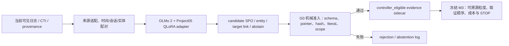

# Project05 LLM 证据编译层：开放研究底座与文献复现式微调修订案 v0.1

日期：2026-07-18  
状态：`pending_user_model_and_training_strategy_review`  
上游设计：`llm-evidence-compiler-mainline-integration-design-v0.1-20260717.md`  
取代对象：R1-C 的 Qwen 推荐、`llm-apt-provenance-research-design-v0.3-qwen25-qlora-amendment-20260716.md` 与 `llm-apt-phase1-implementation-plan-v0.2-qwen25-qlora-20260716.md` 中全部 Qwen 执行授权  
当前授权：**仅允许文献、模型卡、许可证与元数据核验；不允许安装训练环境、下载 tokenizer/权重、训练、正式推理、C07–C12 运行或 M3 接线**

## 0. 裁决先行

1. **Qwen 路线撤销。** Project05 不再把任何 Qwen checkpoint、Qwen tokenizer、Qwen adapter 或 Qwen 运行时作为候选。
2. **不接入闭源 API。** GPT、Claude、Gemini 等付费/闭源服务不得用于训练样本生成、标签生成、正式推理或裁判。
3. **主候选改为 AI2 OLMo 2。** 推荐在用户审阅通过后，以 Allen Institute for AI 发布的 `OLMo-2-1124-7B-Instruct` 为同底座 General/Adapted 对照，用本地 4-bit QLoRA 训练一个窄任务证据编译 adapter。
4. **模型不是论文创新。** 创新仍是“逐边来源约束、可弃权的语义编译层如何进入成本约束调查控制闭环”，不是 OLMo、LoRA 或 QLoRA 本身。
5. **微调方法复现前作思想，但改变任务合同。** 数据构造借鉴 SEvenLLM 的任务选择、Llama-PcapLog 的异构证据配对、Auto-Prov 的代表样本与规则复用、AttacKG+ 的阶段分解，并把输出收缩为 Project05 的 `source pointer + observable SPO + entity/link + abstention`。
6. **M3 与编译层可并行开发，但不能提前耦合。** 编译 sidecar 在 Gate 通过前继续 `controller_eligible=false`；M3 只在双方各自冻结并完成合并审查后消费 admitted claims/links。

建议的完整方法链为：



## 1. “不直接使用商用大模型”的可执行定义

本修订将用户要求落实为以下四条硬边界：

1. 不调用商业闭源 API，不产生按 token 付费的模型调用；
2. 不采用商业公司的 Qwen、Llama、Mistral、Gemma checkpoint 作为正式底座；
3. 正式底座必须可本地离线运行、权重不 gated、许可证和固定 revision 可核验；
4. 模型发布方、训练数据说明和已知第三方条款必须在论文中准确披露。

这一定义不等于宣称“预训练语料中从未出现商业网站文本”或“训练链与任何第三方模型完全无关”。模型卡无法证明的部分必须写 `unknown`，不得用“开源”二字掩盖。

## 2. 底座调研与选择

### 2.1 候选矩阵

| 候选 | 发布方/性质 | 许可证 | 11 GB 本地适配 | 本轮裁决 |
|---|---|---|---|---|
| Qwen2.5-7B-Instruct | Alibaba/Qwen，商业公司 | Apache-2.0 | QLoRA 可尝试 | **用户否决；禁止** |
| Llama-3.1-8B-Instruct | Meta，商业公司 | Llama Community License | QLoRA 可尝试 | **排除** |
| Mistral-7B-Instruct-v0.3 | Mistral AI，商业公司 | Apache-2.0 | QLoRA 可尝试 | **排除**；许可开放不满足发布方约束 |
| Pythia-6.9B | EleutherAI，开放研究组织 | Apache-2.0 | 可量化，但不是 instruction checkpoint | **排除正式候选**；任务学习风险过高 |
| OLMo 2 7B Base | Allen Institute for AI，非营利研究机构 | Apache-2.0 | 官方 FP32 权重约 29.19 GB，几乎占满原 30 GB 模型/cache/checkpoint 总预算，且无指令跟随能力 | **不作为当前主候选** |
| OLMo 2 7B Instruct | Allen Institute for AI，非营利研究机构 | Apache-2.0；模型卡另披露第三方生成数据条款 | 约 14.60 GB 权重；4-bit QLoRA 有条件可行 | **推荐主候选，待用户接受披露边界** |
| OLMo 2 1B Base/Instruct | Allen Institute for AI，非营利研究机构 | Apache-2.0 | 1B Base 约 5.94 GB；Instruct 约 2.97 GB | **运行管线 sentinel / 严格备选，不作为测试集赢家替换** |

### 2.2 推荐主候选的冻结元数据

- Model ID：`allenai/OLMo-2-1124-7B-Instruct`
- 固定 revision：`470b1fba1ae01581f270116362ee4aa1b97f4c84`
- 发布方：Allen Institute for AI（AI2，非营利研究机构）
- Hub 状态：public、not gated
- Hub license metadata：`apache-2.0`
- 架构：`Olmo2ForCausalLM`
- 参数级别：7B
- context length：4096
- config dtype：`bfloat16`
- 2080 Ti 候选 compute dtype：`float16`
- 权重总量：14,597,276,128 bytes
- 仓库总量：14,606,987,735 bytes

权重文件：

| 文件 | bytes | LFS SHA-256 |
|---|---:|---|
| `model-00001-of-00003.safetensors` | 4,970,591,184 | `05ae91e1171f1f1753b23df3a5a6740d89da377932b33a1661bb7485d6ec530e` |
| `model-00002-of-00003.safetensors` | 4,981,161,496 | `0d41b81fe0d7e4c1d673a77beded5ee77080e39d6a6940b523e82f61eaa1dcbd` |
| `model-00003-of-00003.safetensors` | 4,645,523,448 | `51d701cc400703094ae4b6434b067ee8810056170ce4703e93b2f5b2cb93a51d` |

固定元数据文件：

| 文件 | bytes | SHA-256 |
|---|---:|---|
| `README.md` | 9,345 | `1c64f5f2cb6158d24a2fa1241687cd93854154bc6cce6c2b86f6dc3e69cc87de` |
| `config.json` | 679 | `ff8cc8709a229515676797ab6f343a09391041c9a8fbbc78bfec5be4c2e3664e` |
| `tokenizer_config.json` | 4,884 | `50c412c57d832057a3d5db42064c741f751e570f7c8788f037bfb0d2dd6e5f49` |

官方证据：

- [OLMo 2 7B Instruct 模型卡](https://huggingface.co/allenai/OLMo-2-1124-7B-Instruct/blob/470b1fba1ae01581f270116362ee4aa1b97f4c84/README.md)
- [OLMo 2 论文](https://arxiv.org/abs/2501.00656)
- [OLMo 代码仓库及 Apache-2.0 LICENSE](https://github.com/allenai/OLMo)

### 2.3 必须披露的限制

`OLMo-2-1124-7B-Instruct` 模型卡说明：它在 OLMo 2 Base 上经过 Tülu 3 变体 SFT、DPO 与 RLVR；模型卡同时提示其后训练混合含第三方模型生成输出，并链接 Gemma Terms of Use。因此，本研究最多声称：

> 正式运行不直接调用商业大模型或商业 API，底座由非营利研究机构公开发布，权重与代码采用 Apache-2.0，并在本地离线微调和推理。

不得声称：

- “训练链完全不含商业模型影响”；
- “所有上游数据均为 Project05 自行生成”；
- “Apache-2.0 自动消除了所有数据来源与污染风险”。

若用户把要求收紧为“任何后训练数据都不得含第三方模型生成内容”，则 7B Instruct 必须退出，另开 amendment 评估 `OLMo-2-0425-1B` Base 的 task SFT；不能静默换模型。

### 2.4 1B sentinel 的用途

- Model ID：`allenai/OLMo-2-0425-1B-Instruct`
- 固定 revision：`48d788eca847d4d7548f375ad03d3c9312f6139e`
- 权重：2,969,854,224 bytes，SHA-256 `36d044c73655bb904f822915e6294ba3dae8e6e1af5e703e9d452f2d6a3a294f`
- 用途：验证 tokenizer、prompt、response-only loss、LoRA 注入、adapter 保存/重载和 JSON 解码链。
- 禁止用途：在看过 C07–C12 后用 1B 替换 7B；把 1B smoke 当正式科学结果；同时对 1B/7B 试验后选测试集赢家。

## 3. 从已有论文借鉴什么、拒绝照搬什么

| 前作 | 可复现的方法要素 | Project05 的改造 | 明确不照搬 |
|---|---|---|---|
| SEvenLLM（Ji et al., 2024） | Select-Instruct：先选择适用任务，再由来源文本构造指令；多任务安全语料与专家修正 | 任务池缩成 `observable extraction`、`entity binding`、`target linking`、`abstain` 四类；每条输出必须保留 pointer | 不复制 28 类宽任务；不训练 actor/intent/TTP；不用 GPT-4 生成训练答案 |
| Llama-PcapLog（Choi & Lee, 2025） | 按时间、会话和共享标识符对齐异构证据；Alpaca 格式；4-bit LoRA | 将配对改为日志/CTI/provenance 的可见 packet；目标是来源约束图边而非问答 | 不输入原始 PCAP 全文；不用 GPT-4o self-instruct；不把文本并置冒充图对齐 |
| Auto-Prov（Ghosh et al., 2026, preprint） | 只对代表性日志类型调用 LLM，再固化可复用解析规则；以下游图任务验证 | 用 source adapter/Rule-Strong 承担确定性字段，OLMo 只补跨源实体与语义链接 | 不把 LLM 候选当真值；不让无 pointer 的边进入图 |
| AttacKG+（Zhang et al., 2024） | 将重写、解析、识别、总结拆为阶段模块 | 改成 `segment -> observable SPO -> entity/link -> mechanical verifier` | 不生成 tactic/technique/state summary，不调用商业 LLM |
| EXTRACTOR（Satvat et al., 2021） | CTI 文本归一、指代/省略处理、只保留可观测攻击行为 | 作为 CTI source adapter 与 Rule-Strong 设计先例 | 不把传统 NLP 子模块重新包装成创新 |
| QLoRA（Dettmers et al., 2023） | 冻结 4-bit base，仅训练低秩 adapter；NF4、double quantization、gradient checkpointing | 适配 OLMo 2，保持 `<1%` trainable parameters、adapter-only 保存 | 不做 full fine-tuning、模型 merge、测试集选参 |

核心参考：

- [SEvenLLM, arXiv:2405.03446](https://arxiv.org/abs/2405.03446)
- [Llama-PcapLog, DOI:10.34385/proc.97.T3.3.4](https://doi.org/10.34385/proc.97.T3.3.4)
- [Auto-Prov, arXiv:2603.17100](https://arxiv.org/abs/2603.17100)
- [AttacKG+, arXiv:2405.04753](https://arxiv.org/abs/2405.04753)
- [EXTRACTOR, arXiv:2104.08618](https://arxiv.org/abs/2104.08618)
- [QLoRA, arXiv:2305.14314](https://arxiv.org/abs/2305.14314)

## 4. Project05 微调任务的精确定义

### 4.1 输入

模型只读取当前步骤已经可见的：

- 原始或无损窗口化日志记录；
- CTI source span；
- provenance event；
- request-scoped artifact/record/span ID；
- public target-node 临时 ID 与行为描述；
- 允许实体类型、谓词、schema 与弃权说明。

模型不得读取 private gold、canonical claim ID、未来工件、action recovery oracle、成本收益、M3 输出或正确 STOP。

### 4.2 输出

训练目标统一为：

```json
{
  "status": "completed",
  "candidate_claims": [
    {
      "source_pointer": {
        "artifact_id": "request-scoped-id",
        "record_id": "request-scoped-id"
      },
      "subject": {"entity_type": "process", "value": "literal source value"},
      "predicate": "executed",
      "object": {"entity_type": "file", "value": "literal source value"},
      "proposed_target_node_ids": ["public-node-id"]
    }
  ]
}
```

无足够证据时固定为：

```json
{"status":"abstain","candidate_claims":[]}
```

模型不生成 actor、campaign、intent、maliciousness、planner action、成本、STOP、canonical claim ID 或最终 `controller_eligible=true`。

### 4.3 为什么需要微调

微调不是为了向参数中灌入“APT 百科知识”，而是让模型稳定学习一个受限编译合同：

1. 从异构记录中只选择来源直接支持的 observation；
2. 将 observation 写成原子 SPO；
3. 复制正确的 source pointer；
4. 在 compatible scope 内对齐实体和 public target node；
5. 证据不足时弃权。

所以对外名称只能是 `Project05 Evidence-Compiler Adapter` 或 `task/schema-adapted OLMo 2`，不得称为“APT 领域大模型”。

## 5. 数据构造修订

### 5.1 允许复用的材料

1. 主线 WP2 的真实公开 packet、Rule-Strong 输出和冻结 public/private 边界；
2. WP4 已准入、已做许可与泄漏扫描的 CTI source records；
3. 旧 v0.3 已获取的六个日志来源族，只能复用其已批准许可、notice、原始 hash、规范化与 exclusion 审计；迁入主线前必须复验路径和 hash；
4. C01–C06 的 development 工件，只用于 schema/prompt/data-pipeline 冻结；
5. C07–C12、CTINexus wheel 自带 annotation/demo 和 private gold 永不进入训练。

更换底座不会自动把旧 proposal label 变成新路线 gold，也不会自动授权从旧 worktree 合并原始语料。

### 5.2 文献复现式样本构造

```text
source-family split
  -> deterministic source adapter
  -> time/session/entity candidate grouping
  -> Select-Instruct task routing（四类窄任务）
  -> rule/template proposed target
  -> G0 pointer/literal/scope validation
  -> stratified author audit
  -> frozen train / training-validation packets
```

禁止用待评估 OLMo、Qwen、GPT-4o 或其他闭源模型给 C07–C12 伪标注。训练答案只能来自可复现规则、来源字面值和审计决定。

### 5.3 数据 Gate

旧 `400 train / 100 validation` 只保留为 pipeline smoke 下限，不足以单独支持正式微调增益主张。以下 `1,200/300` 是 Project05 针对窄编译任务预注册的工程—科学最低线，不是前作已经证明的普适充分样本量。正式 adapter 至少要求：

- train `>=1,200` packets，来自 `>=4` 个独立来源族；
- training-validation `>=300` packets，来自 `>=2` 个不进入 train 的来源族；
- observation 与 abstain 各占 40%–60%；
- `>=50%` positive packets 含同来源干扰记录或多记录选择；
- log、CTI、provenance 三类中至少两类进入 train，至少两类进入 training-validation；
- 100% 样本通过 schema、pointer、hash、literal、predicate、scope 和 exclusion 自动检查；
- 按 source family × role × predicate 分层抽检至少 20%，作者接受率 `>=95%`；任一 stratum 低于 95% 时扩展为该 stratum 100% 审核；
- 不要求双人盲标；作者审核不是 G2，也不得称为人类共识 gold。

若只达到 400/100，则只允许训练 smoke adapter，论文不得写“微调有效”。

### 5.4 OLMo tokenizer 长度 Gate

在数据冻结前使用固定 revision 的 OLMo tokenizer，对完整 `prompt + evidence packet + target` 计数：

- train 与 training-validation 分别记录 p50、nearest-rank p95、max 和超长数；
- `p95 <=1024` 且 final `max <=1024`；
- 禁止 tokenizer/collator 静默截断；
- 排除超长项后必须重新计算数量、来源族、正负比和干扰比例；
- 任一 Gate 失败则 `smoke_only`，不得临时改 1024 或只保留容易样本。

## 6. 微调配置候选

以下仅是实施计划的预注册候选，不构成环境或训练授权。

| 参数 | 候选值 |
|---|---|
| Base | `allenai/OLMo-2-1124-7B-Instruct@470b1f...f4c84` |
| 方法 | causal SFT + 4-bit QLoRA |
| 量化 | NF4 + double quantization |
| compute dtype | FP16（2080 Ti 不使用 BF16） |
| LoRA rank / alpha | `r=16`, `alpha=32` |
| dropout | `0.05` |
| target modules | 先由 OLMo 2 module inventory smoke 确认，再冻结 attention + MLP linear modules；禁止照抄 Qwen 名称后静默漏层 |
| sequence length | 1024 |
| micro batch | 1 |
| gradient accumulation | 16 |
| epochs | 最多 3 |
| learning rate | `2e-4` |
| scheduler / warmup | cosine / 3% |
| gradient checkpointing | enabled |
| loss | 仅 assistant JSON target；source/prompt 全 mask |
| seed | 单一 primary seed `2026071801` |
| checkpoint selection | 仅 frozen training-validation；禁止读取 C07–C12 |
| artifact | adapter-only；禁止 merged full weights |

`bitsandbytes`、PEFT、Transformers、CUDA 和 Windows 兼容版本必须由独立 runtime preflight 决定。不得继承旧 Qwen 运行时 lock。OLMo 2 正式版本至少需要包含稳定 `Olmo2ForCausalLM` 支持；不得安装未固定 commit 的 Transformers main branch。

## 7. 对照条件与科学 Gate

### 7.1 条件

| 条件 | 模型/组件 | 目的 |
|---|---|---|
| `RULE-STRONG` | 冻结确定性 adapters + target linking | 非 LLM 强基线 |
| `OLMO-GENERAL` | 固定 7B Instruct，adapter disabled | 同底座零适配基线 |
| `OLMO-ADAPTED` | 同一固定 checkpoint + Project05 adapter | 检验任务/schema 适配增量 |
| `REUSE-HYBRID` | 可执行已知组件 + Rule-Strong + G0 | 检验是否根本不需要 LLM |

1B sentinel 不进入正式四条件比较。`LLM-DIRECT` 不再是主线必做条件；若以后恢复，只能作隔离安全诊断，不能把 LLM 结论送进 M3。

### 7.2 编译层主 Gate

OLMo adapter 只有同时满足以下条件才可进入主线候选：

1. 相对 `OLMO-GENERAL`，6-case macro 的冻结参考 claim+link F1 提高至少 0.05，且至少 4/6 案例不劣；
2. 相对 `RULE-STRONG`，F1 提高至少 0.05，或在 F1 差异绝对值不超过 0.02 时将人工修正字段数降低至少 20%；
3. invalid pointer、surface-unsupported、scope conflict 和 ceiling violation 均不高于最强基线；
4. positive coverage 不得下降超过 0.05，不能靠全拒答刷 precision；
5. 输出、prompt、adapter、base、tokenizer、data manifest 与 G0 版本均有 hash；
6. 未做独立语义审计时，只能报告机器可判结果和相对冻结作者参考的一致率，不能写“减少幻觉”。

若 `REUSE-HYBRID >= OLMO-ADAPTED`，主线采用可复用组件，OLMo 降级为可选接口；不得为了保住 LLM 叙事调整测试阈值。

### 7.3 接入 M3 的 Gate

编译层通过主 Gate 仍不等于立即修改 M3：

1. 先冻结 `EvidenceClaim[]`、`EntityBinding[]`、`ClaimNodeLink[]` 与 manifest；
2. 由 clean-room adapter 生成临时 controller case view；
3. 验证不读取 hidden artifacts、recoverable claim oracle、成本收益或 M3 旧结果；
4. 与正在推进的 M3 分支完成合并审查；
5. 才运行端到端路径 F1、over-attribution、成本和 STOP 传导实验。

在此之前，所有 sidecar 保持 `controller_eligible=false`。

## 8. 人工审计边界

当前阶段**不需要双人盲审**。三类工作必须区分：

1. 训练标签审查：单作者分层抽检，确认字面 SPO、pointer 和 abstain；
2. G0：全自动、无 private gold 的机械准入；
3. 独立双人语义审计：只有论文要声称“语义无支撑/幻觉显著减少”时才需要，且可缩到预注册小样本。

若不做第 3 项，论文仍可报告 schema validity、pointer validity、literal support、coverage、abstention、reference claim/link F1 和 M3 的机械端到端指标，但必须删除“人类验证的幻觉减少”措辞。

## 9. 算力、时间与失败路径

### 9.1 硬 Gate

- GPU：RTX 2080 Ti 11 GB；FP16；
- 先做 1B sentinel runtime smoke，再做 7B 不超过 20 packets 的 QLoRA smoke；
- 7B peak VRAM `<=10.5 GiB`；
- trainable parameters `<1%`；
- forward/backward loss finite；
- adapter 可保存、重载并保持固定输入解码一致；
- 1024 OOM 时停止并出 amendment，不静默降到 768；
- 预计或实际 primary training `>24 GPU hours` 时停止；
- 模型/cache/checkpoint 合计仍受 30,000,000,000 bytes Gate；不保存 merged full model。

### 9.2 失败路径

| 失败 | 处理 |
|---|---|
| OLMo 2 许可证/条款不被用户接受 | 停止；评估 1B Base 或其他非商业研究底座，不回退 Qwen |
| Windows bitsandbytes/PEFT 不兼容 | 停止并评估 WSL2/Linux；不为了跑通改模型 |
| 7B OOM | 保留 1B 为工程 smoke；正式 adapter 降级，不把 1B 事后包装成赢家 |
| 数据不足 1,200/300 | 只做 smoke，不写微调增益 |
| Adapter 不优于 General/Rule | 主线采用 Rule/Reuse-Hybrid；LLM 降级为可选编译接口 |
| 未做人类双审 | 限定为机器可验证与作者参考指标；不声称幻觉减少 |

## 10. 新实施顺序

1. 用户审阅本修订案，特别确认 OLMo 2 7B Instruct 的第三方生成数据披露是否可接受。
2. 审阅通过后，编写 `open-base v0.1 implementation plan`；旧 Qwen 计划不可改名复用。
3. 仅做本地 source-family remap、训练候选 inventory、hash/notice/exclusion 复验和数据量预审；仍不下载模型。
4. 单独提交 runtime catalog：Transformers/PEFT/bitsandbytes/CUDA/Windows 或 WSL 版本、磁盘和显存预算。
5. 再请求 tokenizer 与 1B sentinel 权重下载授权；运行 tokenizer/data Gate 与 pipeline smoke。
6. smoke 全绿后，单独请求 7B 固定 revision 权重与隔离环境授权。
7. 运行 20-packet QLoRA smoke；提交 VRAM、loss、trainable%、保存/重载和路径读取审计。
8. 再请求正式训练授权；只用 training-validation 选 checkpoint。
9. adapter 冻结后先跑 component bench；通过才与已冻结 M3 接口合并。
10. 论文只先更新 Markdown，审阅通过后再转其他格式。

## 11. 当前授权状态

| 动作 | 状态 |
|---|---|
| Qwen tokenizer/权重/环境/训练/推理 | **永久否决，除非用户再次明确改策** |
| OLMo 2 方案与许可证元数据研究 | 已完成本轮只读核验 |
| 写入本 Markdown 修订案 | 已授权 |
| 迁移旧训练语料到主线 | 未授权 |
| 下载 OLMo tokenizer 或任何权重 | 未授权 |
| 安装 Transformers/PEFT/bitsandbytes/torch | 未授权 |
| 1B/7B smoke、训练或正式推理 | 未授权 |
| C07–C12 与 M3 接线 | 未授权 |
| 论文正向结果、DOCX/PPT/PDF | 未授权 |

## 12. 审阅裁决项

用户只需裁决两件事：

1. 是否接受 `OLMo-2-1124-7B-Instruct` 作为“非商业发布方、开放权重、本地离线运行”的主候选，并在论文中完整披露第三方生成数据条款；
2. 是否批准下一步只编写详细实施计划和本地数据 inventory，仍不下载 tokenizer/权重、不装环境、不训练。

本稿通过前，当前状态保持 `design_only / no_runtime_authority`。
