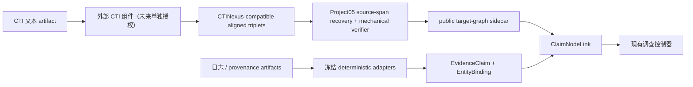

# Project05 主线证据编译层 WP3 组件复用审计 v0.1

日期：2026-07-17  
状态：`component_scope_frozen_for_adapter_implementation`  
范围：CTI/日志语义组件的 revision、license、I/O 与运行可行性  
非目标：安装组件、下载模型、调用付费 API、运行 C07–C12、形成性能结论

## 1. 裁决

现有组件已经覆盖 Project05 编译层的多个子问题，但**没有一个候选能在当前权限与硬件边界下直接成为完整、无模型的 `REUSE-HYBRID`**：

- CTINexus 最适合做 CTI 侧输出合同，但其 IE、类型、实体对齐和 link prediction 均依赖生成模型或 embedding；
- OntoLogX 对“原始日志与图节点共同持久化”的设计最接近来源可追溯要求，但运行需要 LLM、embedding、Neo4j 与 Python 3.13；
- Matryoshka 可作为确定性解析器生成的强前作，但 GPL-3.0 代码不进入 Project05；
- Auto-Prov 仍只有论文，作者声明的仓库在 2026-07-17 返回 404；
- TACTIC-KG 的 supporting-sentence verifier 很有价值，但仓库无代码许可证，不能复制。

因此 WP3 冻结的实现路径是：

本轮只实现 C→D→E 的兼容合同与 stub，并复用已经冻结的 G→H。B 不运行，第三方代码不复制。

## 2. 检索与复核方法

WP2/M2 审阅通过后，按 WP3 预注册候选复核：CTINexus、OntoLogX、Matryoshka、Auto-Prov、TACTIC-KG。

- Parallel CLI：已安装，版本 0.7.1，位置 `C:/Users/35393/.local/bin/parallel-cli.exe`；当前未认证，因此没有伪造 Parallel 检索结果；
- 学术证据：继承已冻结 prior-art 包中的 arXiv、Crossref、OpenAlex、Semantic Scholar、论文全文与 DOI 记录；
- 代码证据：2026-07-17 通过 GitHub 公共 API 读取仓库状态、default branch、HEAD commit、license、根目录、recursive tree 与关键文件 Git blob；
- 包证据：通过 PyPI JSON API 核对 CTINexus 0.2.1 wheel/sdist SHA-256；
- 纳入条件：官方仓库可定位、代码许可证明确、I/O 可映射、依赖可声明；
- 复用条件：不接触 C07–C12 答案、不要求当前未授权的模型/API/环境、不把论文许可证误当代码许可证。

完整机器记录见 `llm-evidence-compiler-wp3-component-reuse-metadata-v0.1-20260717.json`。

## 3. 逐组件审计

| 组件 | 固定 revision | 许可证 | 可执行性 | WP3 决定 |
|---|---|---|---|---|
| CTINexus | `0c688536...ff865` | MIT | package 可得，但 IE/ET/EA/LP 需要 LLM/embedding | 选为输出 profile；暂不安装/运行 |
| OntoLogX | `6ed386e6...16b7f` | MIT | Python 3.13 + LLM + embedding + Neo4j | schema/来源设计参照 |
| Matryoshka | `2ee96934...cd2a` | GPL-3.0 | 可生成确定性 parser，但许可不适合 vendor | 算法参照，不复制 |
| Auto-Prov | 仓库 404 | 不可得 | 无法复现代码 | 论文强前作 |
| TACTIC-KG | `5df3b630...ed4d` | 无仓库许可证 | 可见源码不等于可复制 | 论文/接口参照，不复制 |

### 3.1 CTINexus

CTINexus 0.2.1 接受 CTI text/file/URL，返回：

- `IE.triplets`；
- `EA.aligned_triplets`；
- `LP.predicted_links`；
- entity-relation graph。

这是最容易映射为 Project05 target-graph sidecar 的候选。其 PyPI wheel SHA-256 为 `ee45eef7d719b5eda187455ddc9262967a36a1595785f190e9062080d4a1c003`，sdist 为 `d57e7e7ab3b1b253d4208ce5b789f79ce352684aeba04931458dadcb0d78962e`。

但它不是无模型 parser：`litellm` 用于生成，entity merger 调 embedding API，Ollama 路径也要求本地模型。因此本轮只接受其 JSON shape，不产生 CTINexus 性能结果。

### 3.2 OntoLogX

OntoLogX 的 `GraphDocument` 保存节点、关系和 originating source event，Pydantic dynamic model 限制 ontology node/relation types，并在 main parser 中迭代修正结构化输出。这些都是 Project05 可借鉴的接口纪律。

完整运行需要：Python `>=3.13,<3.14`、LangChain、LLM backend、embedding backend、Neo4j、RDFLib/SHACL。默认配置还引用 70B parser/evaluator、32B coder 与 Foundation-Sec-8B，明显超出当前 2080 Ti 和“禁止下载模型”权限。因此不进入本轮 runtime。

### 3.3 Matryoshka

Matryoshka 证明了“LLM 生成 parser，正式 ingest 由确定性 parser 执行”是成熟路线，构成 Project05 不可回避的日志规范化前作。仓库为 GPL-3.0；本项目只实现独立合同，不 vendor 或改写其源码。

### 3.4 Auto-Prov 与 TACTIC-KG

Auto-Prov 已完成异构日志到 provenance graph 的主要创新子问题，Project05 不声称首创。但官方仓库仍 404，无法包装。

TACTIC-KG 将 extraction、typing、verification、curation 分离，并强调 supporting sentence。其仓库没有许可证；Project05 只独立实现“输入来源中机械恢复支持句”的通用验证规则，不复制代码、prompt 或训练数据。

## 4. 选定的 clean-room 兼容合同

WP3 adapter 只接受一个窄化 profile：

1. component revision 与 license 必须在冻结 catalog 中；
2. 输入必须来自当前 public request 内 `cti_text` artifact；
3. 外部 triplet 只能提供 subject/relation/object，不直接成为 controller edge；
4. wrapper 必须在同一 public record 中找到同时包含 subject 与 object 的最小支持句；
5. 无支持句、未知 pointer、未知 revision、actor/campaign 越级或重复边全部 fail closed；
6. 输出使用 request-scoped IDs，不出现 canonical claim/node/action IDs；
7. wrapper 输出只是 Stage-B target-graph sidecar；未完成 target mapping 前不能进入控制器。

这个合同比 CTINexus 原生输出更严格，因为 CTINexus 的 aligned triplet 并不天然携带 Project05 所需的逐边 source span。

## 5. 当前数据上的可证伪结论

WP2 的 C04–C12 public artifacts 只有 `local_log`、`host_forensics`、`provenance_graph` 和 `network_summary`，没有冻结的 `cti_text` artifact。因此：

- 可以完成 adapter 单元 Gate；
- 可以证明无 CTI 文本时显式 abstain；
- 不能在不新建数据 amendment 的情况下声称 CTINexus/OntoLogX 已在 Project05 案例上运行；
- Stage A 的 `REUSE-HYBRID` 日志侧只能复用 `RULE-STRONG`，不会产生虚假的组件增益；
- Stage B 的真实 component Gate 必须等待“冻结 CTI 文本 artifact + 单独模型/runtime 授权”。

## 6. 文献与代码来源

- [Cheng et al., 2025 — CTINexus](https://doi.org/10.1109/EUROSP63326.2025.00057)
- [CTINexus official repository](https://github.com/peng-gao-lab/ctinexus)
- [OntoLogX, arXiv:2510.01409](https://arxiv.org/abs/2510.01409)
- [OntoLogX official repository](https://github.com/LucaCtt/ontologx)
- [Matryoshka, arXiv:2506.17512](https://arxiv.org/abs/2506.17512)
- [Matryoshka official repository](https://github.com/julien-piet/matryoshka)
- [Auto-Prov, arXiv:2603.17100](https://arxiv.org/abs/2603.17100)
- [TACTIC-KG, arXiv:2607.05001](https://arxiv.org/abs/2607.05001)
- [TACTIC-KG repository, no code license observed](https://github.com/mohaminemed/TACTIC-KG)

## 7. 实施授权边界

本审计授权继续实现：

- component catalog；
- CTINexus-compatible normalized triplet schema；
- source-span recovery / rejection adapter；
- synthetic unit fixture；
- 无 `cti_text` 时的 development explicit-abstention Gate。

仍不授权：

- `pip install ctinexus` 或 OntoLogX；
- Ollama/Qwen/Llama/embedding 下载；
- OpenAI/Gemini/AWS API 调用；
- CTINexus 自带 annotation/demo/test 数据进入 Project05 正式输入；
- C07–C12 自动条件运行；
- 将 interface pass 写成组件性能提升。
