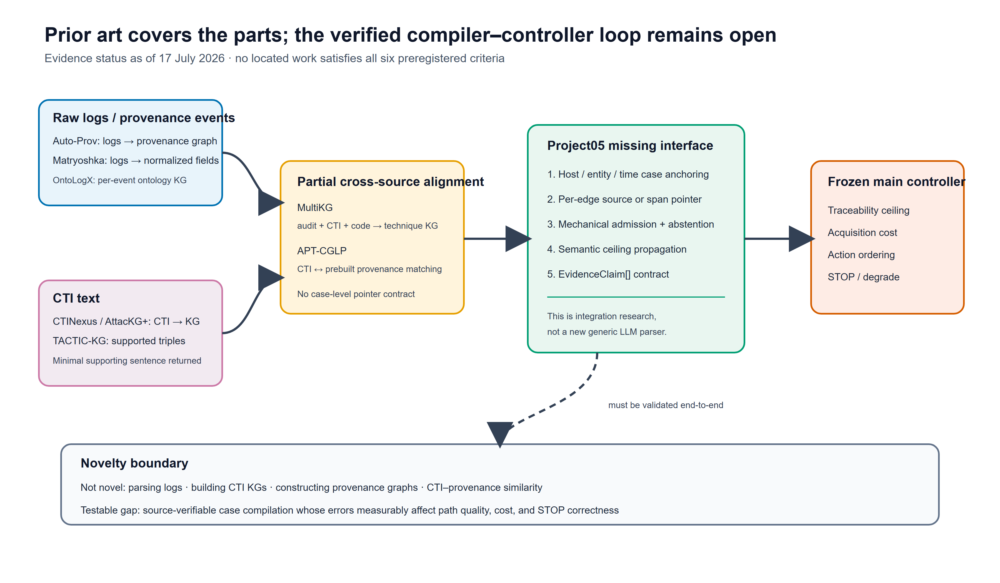

# LLM 语义建图层 prior-art 调研与 Project05 主线合并裁决 v0.1

日期：2026-07-17  
状态：`review_complete_for_architecture_decision`  
裁决：`fragmented_prior_art`  
实施授权：无；本稿不授权下载模型、训练、改动冻结实验或撰写正向结果

## 1. 结论先行

没有找到一项工作同时完成以下完整闭环：

```text
原始/半结构化日志 + CTI
  -> LLM 跨源语义对齐
  -> 带逐边来源指针的案件级 provenance 图
  -> 自动判断当前证据可支持到何种溯源粒度
  -> 在获取成本约束下选择下一取证动作或 STOP
```

但“LLM 编译层没人做过”这一宽泛判断是错误的。关键子问题已有强前作：

- [Auto-Prov](https://arxiv.org/abs/2603.17100) 已做异构原始日志到 provenance graph 的自动构建，并把图交给四类 provenance 异常检测器。Project05 不能再宣称首次用 LLM 从日志构图。
- [MultiKG](https://arxiv.org/abs/2411.08359) 已融合审计日志、CTI 和静态代码，但输出是从受控攻击执行中汇总的 technique-level attack knowledge graph，不是当前案件的证据图。
- [APT-CGLP](https://arxiv.org/abs/2511.20290) 已做 CTI 与既有 provenance subgraph 的跨模态语义匹配，但不生成带来源指针的新案件图，也不选择取证动作。
- [TACTIC-KG](https://arxiv.org/abs/2607.05001) 已做 CTI 的 span-level 三元组抽取、逐三元组 `SUPPORTED/NOT_SUPPORTED` 校验和最小支持句返回。Project05 不应重新发明 CTI 文本证据校验器。
- [Matryoshka](https://arxiv.org/abs/2506.17512)、[OntoLogX](https://arxiv.org/abs/2510.01409) 和 [CTINexus](https://doi.org/10.1109/EUROSP63326.2025.00057) 分别覆盖日志规范化、日志事件 KG、CTI 抽取与实体对齐。

因此，建议终止“独立 Paper B + 自建 QLoRA 编译器”作为默认路线，把 LLM 合并为主线前端。可辩护的新研究对象不是一个新的通用解析器，而是：

> 一个经来源校验的案件级证据编译器—控制器接口：把日志、CTI 与既有 provenance 事件编译为可回指、可弃权、受语义上限约束的 `EvidenceClaim`/图边，然后由 Project05 既有控制器判断可支持的溯源粒度，并在成本约束下选择取证顺序或 STOP。

这项主张仍须通过端到端实验才能成立；在出结果前不能写成“首次”或正向贡献。



图示说明：蓝/紫框为日志与 CTI 的已有组件，黄色框为已有的部分跨源对齐，绿色框为 Project05 尚需验证的案件级证据契约，橙色框为冻结的主线成本控制器。箭头表示数据/接口流，虚线表示尚未由实验建立的端到端因果主张。

## 2. 调研问题与判据

完整前作必须同时满足六项：

1. 输入至少覆盖日志、CTI、provenance events 中两类；
2. LLM 完成跨来源语义对齐；
3. 输出为案件级、可映射到系统 provenance 节点/边的图；
4. 每条关键边回指原始记录或文本 span；
5. 图被自动调查/溯源控制器实际消费；
6. 下游显式处理取证成本、动作顺序、可溯源性或 STOP 中至少一项。

其中，“图交给异常检测器”只算第 5 项的部分覆盖；论文中的推理耗时、API token 费用或图匹配 cost function 不等于第 6 项所指的证据获取成本。

## 3. 检索覆盖与限制

- 检索日期：2026-07-17。
- 数据源：OpenAlex、arXiv、Crossref、Semantic Scholar；另核对论文全文和官方 GitHub 仓库。
- OpenAlex：14 组查询，274 个源内去重候选。
- arXiv：6 组查询，80 个源内去重候选。
- Crossref：8 组查询，每组最多 30 条，作为 DOI/正式版本补充。
- Semantic Scholar：全部请求返回 HTTP 429，记为“数据库不可用”，不记为零命中。
- 核心全文：16 篇；另有 2 篇仅获得摘要。`2509.01271` 与 `2507.10873` 的 arXiv HTML 端点返回 404。
- Parallel CLI 已安装，但本机尚无 `PARALLEL_API_KEY`/登录凭据，因此本轮结论基于上述公开学术 API、已获取全文与 GitHub 公共 API。它是检索局限，不改变已确认的强前作事实。

本调研属于新颖性/范围综述，不是带双人独立筛选的医学式系统综述；结论措辞采用“本轮未发现”，而不是绝对断言“从未存在”。

## 4. 证据综合

### 4.1 日志到结构/图：已有成熟前作

Auto-Prov 是最直接的创新性威胁。其 Candidate Provenance Extractor 从代表性原始日志中抽取实体、方向、交互类型与时间，随后由较小模型生成正则规则，在流式日志上产生 provenance records 并连成 provenance graph。图随后被 Flash、MAGIC、OCR-APT、Kairos 等检测器消费。其缺口是：不输入 CTI，不明确把每条正式图边保留为可供外部审计的原始记录/span 指针，也不做成本约束的证据获取。

Matryoshka 的产物不是图，而是“语法解析—语义命名—OCSF/UDM 映射”的确定性解析器。它非常适合作为日志入口基线，但 GPL-3.0 代码不宜直接 vendoring 到 Project05。OntoLogX 可把单条原始日志转成 ontology-grounded event KG，并把 originating log event 一同持久化；它明确不重建完整攻击叙事，跨事件推理留给后续阶段。

结论：日志解析/日志构图不能作为 Project05 的独立创新；可以借鉴或包装，但必须把研究重心移到后续证据契约与控制闭环。

### 4.2 CTI 到图与来源校验：已有可复用组件

AttacKG+ 与 CTINexus 已分别完成 CTI 行为图抽取和 CTI KG 的实体对齐/关系补全。TACTIC-KG 进一步把 extraction、typing、verification、curation 拆开，并要求 verifier 在闭世界条件下仅使用输入文本，返回最小支持句。这与 Project05 需要的来源校验非常接近。

但 TACTIC-KG 只处理 CTI 文本，输出 CSKG；没有把 CTI 实体锚定到具体主机、进程、文件、socket 与时间窗，也没有接入取证控制器。其仓库当前无代码许可证，不能直接复制实现。CTINexus 为 MIT 且已提供 Python package，是更适合作为可执行基线的 CTI 组件；如需要 TACTIC-KG 式 verifier，应依据论文进行最小 clean-room 实现，或先向作者确认许可。

### 4.3 多源融合与 CTI–provenance 对齐：已做一半

MultiKG 是唯一定位到的“审计日志 + CTI + 静态代码”强交叉工作。它在完全可控的 Atomic Red Team 执行环境中按 technique ID 聚合多源图，目标是获得更完整的通用攻击技术图。其局限决定了它不能替代 Project05 编译层：

- 对齐键依赖已知 technique 编号和受控攻击执行，而不是未知案件中的 host/time/entity anchoring；
- 输出是 technique-level 知识，不是某次调查中“已看见/尚未获取/冲突”的案件证据状态；
- 没有逐边来源指针；
- 下游仅以案例说明可辅助匹配/检测，没有证据获取动作或 STOP。

APT-CGLP 绕过 CTI-to-query-graph 的信息损失，直接学习 CTI 文本与 provenance subgraph 的相似性。它证明“CTI–provenance 语义对齐”本身也不能再作为独立创新，但它输出匹配概率而不是可执行证据边，也不解决下一步应获取什么证据。

### 4.4 LLM 调查系统：会检测/解释，不会受控取证

[OCR-APT](https://doi.org/10.1145/3719027.3765219) 和 [OMNISEC](https://arxiv.org/abs/2503.03108) 都是在预先构建的 provenance graph 上先检测异常，再让 LLM 生成攻击叙事或判定异常；它们不是证据编译层。[Automated Attack Investigation](https://arxiv.org/abs/2509.01271) 的摘要声称在 430 万条异构日志上迭代检索威胁知识并扩展调查上下文，是最接近自动调查的工作之一，但现有摘要未声称逐边来源指针、外部证据获取成本或 STOP；全文尚未取得，因此这些字段标为未知/未证实，而非否定事实。

当前未发现任何 LLM 系统把编译出的案件图交给一个同时执行“可支持溯源粒度判定 + 成本约束证据动作排序 + STOP”的控制器。

## 5. 六项判据结果

`Y` 表示明确满足，`P` 表示部分/间接满足，`N` 表示不满足，`U` 表示全文不足以判断。

| 工作 | 多类输入 | LLM 跨源对齐 | 案件 provenance 图 | 来源指针 | 自动控制 | 成本/顺序/STOP |
|---|---:|---:|---:|---:|---:|---:|
| Auto-Prov | N | N | Y | P | P | N |
| MultiKG | Y | P | P | N | P | N |
| APT-CGLP | Y | Y | N | N | P | N |
| TACTIC-KG | N | N | N | Y | N | N |
| OntoLogX | N | P | N | P | N | N |
| Matryoshka | N | P | N | P | N | N |
| TRACE | N | P | N | P | N | N |
| Automated Attack Investigation | P | P | P | U | P | N |

没有一行达到六项全 Y，因此不是 `complete_precedent`。能力又明显分散在多个系统中，而非一个成熟的案件级编译器只差成本控制器，故最终判为 `fragmented_prior_art`，而不是 `partial_compiler_precedent`。

详细逐篇字段见 `prior-art-evidence-matrix.csv`，筛选状态见 `screening-matrix.csv`。

## 6. 对 Project05 的直接影响

### 6.1 应当合并到主线，而不是保留独立 Paper B

Project05 现有 `evidence_claim.schema.json` 已经定义了几乎完整的编译目标：

- `case_id`；
- 原子 `subject-predicate-object`；
- `source_type`；
- `time_window`；
- `source_pointer`（artifact、line、record、hash）；
- `observable_status`；
- tactic/technique 映射与 confidence。

现有 `alignment_state.schema.json` 又把 claim 编译为 CTI node/edge coverage、冲突、可支持粒度与 budget 状态；`run_mvp.py` 已实现成本约束动作选择和 STOP。换言之，主线缺的不是另一个 LLM planner，而是把手工编写的 `evidence_claims.json` 自动、可审计地生成出来。

最小正确集成点应是：

```text
raw evidence
  -> optional source adapters
  -> compiler candidates
  -> mechanical admission + source verification
  -> EvidenceClaim[]  ← 唯一正式接口
  -> existing alignment_state
  -> existing cost-aware planner / STOP
```

LLM 不应直接看到隐藏 claim、oracle 标签、可恢复结果或 planner 的真值字段，也不应直接选择取证动作。这样既符合主线信息边界，也避免把论文重新变成“LLM agent 做一切”。

### 6.2 复用与自研边界

| 模块 | 处理方式 | 原因 |
|---|---|---|
| 日志语法/字段规范化 | Matryoshka 思路作基线；不直接拷贝 GPL 代码 | 该问题已有成熟前作 |
| 原始日志到 provenance records | 对照 Auto-Prov；代码仓当前 404，先实现兼容 adapter 合约而非复刻整套系统 | 避免把通用构图冒充创新 |
| CTI 实体/关系抽取 | 优先包装 MIT 许可 CTINexus | 已有 package 和实体对齐实现 |
| CTI 支持句校验 | clean-room 实现 TACTIC-KG 式最小 verifier，或等待许可 | 方法已公开，代码无许可证 |
| CTI–本地证据案件锚定 | Project05 自研 | 现有系统多为 technique ID 对齐或相似度检索 |
| source pointer、语义上限、弃权/admission | Project05 自研并机器校验 | 是编译器接入控制器所需的可信边界 |
| 成本规划与 STOP | 复用 Project05 现有主线 | 这才是编译结果的执行消费者 |

完整许可核对见 `code-reuse-audit.csv`。

## 7. 论文创新应如何改写

不能再写：

- “首次利用 LLM 解析安全日志”；
- “首次由日志构建 provenance graph”；
- “首次将 CTI 转为攻击图”；
- “首次做 CTI–provenance 语义对齐”；
- “提出新的 APT 领域 LLM/QLoRA”。

可以在实验支持后写成：

1. **经证据约束的编译—控制接口**：统一表示 CTI 文本跨度、日志记录和 provenance 事件，要求每条进入控制器的边可回指来源并通过机械 admission。
2. **案件级跨源锚定**：把 technique-level/文本级知识收缩为 host、entity、time、event 可验证的案件图；不能锚定的内容保留为未决或弃权，而不补全成事实。
3. **语义上限传播**：编译器输出不仅是图，还声明当前证据最多支持到哪一溯源粒度，控制器据此避免 over-attribution。
4. **端到端调查效用**：首次需要被证明的不是抽取 F1 单点，而是编译误差如何影响可溯源性、路径质量、总获取成本与 STOP 正确性。

“首次”一词仍需等补齐两篇摘要-only 全文、Parallel 补检与正式实验后再决定。当前安全措辞是：

> 在本轮检索范围内，未发现把来源可验证的多源案件证据编译与成本感知溯源控制闭环统一起来的系统。

## 8. 下一阶段最小研究设计

本调研支持进入“接口设计”，但不支持立即训练 QLoRA。

建议下一份仅写 Markdown 的设计稿聚焦三个问题：

1. 编译层能否在冻结测试案例上稳定生成 schema-valid、pointer-valid、ceiling-valid 的 `EvidenceClaim`？
2. 与规则/人工编译相比，受约束 LLM 编译是否减少人工字段修正，同时不增加 unsupported edge 与错误案件锚定？
3. 把编译输出交给同一个冻结控制器后，路径质量、over-attribution、总成本和 STOP correctness 如何变化？

基线应至少包括：

- 现有人工 `evidence_claims.json`：oracle/reference ceiling，不作为可部署基线；
- 规则/既有 case compiler；
- 可包装组件：CTINexus + 机械 verifier；
- 通用 LLM structured compiler；
- LLM-direct：只作越界/幻觉安全对照，不进入正式控制器。

只有在 off-the-shelf structured compiler 明确不能达到冻结 admission Gate，且失败可归因于任务格式而非数据泄漏/上下文截断时，才重新评估 QLoRA。先前为独立 Paper B 准备的大规模训练来源与 train-null 方案不再是默认前置任务。

## 9. 风险与待补证据

1. Auto-Prov 论文声称公开代码，但目标仓库在 2026-07-17 返回 404；不得声称已可直接复用。
2. TACTIC-KG 论文采用 CC BY 4.0，但 GitHub 仓库无代码许可证；论文许可不自动覆盖代码。
3. Matryoshka 是 GPL-3.0；直接合并可能改变衍生代码的分发义务。
4. Automated Attack Investigation 与 SHIELD 目前仅按摘要判定；全文取得后需复核来源指针和控制闭环字段。
5. Semantic Scholar 429、Parallel 未认证使召回率存在不确定性；因此结论是保守的新颖性裁决，不是绝对优先权意见。

## 10. 最终裁断

**不应继续把 LLM 做成独立于主线的“附加算法/新 Paper B”。**

应该把它降到且固定在一个明确位置：

> LLM 负责把散乱证据编译为可验证的案件图边；Project05 主线负责判断这些边足以支持什么结论，以及下一份证据是否值得付出成本去获取。

前人的工作已经完成了“解析、抽取、构图、文本—图对齐”的大部分零件；Project05 值得研究的剩余问题，是这些零件如何通过来源指针、案件锚定和语义上限形成一个不会越权的执行接口，并在真实的成本/STOP 控制闭环中产生可测价值。
