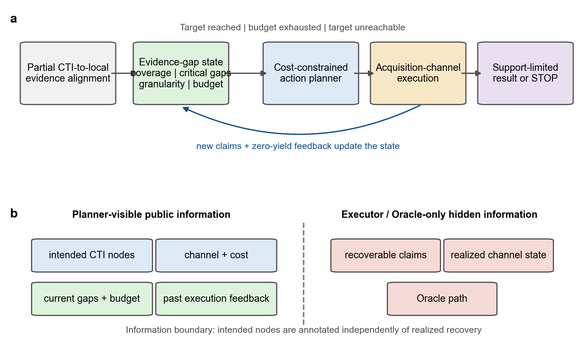
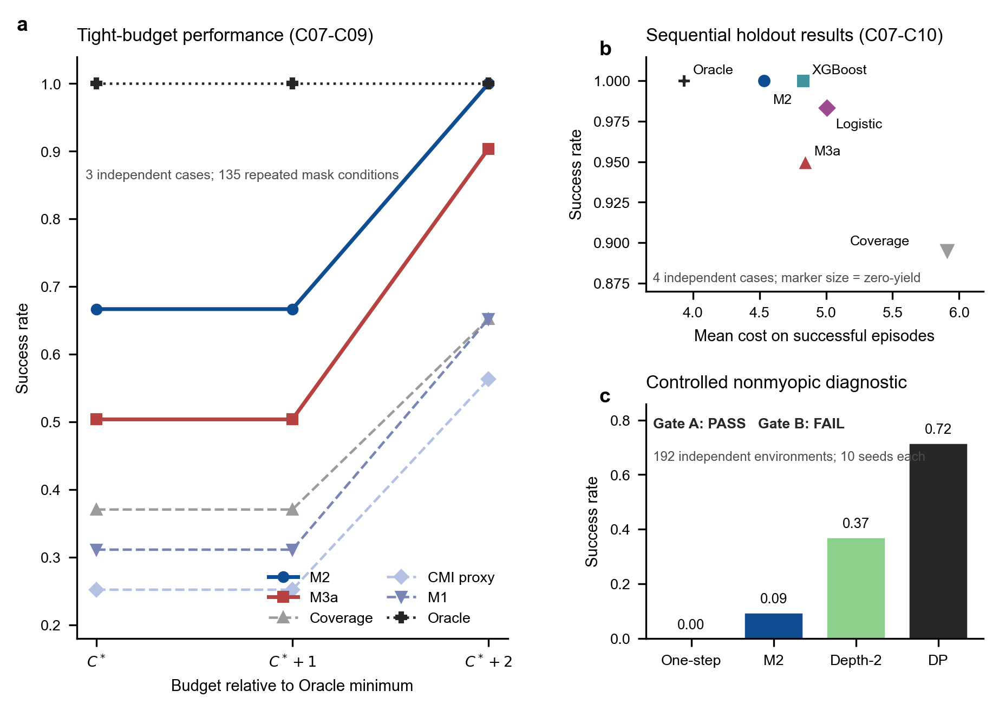

# 不完整证据下的 APT 归因：对齐感知证据缺口与成本约束主动取证

**英文题目（暂定）**：Alignment-Aware Evidence-Gap Modeling and Cost-Constrained Active Acquisition for APT Attribution under Incomplete Evidence

**作者与单位**：待确认

## 摘要

APT 归因依赖威胁情报描述与本地遥测证据之间的关联，但真实调查中的关键日志、采集通道和攻击阶段通常并不完整。现有方法多聚焦情报抽取、攻击图对齐或攻击者分类，较少直接回答证据不足时下一步应采集什么、何时停止以及当前证据最多支持何种归因粒度。本文将这一问题形式化为对齐之后的成本约束主动取证任务：将 CTI 行为图与 evidence claims 的部分对齐转化为可更新的证据缺口状态；将公开动作意图与隐藏实际恢复结果隔离；并在统一接口下比较规则、监督学习、Oracle、显式 STOP 与非短视规划。实验包含六个开发案例、四个参数锁定真实案例、通道失效与部分可达压力测试，以及 192 个受控非短视环境。C07-C10 上，M2 与 XGBoost 的序贯成功率均为 1.0000，平均成功成本分别为 4.5333 和 4.8278；M3a 的成功率为 0.9500，并在 C10 出现 0.2000 的过早停止。三案例紧预算实验中，M2 在 $C^*$、$C^*+1$ 和 $C^*+2$ 下的成功率分别为 66.67%、66.67% 和 100.00%，均高于 M3a。受控诊断中，一步贪心从未达到目标，完整动态规划的成功率为 0.7156，表明多步规划在所构造环境中具有必要性；但完整规划的中位耗时仅 0.7692 ms，因此当前证据不支持启动 DQN。本文的主要增量不是某一学习器的全面胜出，而是把部分对齐转化为可审计、可停止且受预算与证据粒度共同约束的调查决策问题，并用正结果和负结果共同界定其适用范围。

**关键词**：APT 归因；证据不完整；主动取证；证据缺口；归因粒度；成本敏感决策；非短视规划

## 1 引言

APT 调查面临一个长期存在但常被评价协议掩盖的矛盾：系统需要在证据并不完整时辅助归因，而归因模型通常被要求直接输出一个 actor、campaign 或 technique 标签。CTI 报告可以描述较完整的行为链，本地环境却可能只保留部分进程、文件、注册表或网络事件；网络遥测离线、日志窗口过窄和主机侧采集缺口都会使同一攻击在不同现场呈现不同证据子集。在这种条件下，继续追求单次分类置信度容易把“尚未观察到”误写成“不存在”，也容易在证据不足时输出超过证据承载能力的归因结论。

POIROT 展示了 CTI 查询图与审计日志图之间行为对齐的价值 [@milajerdi_poirot_2019]；EXTRACTOR 与 AttacKG 则推动了从自然语言报告中抽取攻击行为和构建 technique graph [@kiavash_satvat_extractor_2021; @zhenyuan_li_attackg_2022]。近年来，TAA-EPLMR、AURA、APT-ATT、APTChaser、MM-AttacKG 和 LLMAPT 分别探索了证据路径增强的大模型推理、多智能体知识增强归因、异构威胁情报表示、攻击技术建模、多模态攻击图构建和多源 LLM 归因框架 [@xiao_taa-eplmr_2025; @rani_aura_2025; @cai_apt-att_2025; @zhang_aptchaser_2025; @zhang_mm-attackg_2025; @alshamrani_llm-based_2026]。这些研究增强了“已有证据如何表示和推理”的能力，但尚未共同解决另一类决策问题：当现有证据不足以支持目标粒度时，系统应执行哪个取证动作，动作失败后如何更新判断，以及何时应停止而不是继续生成结论。

本文不再把“缺失证据列表”视为最终输出，而是把它转化为序贯决策的中间状态。系统接收 CTI 行为图、可回指来源的 evidence claims、候选取证动作、采集通道、预算和目标粒度，输出下一条取证动作；若目标已经达成、预算不足或结构上不可达，则输出受证据上限约束的 STOP/降级结果。这样，图对齐成为主动调查的起点，缺失证据成为可操作的状态，而 LLM 被限制在可审计的语义编译与解释接口，不被默认赋予不可验证的在线决策权。

本文的贡献如下。第一，提出对齐感知证据缺口状态，将节点/边覆盖、关键缺口、阶段覆盖、预算和可支撑归因粒度放入统一决策状态。第二，提出公开动作意图与隐藏恢复结果分离的信息边界，结合通道门控避免规划器以声明目标间接读取答案键。第三，构建包含规则、监督学习、Oracle、STOP 和有限深度/完整规划的统一实验框架，使正结果与负结果都可定位到状态、动作或策略层。第四，在 DARPA TC E5 与 OpTC 编译的四个参数锁定案例上进行描述性复现，并通过紧预算、不可达、部分可达和非短视诊断明确方法边界。本文尤其保留三个负结果：显式 action-gap 兼容性没有超过 M2，XGBoost 没有超过 M2，当前规模没有支持 DQN 必要性。

## 2 相关工作

### 2.1 CTI 行为抽取、图构建与证据对齐

CTI 文本只有被转换为结构化行为表示，才能与本地事件建立可计算联系。EXTRACTOR 从威胁报告中抽取攻击行为，AttacKG 将 technique 及其关系组织为攻击知识图，MM-AttacKG 又把多模态信息与大模型用于攻击图构建 [@kiavash_satvat_extractor_2021; @zhenyuan_li_attackg_2022; @zhang_mm-attackg_2025]。POIROT 则从另一侧出发，把攻击行为查询与内核审计记录进行图匹配 [@milajerdi_poirot_2019]。这条研究线回答了“怎样得到图”和“怎样匹配图”，也是本文状态构造的上游基础。本文不替代抽取器或对齐器，而是研究部分对齐之后如何继续采证。

### 2.2 APT 归因与大模型辅助推理

TAA-EPLMR 通过证据路径增强 LLM 的威胁行为者归因推理，AURA 使用知识增强多智能体框架组织归因任务，APT-ATT 结合异构威胁情报表示与 CTGAN 改善闭集归因，APTChaser 则基于攻击技术建模进行威胁归因 [@xiao_taa-eplmr_2025; @rani_aura_2025; @cai_apt-att_2025; @zhang_aptchaser_2025]。LLMAPT 已把多源情报、LLM 语义分析、置信度和解释接口组合进同一框架；ExCyTIn-Bench 则开始评价 LLM agent 的多步威胁调查能力 [@alshamrani_llm-based_2026; @yiran_wu_excytin-bench_2025]。这些工作说明行为路径、异构表示和语言推理能够增强证据组织，但其核心输出仍主要是归因判断、候选实体或调查回答。本文把输出前移为调查控制：当证据只支持较粗粒度结论时，系统先决定补什么证据或停止，不让语言流畅性替代证据充分性。

### 2.3 主动特征获取与非短视规划

主动特征获取研究把每个未观测特征视为具有成本的动作，在预测效用与获取成本之间进行序贯权衡 [@aronsson_survey_2025]。NOCTA 强调非贪心的长期目标与成本权衡，WinRegRL 则把强化学习用于 Windows 注册表事件响应中的调查规划 [@noauthor_nocta_2025; @ghanem_leveraging_2026]。这些工作为本文提供了决策理论参照，但网络安全证据采集与通用 AFA 存在三点差异：证据动作可能跨通道失效，动作意图不等于实际可恢复内容，最终输出还受证据支持粒度约束而非仅由分类损失决定。因此本文需要显式建模通道、来源指针、归因粒度和正当停止。

### 2.4 研究空缺

现有工作尚未形成一个同时满足以下条件的闭环：以 CTI-本地证据部分对齐为起点；将缺口构造成可更新状态；在不知道真实恢复结果时选择有成本的动作；在通道失败后利用反馈更新；并以可支撑粒度和 STOP 约束输出。本文的创新位置位于这一闭环及其信息边界，而不是重新包装多源融合、攻击图或通用 LLM 归因。

## 3 问题定义

### 3.1 输入、状态与动作

设 CTI 行为图为 $G=(V,E)$，其中节点表示攻击行为或 technique，边表示时间、因果或阶段依赖。当前可见证据为 claim 集合 $\mathcal{C}_t$，每条 claim 带有事件 UUID、日志行、文件位置或其他来源指针，并可覆盖一个或多个 CTI 节点。当前状态写为

\[
s_t=(V_t^{cov}, E_t^{cov}, U_t, K_t, D_t, g_t, B_t, H_t),
\]

其中 $V_t^{cov}$ 与 $E_t^{cov}$ 是已覆盖节点和边，$U_t=V\setminus V_t^{cov}$ 是未匹配节点，$K_t\subseteq U_t$ 是关键缺口，$D_t$ 是阶段和证据类型覆盖摘要，$g_t$ 是当前可支撑粒度，$B_t$ 是剩余预算，$H_t$ 是已执行动作及零收益反馈。当前实现采用 OR 覆盖语义：只要节点关联的任一 required claim 已可见，该节点即被覆盖。

候选动作集合为 $\mathcal{A}_t$。每个非 STOP 动作 $a$ 具有公开意图节点 $I(a)$、采集通道 $q(a)$、成本 $c(a)$ 和可选的期望效果摘要；真实可恢复 claim 集合 $R(a)$ 对规划器隐藏，只供环境执行与 Oracle 评价使用。公共动作 STOP 的成本为零。

### 3.2 可支撑归因粒度

本文采用从低到高的离散粒度格：`G0_unknown`、`G1_technique`、`G2_tactic_intent` 和 `G3_campaign`。实现中的可审计阈值为：节点覆盖率不低于 0.75、边覆盖率不低于 0.60 且关键节点全部覆盖时进入 G3；节点覆盖率不低于 0.45 且至少覆盖两个攻击阶段时进入 G2；节点覆盖率不低于 0.15 时进入 G1；否则为 G0。最终 $g_t$ 再由 `support_ceiling` 截断。该离散规则不是声称替代分析师，而是为实验提供稳定、可检查的“当前最多能说到哪里”。

### 3.3 决策目标

给定目标粒度 $g^\star$ 和预算 $B$，规划器在每一步选择 $a_t\in\mathcal{A}_t$。环境依据通道实现返回新 claims，随后更新状态。若在预算内达到 $g^\star$，episode 成功；若目标不可达或继续动作无正价值，系统应 STOP 并接受 $g_t$；若 Oracle 仍可达却停止，则记为过早停止。设 Oracle 最小达标成本为 $C^\star$，成功 episode 的成本遗憾定义为累计成本减 $C^\star$。

### 3.4 信息边界

公开意图 $I(a)$ 表示动作希望解决的调查问题，不能由隐藏恢复集合 $R(a)$ 反向生成。若二者在节点级恒等，即 $I(a)=\operatorname{ORCover}(R(a))$，所谓兼容性评分就会在通道在线时退化为答案键。本文因此实施编译期校验：除 STOP 和空意图噪声动作外，不允许公开意图与隐藏恢复集合的 OR 覆盖完全相等。运行时再由通道门控决定实际收益，规划器只在动作执行后看到零收益或新增 claim。这一边界保证规则模型和学习模型都只能使用部署时可获得的信息。

## 4 方法

### 4.1 总体流程

方法由五个模块构成：上游 evidence claim 编译、证据缺口状态构造、成本约束动作排序、通道执行与反馈、粒度重算及 STOP。结构化 CTI 与本地证据的对齐结果进入状态构造器；规划器仅读取公开状态-动作特征；执行器访问隐藏恢复集合并模拟或调用真实采集通道；更新器合并新 claims 并重新计算 $g_t$。因此对齐不是终点，缺口也不是静态列表，而是驱动下一动作的状态。

### 4.2 M2：规则部署锚点

M2 使用公开的期望粒度提升、不确定性下降、过度归因风险下降、阶段缺口、证据类型缺口、动作重叠、同类动作历史零收益比例和相对预算成本。其实现分数为

\[
2\Delta g+1.5\Delta u+1.5\Delta r+1.5d_{stage}+d_{evidence}-1.5o-r_{zero}-0.75\rho_c.
\]

其中各项均来自公开字段和执行历史，不读取隐藏恢复集合。M2 是目前跨真实案例表现最稳健的规划器，因此在本文中被定位为部署锚点，而不是需要被新模型强行击败的弱基线。

### 4.3 M3a：节点级 action-gap 兼容性

M3a 检验“公开动作意图与当前关键缺口更精细的匹配能否改善选路”。令 $T(a,s_t)=I(a)\cap U_t$，则非 STOP 动作得分为

\[
\operatorname{score}_{M3a}=\frac{8|T\cap K_t|+3|T|+2P+R-0.5c(a)}{c(a)},
\]

其中 $P=|T|/|I(a)|$，$R=|T|/|U_t|$，STOP 得分为 0。M3a 不读取通道可靠性先验，也不读取 $R(a)$。它是一个机制消融，不被预设为最终主模型；真实留出结果显示，仅强调意图-缺口重合会忽略成本、动作冗余和执行反馈，因而不能稳定超过 M2。

### 4.4 学习型策略

Logistic M3b 和 XGBoost 共享 16 个公开 state-action 特征，训练数据仅来自 C01-C06 开发案例，C07-C10 不参与训练或调参。监督标签描述动作在当前状态下的效用/可达性，序贯测试则把模型分数置于完整 episode 中，避免只用离线分类指标代替规划效果。XGBoost 使用 150 轮、深度 3、学习率 0.05、随机种子 11 的冻结设置。该设计回答的是“现有公开特征能否学到比线性模型更稳定的排序”，而不是把树模型称作大语言模型或强化学习模型。

### 4.5 STOP、通道反馈与降级

STOP 与取证动作在同一动作空间中竞争。目标已达时为达标停止；Oracle 也不可达时为正当降级；Oracle 仍可达时为过早停止。非 STOP 动作绑定具体采集通道，通道离线时返回空集合，零收益被写入 $H_{t+1}$。`support_ceiling` 独立约束最终粒度，防止局部新增证据导致越级输出。

### 4.6 非短视扩展及 DQN Gate

短视规则与监督排序都可能被高即时收益诱饵吸引，而忽略低即时收益但能解锁后续关键证据的动作。为判断是否值得引入 DQN，本文先构造两级 Gate。Gate A 要求受控环境稳定出现“单步最优不等于长期最优”；Gate B 要求有限深度或完整规划在计算上不可接受，才批准 DQN 工程。候选增强因此优先采用深度 2 搜索或小规模动态规划；DQN 只有在状态空间扩大后同时满足性能与复杂度门槛时才进入主模型。

### 4.7 LLM 的具体作用与边界

LLM 在本项目中是可选的离线语义编译器和解释器，而不是已经验证的在线规划器。它可以把 CTI 段落、IOC、日志摘要和 provenance 子图编译为符合 schema 的 evidence claims，草拟公开动作意图，并在规划结束后把状态轨迹转换为带来源指针的解释。所有输出必须经过结构校验、来源回指和 unsupported-claim 检测。已完成的主实验没有调用在线 LLM，因而本文不能把实验增益归因于 Qwen、SEVENLLM 或其他语言模型。未来只有在独立标注集上验证 schema 合规率、claim 准确率、来源指针正确率和下游策略影响后，LLM 才能作为实证模块进入标题或核心贡献。

## 5 实验设计

### 5.1 研究问题与可证伪判据

实验围绕三个研究问题展开。RQ1 问：在公开意图与隐藏恢复集合隔离后，证据缺口闭环能否在异构真实案例上达到目标粒度且不越过 `support_ceiling`？如果冻结规划器在参数锁定案例中频繁失败或出现 ceiling violation，则闭环的工程可执行性不成立。RQ2 问：节点级 action-gap 兼容性或监督学习排序能否相对 M2 降低达标成本？如果 M3a 或学习器在配对紧预算条件中不优于 M2，或者成功条件成本更高，则相应优越性假设被否定。RQ3 问：显式 STOP 能否区分不可达与过早放弃，以及是否存在短视策略系统失败而多步规划可恢复的环境？如果不可达压力中停止决策不能与 Oracle 对齐，或受控环境中多步规划不能稳定超过短视策略，则 STOP 或非短视必要性主张不成立。

### 5.2 案例与数据边界

C01-C06 用于开发、消融和学习器训练。参数锁定测试包含四个案例：C07 为 DARPA TC E5 THEIA Linux 的 Firefox Drakon/BinFmt-Elevate 链；C08 为 E5 ClearScope Android 的 Appstarter Micro APT Elevate 链；C09 为 OpTC Windows SysClient0201 的 Day 1 PowerShell Empire 链；C10 为 OpTC Windows SysClient0351 的 Day 3 恶意升级、反向连接与远程线程迁移链。C10 从 1.61 GB eCAR 分片中扫描 27,832,841 行，在锁定窗口抽取 37,301 行并编译 5/5 个预登记 motif。四个案例覆盖 Linux、Android 和 Windows，但只能称为四个参数锁定案例和两个主要 engagement/语料家族，不能称为四个独立数据源。

### 5.3 遮蔽、重复与统计单位

每个案例在不同初始遮蔽、强度和通道 seed 下重复运行，用于观察策略对同一攻击链的条件敏感性。C07-C10 每个规划器共 180 个 episode，但独立案例数是 4，不是 180。本文对这些结果作描述性比较，不进行把重复条件当独立样本的显著性推断。

### 5.4 基线与指标

基线包括 Coverage、CMI proxy、M1、M2、M3a、Logistic、XGBoost 和 Oracle。主指标为 success、成功条件下 cost-to-target、相对 Oracle 的 regret、zero-yield、premature STOP 和 ceiling violation。学习器同时报告 Accuracy、Brier、AUROC、平均精确率和 top-1 critical-gap hit，但模型选择以序贯 episode 结果为主。

### 5.5 压力测试

紧预算曲线把每个条件的预算设置为 $C^\star$、$C^\star+1$ 和 $C^\star+2$。真正应停压力移除关键可靠回退，使 Oracle 也不可达，用于评价正当降级。部分可达压力保留可靠回退但把预算收紧到恰好覆盖最短路径，用于区分“会停”与“会选路”。非短视 Gate 使用 192 个独立参数环境、每环境 10 个 seed，系统改变解锁深度、预算、诱饵数、诱饵即时收益和链路可靠性，共运行 7,680 个 episode。

## 6 结果

### 6.1 三案例冻结结果与紧预算曲线

C07-C09 上 M2 与 M3a 均达到 45/45 成功且没有 ceiling violation，但 M3a 的平均成本在三个案例上分别比 M2 高 0.6222、0.5333 和 0.4889，平均额外 regret 为 0.5481。将预算收紧后，差异更加明确。

| 方法 | \(C^\star\) | \(C^\star+1\) | \(C^\star+2\) |
|---|---:|---:|---:|
| Coverage | 37.04% | 37.04% | 65.19% |
| CMI proxy | 25.19% | 25.19% | 56.30% |
| M1 | 31.11% | 31.11% | 65.19% |
| **M2** | **66.67%** | **66.67%** | **100.00%** |
| M3a | 50.37% | 50.37% | 90.37% |
| Oracle | 100.00% | 100.00% | 100.00% |

在 135 个配对条件中，M3a 在三个预算档均没有一次净胜 M2。这一结果否定了“节点级兼容性必然改善成本效率”的原始假设，也使 M2 成为当前部署锚点。

### 6.2 C07-C10 学习器与序贯策略

XGBoost 在 990 条测试 state-action 行上的 Accuracy、Brier、AUROC、AP 和 top-1 hit 分别为 0.8051、0.1161、0.9243、0.8879 和 0.8667；Logistic 分别为 0.7939、0.1249、0.9239、0.8876 和 0.8389。XGBoost 在这些描述性指标上略优于 Logistic，但二者的 AUROC 几乎相同。

| Planner | Success | Mean cost | Regret | Zero-yield | Premature STOP |
|---|---:|---:|---:|---:|---:|
| Oracle | 1.0000 | 3.9333 | 0.0000 | 0.0000 | 0.0000 |
| **M2** | **1.0000** | **4.5333** | **0.6000** | 0.2667 | 0.0000 |
| XGBoost | **1.0000** | 4.8278 | 0.8944 | **0.2000** | 0.0000 |
| Logistic | 0.9833 | 5.0056 | 1.0565 | 0.3000 | 0.0167 |
| M3a | 0.9500 | 4.8421 | 1.0702 | 0.6111 | 0.0500 |
| Coverage | 0.8944 | 5.9068 | 2.1988 | 1.2667 | 0.1056 |

XGBoost 修复了 Logistic 的部分过早停止，并以低于 Logistic 的平均成本保持全成功，但仍比 M2 多消耗 0.2945 成本。因此支持的结论是“非线性学习排序优于线性对照”，不是“学习器优于规则规划”。

### 6.3 C10 错误分析

C10 中 Oracle、M2、XGBoost 和 Logistic 均达到 1.0000 成功率，平均成本依次为 4.0667、4.5556、5.0444 和 5.4444。M3a 成功率只有 0.8000；其成功条件成本 3.9722 看似更低，但该均值排除了失败 episode，不能用于优越性比较。C10 说明公开意图与关键缺口的静态重合不足以保证稳健 STOP，正好构成 M3a 的反例。

### 6.4 STOP 与部分可达负结果

在真正不可达压力中，Oracle 的可达成功率为 0.8148，约 18.52% 条件需要降级；M3a 和 M3b 与 Oracle 的停止判定对齐，表明显式 STOP 能表达“正确认输”。但在保留可靠回退、预算恰好够最短路径的 10 个部分可达条件中，Oracle 成功率为 1.00，静态和自适应 M3b 均约为 0.10，M3a 为 0.00。典型错误是先执行廉价但离线的死通道动作，随后因预算不足而 STOP。该结果表明，会识别不可达不等于会避开诱饵并选择可靠路径。

### 6.5 非短视 Gate

| Planner | Success | 成功条件均成本 | Premature STOP |
|---|---:|---:|---:|
| One-step gain/cost | 0.0000 | - | 0.1250 |
| 冻结 M2 | 0.0948 | 3.0000 | 0.2333 |
| Depth-2 + M2 | 0.3708 | 3.1770 | 0.0766 |
| DP Oracle | 0.7156 | 3.4367 | 0.0000 |

192 个环境中有 166 个出现 DP 相对 M2 的明显优势，平均 success 优势为 0.6208，因此 Gate A 通过：非短视规划具有结构必要性。DP 相对 Depth-2 仍有 0.3448 的优势，但 DP 冷启动中位耗时为 0.7692 ms、p95 为 83.9598 ms，最大状态展开数 23,892，均低于预设门槛，因此 Gate B 不通过。当前决策是使用轻量非短视规划而不启动 DQN。该结果不能外推为 RL 无效，只说明当前动作空间规模下完整或有限深度规划更可辩护。

## 7 讨论

### 7.1 方法贡献与技术边界

本文不是给已有归因器“加一层保护”。如果只在分类器后加置信度阈值，系统仍不知道下一步获取什么证据，也无法区分通道失败、预算不足和结构不可达。本文改变的是问题对象：输入不再是完整特征向量，输出也不再只是 actor 标签；调查被表示为具有公开意图、隐藏实现、成本、反馈和停止语义的序贯控制过程。证据缺口状态、信息边界与支持粒度共同决定哪些结论可说、哪些动作值得做。

### 7.2 为什么负结果仍然重要

M3a、Logistic 和 XGBoost 没有超过 M2，并不使项目失去价值。相反，它们排除了三种容易写进论文但并不成立的捷径：更细的 action-gap 匹配不自动等于更好规划；非线性学习器不自动等于更低调查成本；存在长期依赖不自动等于必须使用 DQN。把这些边界通过冻结协议和反例写清楚，能让后续方法开发从真实失败出发，而不是继续叠加模型名称。

### 7.3 LLM 与图谱的合理位置

图谱没有被剔除，它承担 CTI 行为结构、关键节点和覆盖关系的载体；本文只是不把图神经网络设为默认规划器。LLM 也没有被剔除，但其合理作用是将多模态原始材料编译为统一 claims、辅助意图标注和生成带证据指针的解释。在线动作选择当前由可审计规则和小型监督模型完成。这样的模块分工使未来多模态与 agent 支线可以接入同一 schema，而不会改变主实验的因果解释。

### 7.4 局限性

第一，真实参数锁定案例只有四个，且来自两个主要数据家族，不能支持广泛统计泛化。第二，evidence claims 和动作空间仍由规范与脚本编译，尚未测量人工标注一致性及 LLM 编译误差。第三，可支撑粒度阈值是工程化代理，不等同于真实组织中的法律或情报置信标准。第四，非短视 Gate 是存在性诊断，不估计真实调查中长期依赖的发生率。第五，DP 使用完整转移概率，只作为规划上界；将其转化为部署方法仍需学习或估计通道转移模型。

## 8 结论

本文针对证据不完整条件下的 APT 归因，建立了对齐感知证据缺口状态和成本约束主动取证闭环。系统在不读取隐藏恢复结果的前提下选择下一动作，并以通道反馈、预算、支持粒度和显式 STOP 控制输出。四个参数锁定真实案例表明 M2 仍是当前最稳健的部署锚点，XGBoost 可改善线性对照但尚未超过 M2，M3a 的静态节点兼容性假设在 C10 和紧预算实验中被证伪。非短视诊断进一步表明，在所构造的先决依赖环境中需要更深规划，但当前没有引入 DQN 的必要。后续工作的优先级应是把轻量非短视规划接入真实案例、建立独立的 claim/意图标注评测，并扩大跨 engagement 案例数量；LLM、多模态和 agent 则作为受 schema 与来源约束的扩展模块，而不是替代证据本身。

## 数据与代码可用性

本文使用的 DARPA TC E5 与 OpTC 原始数据受各自发布条款约束，项目仓库不重新分发原始大体量数据。案例配置、事件窗口抽取摘要、evidence claims、候选动作、冻结实验协议、规划轨迹、汇总表、绘图脚本和回归测试均保存在 Project05 仓库中。C07-C10 的不同 mask、intensity 和 seed 是同一攻击案例的重复测量，不能作为独立攻击样本重新计数。

## 参考文献

参考文献由 Zotero 导出的 `paper-main-references-v0.3.bib` 生成。提交前应根据目标期刊样式重新渲染，并再次核查预印本版本、页码、会议名称和 DOI。

## 待补投稿信息

- 作者、单位、通讯作者与 ORCID。
- 目标期刊及其摘要字数、章节和参考文献格式。
- 作者贡献、利益冲突、资金来源与数据许可声明。
- 若把 LLM 编译器写入实证贡献，需要先补独立标注集、schema 合规率、claim 准确率、来源指针正确率和下游影响实验。
