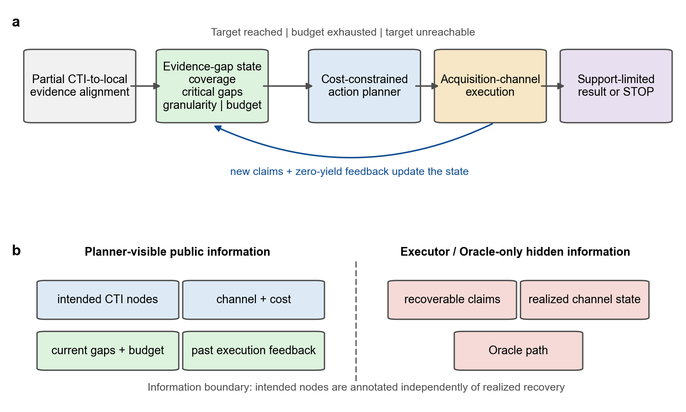
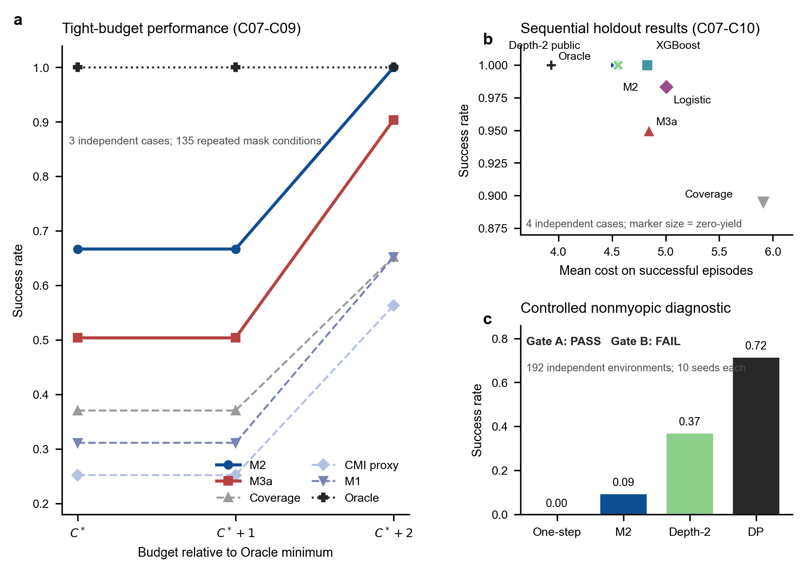
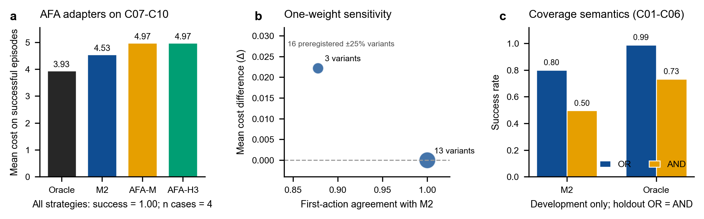

# 不完整证据下的 APT 调查控制：信息边界约束的证据缺口驱动取证

**英文题目（暂定）**：Evidence-Gap-Aware Investigation Control for APT Attribution under Incomplete Information

**作者与单位**：待确认

**稿件状态**：v0.5；在 v0.4 的 C07-C10 主分析上加入 C11 第三封装、多 provider AND 覆盖和自然降级外部效度压力。C11 不并入 G3 主结果均值。

## 摘要

真实 APT 调查通常在证据尚不完整时开始，而多数归因与对齐方法主要回答如何解释已经获得的证据。它们较少处理一个部署前置问题：在不知道动作真实收益、采集通道可能失败且预算有限时，下一步应采什么、何时停止，以及当前材料最多支持何种调查结论。本文将部分 CTI—本地证据对齐转化为受信息边界约束的调查控制问题：以可更新证据缺口状态表示调查进度，通过运行时公开视图隔离动作意图与隐藏实际恢复集合，并以预算、通道反馈、结论粒度和显式 STOP 约束动作选择。我们在六个开发案例、四个参数锁定 G3 案例和一个独立的 OTRF APT29 仿真案例上评估该接口。C07-C10 中，透明部署策略 M2 在 180/180 个重复条件达到内部目标，平均成功成本为 4.5333；XGBoost、公开 Depth-2、AFA-VOI Myopic 与三步 Rollout 均未降低该成本。C11 在第三种 Windows JSONL/多 provider 封装下保留自然证据缺口并把目标截断为 G2；AND 主分析中 M2 在 45/45 个重复条件达标、平均成本为 3.6667，但并非最低成本规则，而只改成 OR 即把其成本降至 1.0222。本文不声称提高了攻击者识别准确率；其贡献是给出一种可审计的调查决策框架，并以跨封装正负结果说明复杂策略收益和证据组合语义都必须在明确边界内解释。

**关键词**：APT 调查控制；证据不完整；信息边界；主动取证；证据缺口；可支撑结论粒度；主动特征获取

## 1 引言

APT 归因的实际瓶颈往往出现在分类或解释之前：调查者必须在不完整、异构且可能继续丢失的证据中决定下一步做什么。CTI 报告可以描述较完整的行为链，本地环境却可能只保留部分进程、文件、注册表或网络事件；网络遥测离线、日志窗口过窄和主机侧采集缺口会使同一攻击在不同现场呈现不同证据子集。此时，直接要求系统输出 actor、campaign 或 technique 标签，会把“尚未观察到”与“不存在”混为一谈。本文因此研究的不是新的攻击者分类器，而是服务于归因过程的 **investigation control**：当前证据缺什么，哪项采集值得执行，以及何时必须停止或降低结论粒度。

POIROT 展示了 CTI 查询图与审计日志图之间行为对齐的价值 [@milajerdi_poirot_2019]；EXTRACTOR 与 AttacKG 则推动了从自然语言报告中抽取攻击行为和构建 technique graph [@kiavash_satvat_extractor_2021; @zhenyuan_li_attackg_2022]。近年来，TAA-EPLMR、AURA、APT-ATT、APTChaser、MM-AttacKG 和 LLMAPT 分别探索了证据路径增强的大模型推理、多智能体知识增强归因、异构威胁情报表示、攻击技术建模、多模态攻击图构建和多源 LLM 归因框架 [@xiao_taa-eplmr_2025; @rani_aura_2025; @cai_apt-att_2025; @zhang_aptchaser_2025; @zhang_mm-attackg_2025; @alshamrani_llm-based_2026]。这些研究增强了“已有证据如何表示和推理”的能力，但尚未共同解决另一类决策问题：当现有证据不足以支持目标粒度时，系统应执行哪个取证动作，动作失败后如何更新判断，以及何时应停止而不是继续生成结论。

本文不把“缺失证据列表”视为最终输出，而是把它转化为序贯决策的中间状态。系统接收 CTI 行为图、可回指来源的 evidence claims、候选取证动作、采集通道、预算和目标结论粒度，输出下一条取证动作；若目标已经达成、预算不足或结构上不可达，则输出受证据上限约束的 STOP/降级结果。关键约束是规划器只能看到动作希望解决的问题，不能预先看到动作真正能够恢复什么。这样，图对齐成为主动调查的起点，缺失证据成为可操作状态，而语言模型被限制在可审计的语义编译与解释接口，不被默认赋予不可验证的在线决策权。

本文的贡献不以新规划器全面胜出为前提，而分为四点。第一，定义部分对齐之后的调查控制任务，以证据缺口状态统一表示节点/边覆盖、关键缺口、通道反馈、预算和当前可支撑结论粒度。第二，给出公开动作意图与隐藏恢复集合分离的信息边界，并以编译期审计和运行时字段 allowlist 将该边界落实为可测试接口；在此基础上形式化节点级泄漏、证据增加下的粒度单调性和 Bellman 意义下的停止条件。第三，在同一公开接口下适配透明规则、监督学习、通用 AFA-VOI、有限前瞻、完整规划和显式 STOP，使方法复杂度的收益可以被公平证伪。第四，在 DARPA TC E5 与 OpTC 的四个参数锁定 G3 案例中，M2 在所评估的非 Oracle 策略内提供当前最佳成本—达标折中；独立的 C11 外部效度压力则表明该排序不跨场景保持，且 AND/OR 证据组合语义会显著改变达标成本。该组合证据支持可审计调查控制的部署价值，但不支持 M2 全局最优、真实 actor 识别提升或广泛跨域泛化。

## 2 相关工作

### 2.1 CTI 行为抽取、图构建与证据对齐

CTI 文本只有被转换为结构化行为表示，才能与本地事件建立可计算联系。EXTRACTOR 从威胁报告中抽取攻击行为，AttacKG 将 technique 及其关系组织为攻击知识图，MM-AttacKG 又把多模态信息与大模型用于攻击图构建 [@kiavash_satvat_extractor_2021; @zhenyuan_li_attackg_2022; @zhang_mm-attackg_2025]。POIROT 则从另一侧出发，把攻击行为查询与内核审计记录进行图匹配 [@milajerdi_poirot_2019]。这条研究线回答了“怎样得到图”和“怎样匹配图”，也是本文状态构造的上游基础。本文不替代抽取器或对齐器，而是研究部分对齐之后如何继续采证。

### 2.2 APT 归因与大模型辅助推理

TAA-EPLMR 通过证据路径增强 LLM 的威胁行为者归因推理，AURA 使用知识增强多智能体框架组织归因任务，APT-ATT 结合异构威胁情报表示与 CTGAN 改善闭集归因，APTChaser 则基于攻击技术建模进行威胁归因 [@xiao_taa-eplmr_2025; @rani_aura_2025; @cai_apt-att_2025; @zhang_aptchaser_2025]。LLMAPT 已把多源情报、LLM 语义分析、置信度和解释接口组合进同一框架；ExCyTIn-Bench 则开始评价 LLM agent 的多步威胁调查能力 [@alshamrani_llm-based_2026; @yiran_wu_excytin-bench_2025]。这些工作说明行为路径、异构表示和语言推理能够增强已有证据的组织与解释，但其主要输出仍是归因判断、候选实体或调查回答。本文不与其比较 actor accuracy，而研究它们部署前仍需面对的控制问题：当现有材料只支持较粗结论时，应补采哪类证据，还是停止。

### 2.3 主动特征获取与非短视规划

主动特征获取（AFA）把每个未观测特征视为具有成本的动作，在预测效用与采集成本之间进行序贯权衡 [@aronsson_survey_2025]。NOCTA 以候选未来采集计划的预期预测损失和成本构造非贪心目标；WinRegRL 则在专家指定的 Windows 取证 MDP 上使用动态规划和有限 RL 修正 [@noauthor_nocta_2025; @ghanem_leveraging_2026]。这些工作已覆盖“有成本地选择下一观测”的宽泛问题，因此本文不把 AFA、MDP 或非贪心规划本身视为创新。差异位于部署信息结构：安全动作可能跨通道失败，公开意图不能等同于实际可恢复内容，输出还要受来源可回指性和结论粒度上限约束。为检验这些差异是否实质存在，本文把一步 AFA-VOI 与三步 objective-cost rollout 适配到同一动作空间，而不是只在相关工作中做文字区分。

| 方法族 | 主要状态/目标 | 是否选择调查动作 | 是否隔离公开意图与真实恢复 | 是否约束结论粒度 |
|---|---|---:|---:|---:|
| CTI 抽取/对齐 | 文本、图及匹配分数 | 否 | 不适用 | 否 |
| APT 归因/LLM 推理 | IOC、TTP、证据路径、候选 actor | 通常否 | 通常否 | 通常以置信度表示 |
| 通用 AFA/NOCTA | 部分特征、预测损失、成本 | 是 | 未按安全动作区分 | 否 |
| WinRegRL | 专家取证状态、转移和奖励 | 是 | 依赖专家转移模型 | 否 |
| 本文 | CTI—本地证据缺口、通道、预算、反馈 | 是 | **是** | **是，但仍待人工校准** |

### 2.4 研究空缺

现有方法分别覆盖了证据表示、图对齐、归因推理和有成本的特征采集，但尚缺少一个经过泄漏审计的接口，把部分 CTI—本地证据对齐转化为可更新调查状态，并在不知道真实恢复结果时完成采集、反馈、STOP 与结论粒度截断。本文的可辨识增量是该任务接口和信息边界，而不是重新包装多源融合、攻击图、AFA 或通用 LLM 归因。相应地，实验重点不是证明某个复杂规划器必然胜出，而是检验这一接口是否可执行、哪些方法在该边界下有效，以及内部代理在哪些条件下失效。

## 3 问题定义

### 3.1 输入、状态与动作

设 CTI 行为图为 $G=(V,E)$，其中节点表示攻击行为或 technique，边表示时间、因果或阶段依赖。当前可见证据为 claim 集合 $\mathcal{C}_t$，每条 claim 带有事件 UUID、日志行、文件位置或其他来源指针，并可覆盖一个或多个 CTI 节点。当前状态写为

\[
s_t=(V_t^{cov}, E_t^{cov}, U_t, K_t, D_t, g_t, B_t, H_t),
\]

其中 $V_t^{cov}$ 与 $E_t^{cov}$ 是已覆盖节点和边，$U_t=V\setminus V_t^{cov}$ 是未匹配节点，$K_t\subseteq U_t$ 是关键缺口，$D_t$ 是阶段和证据类型覆盖摘要，$g_t$ 是当前可支撑结论粒度，$B_t$ 是剩余预算，$H_t$ 是已执行动作及零收益反馈。默认实现采用 OR 覆盖语义：节点关联的任一 required claim 已可见即视为覆盖；敏感性分析同时实现 AND 语义，以检验多条 corroborating claims 全部可见时才覆盖的更严格定义。

候选动作集合为 $\mathcal{A}_t$。每个非 STOP 动作 $a$ 具有公开意图节点 $I(a)$、采集通道 $q(a)$、成本 $c(a)$ 和可选的期望效果摘要；真实可恢复 claim 集合 $R(a)$ 对规划器隐藏，只供环境执行与 Oracle 评价使用。公共动作 STOP 的成本为零。

### 3.2 可支撑调查结论粒度

本文采用从低到高的离散粒度格：`G0_unknown`、`G1_technique`、`G2_tactic_intent` 和 `G3_campaign`。实现中的默认阈值为：节点覆盖率不低于 0.75、边覆盖率不低于 0.60 且关键节点全部覆盖时进入 G3；节点覆盖率不低于 0.45 且至少覆盖两个攻击阶段时进入 G2；节点覆盖率不低于 0.15 时进入 G1；否则为 G0。最终 $g_t$ 再由 `support_ceiling` 截断。该离散规则是用于控制实验的结构代理，不是 actor identification accuracy，也没有在本稿中被宣称为分析师判断的替代品。我们分别对数值阈值和 OR/AND 语义进行敏感性分析，并把双人盲标校准保留为正式外部效度门槛。

### 3.3 决策目标

给定目标粒度 $g^\star$ 和预算 $B$，规划器在每一步选择 $a_t\in\mathcal{A}_t$。环境依据通道实现返回新 claims，随后更新状态。若在预算内达到 $g^\star$，episode 成功；若目标不可达或继续动作无正价值，系统应 STOP 并接受 $g_t$；若 Oracle 仍可达却停止，则记为过早停止。设 Oracle 最小达标成本为 $C^\star$，成功 episode 的成本遗憾定义为累计成本减 $C^\star$。

### 3.4 信息边界

公开意图 $I(a)$ 表示动作希望解决的调查问题，不能由隐藏恢复集合 $R(a)$ 反向生成。本文使用两层信息边界。编译期审计把 `intended == OR(recoverable)` 作为节点级答案键风险信号，但不把集合偶然相等本身等同于泄漏。运行时，所有非 Oracle 策略只接收 `planner_action_view` 与 `planner_state_view`：前者通过字段 allowlist 排除 `recoverable_claim_ids`、`oracle_effects` 和可能透露实现的自由文本备注，后者排除隐藏 claim 标识、mask 机制、随机 seed 与运行标识，并过滤嵌套诊断中的不可见 claim 引用。执行器在策略返回 `action_id` 后才解析完整动作对象，依据通道状态生成新增 claim 或零收益反馈。该实现是进程内接口隔离，不是数据库访问控制或密码学隔离；其作用是使规则、学习器和外部 selector 在主运行入口上不能读取模拟器答案键。

### 3.5 三个接口性质

以下性质刻画任务接口，而不是给出任何策略的性能保证。

**性质 1（节点级恢复映射泄漏）**。令 $\phi(R)=\operatorname{ORCover}(R)$。若动作公开意图由隐藏恢复集合确定为 $I(a)=\phi(R(a))$，则观察 $I(a)$ 等价于观察该动作的节点级可恢复集合 $\phi(R(a))$。因此，任何以 $I(a)\cap U_t$ 计算动作—缺口兼容性的规划器，都已直接获得通道在线时哪些缺口节点可由该动作恢复的信息。

证明由等式本身得到：$I(a)$ 与 $\phi(R(a))$ 是同一随机变量。该结论只涉及节点级覆盖，不表示规划器恢复了 claim 身份、通道实现或全局最优路径；因此本文将其称为 node-level leakage，而不是完整 Oracle 等价。

**性质 2（证据增加下的代理粒度单调性）**。固定 CTI 图、覆盖语义、阈值和 `support_ceiling`。若 $\mathcal{C}_t\subseteq\mathcal{C}_{t+1}$，则 $g(\mathcal{C}_t)\preceq g(\mathcal{C}_{t+1})$。

在 OR 与 AND 语义下，增加可见 claims 都不会使已覆盖节点集合缩小；节点集合不缩小又保证已覆盖边、阶段数和关键节点数均不下降。G1-G3 的判定条件只由这些单调量的下界构成，固定上限截断也保持偏序，故结论成立。该性质说明状态更新不会因新增证据自动降低代理粒度，但不证明该粒度与人类判断一致。

**性质 3（成本约束停止条件）**。令停止的终端价值为 $U(s)$，继续动作的最优价值为

\[
Q^\star(s,a)=-c(a)+\mathbb{E}\left[V^\star(s')\mid s,a\right].
\]

则 STOP 在状态 $s$ 最优，当且仅当 $U(s)\geq\max_{a\neq\mathrm{STOP}}Q^\star(s,a)$。这是有限时域 Bellman 最优性条件。仅有“每个动作的一步期望增益小于成本”一般不足以推出 STOP，因为两个单步负收益动作仍可能通过互补或解锁产生正的序列价值；本文的合成非短视 Gate 正是该反例。只有在不存在后续互补、或 $Q^\star$ 可退化为单步价值时，一步 gain-cost 判据才构成充分条件。

## 4 方法

### 4.1 总体流程

框架由五个模块构成：上游 evidence claim 编译、证据缺口状态构造、成本约束动作排序、通道执行与反馈、粒度重算及 STOP。结构化 CTI 与本地证据的对齐结果进入状态构造器；规划器仅读取公开状态—动作特征；执行器访问隐藏恢复集合并模拟或调用真实采集通道；更新器合并新 claims 并重新计算 $g_t$。因此对齐不是终点，缺口也不是静态列表，而是驱动下一动作的状态。本文的方法贡献是该框架和信息边界；下列策略是同一接口下的可替换实现与对照。

### 4.2 M2：透明部署策略

M2 使用公开的期望粒度提升、不确定性下降、过度归因风险下降、阶段缺口、证据类型缺口、动作重叠、同类动作历史零收益比例和相对预算成本。其实现分数为

\[
2\Delta g+1.5\Delta u+1.5\Delta r+1.5d_{stage}+d_{evidence}-1.5o-r_{zero}-0.75\rho_c.
\]

其中各项均来自公开字段和执行历史，不读取隐藏恢复集合。M2 的系数是工程设定而非理论最优解；本文通过单权重 ±25% 扰动检查局部稳定性。由于它在 C07-C10 参数锁定攻击轨迹中所评估的非 Oracle 策略内提供最好的成本—达标折中，本文将 M2 定位为 **interpretable deployment policy**，而不是为了衬托复杂模型而设置的弱基线。

### 4.3 M3a：节点级 action-gap 兼容性

M3a 检验“公开动作意图与当前关键缺口更精细的匹配能否改善选路”。令 $T(a,s_t)=I(a)\cap U_t$，则非 STOP 动作得分为

\[
\operatorname{score}_{M3a}=\frac{8|T\cap K_t|+3|T|+2P+R-0.5c(a)}{c(a)},
\]

其中 $P=|T|/|I(a)|$，$R=|T|/|U_t|$，STOP 得分为 0。M3a 不读取通道可靠性先验，也不读取 $R(a)$。它是一个机制消融，不被预设为最终主模型；参数锁定轨迹留出结果显示，仅强调意图-缺口重合会忽略成本、动作冗余和执行反馈，因而不能稳定超过 M2。

### 4.4 学习型策略

Logistic M3b 和 XGBoost 共享 16 个公开 state-action 特征，训练数据仅来自 C01-C06 开发案例，C07-C10 不参与训练或调参。监督标签描述动作在当前状态下的效用/可达性，序贯测试则把模型分数置于完整 episode 中，避免只用离线分类指标代替规划效果。XGBoost 使用 150 轮、深度 3、学习率 0.05、随机种子 11 的冻结设置。该设计回答的是“现有公开特征能否学到比线性模型更稳定的排序”，而不是把树模型称作大语言模型或强化学习模型。

### 4.5 STOP、通道反馈与降级

STOP 与取证动作在同一动作空间中竞争。目标已达时为达标停止；Oracle 也不可达时为正当降级；Oracle 仍可达时为过早停止。非 STOP 动作绑定具体采集通道，通道离线时返回空集合，零收益被写入 $H_{t+1}$。`support_ceiling` 独立约束最终粒度，防止局部新增证据导致越级输出。

### 4.6 通用 AFA-VOI 适配基线

为避免只与内部方法比较，本文把通用 AFA 的 expected value-of-information 和非贪心 objective-cost trade-off 适配到同一公开动作空间。对公开代理覆盖节点集 $M$，定义终端效用

\[
U(M)=g(M)+0.5\operatorname{NodeCov}(M)+0.5\operatorname{EdgeCov}(M).
\]

`AFA-VOI Myopic` 最大化单步期望效用增量减归一化成本；`AFA-VOI Rollout-H3` 枚举最多三步公开计划，并按通道先验计算期望终端效用。同一通道的多个动作共享通道状态，以匹配模拟器的执行语义。二者只读取匹配节点、公开意图、通道和成本，不读取隐藏 claims、M2 分数或 Oracle 路径。这是 AFA 方法族的领域适配，不是 NOCTA 或 WinRegRL 官方实现的直接复现。

### 4.7 非短视诊断及 DQN Gate

短视规则与监督排序都可能被高即时收益诱饵吸引，而忽略低即时收益但能解锁后续关键证据的动作。为判断是否值得引入 DQN，本文先构造两级 Gate。Gate A 要求受控环境稳定出现“单步最优不等于长期最优”；Gate B 要求有限深度或完整规划在计算上不可接受，才批准 DQN 工程。C07-C10 轨迹中的部署候选 `project05_depth2_public` 不读取隐藏恢复集合，而以通道可靠性构造“公开成功代理”和“公开零收益代理”，在两个分支中复用 M2 选择第二步，并以折扣 0.8 汇总期望效用。该轨迹接入在结果前冻结，未因 C07-C10 表现调节参数。DQN 只有在状态空间扩大后同时满足性能与复杂度门槛时才进入主模型。

### 4.8 LLM 的具体作用与边界

LLM 在本项目中是可选的离线语义编译器和解释器，而不是已经验证的在线规划器。它可以把 CTI 段落、IOC、日志摘要和 provenance 子图编译为符合 schema 的 evidence claims，草拟公开动作意图，并在规划结束后把状态轨迹转换为带来源指针的解释。所有输出必须经过结构校验、来源回指和 unsupported-claim 检测。已完成的主实验没有调用在线 LLM，因而本文不能把实验增益归因于 Qwen、SEVENLLM 或其他语言模型。未来只有在独立标注集上验证 schema 合规率、claim 准确率、来源指针正确率和下游策略影响后，LLM 才能作为实证模块进入标题或核心贡献。

## 5 实验设计

### 5.1 研究问题与可证伪判据

实验围绕四个研究问题展开。RQ1 问：在公开意图与隐藏恢复集合隔离后，证据缺口闭环能否在参数锁定 G3 案例及第三封装 G2 压力案例上达到内部目标且不越过 `support_ceiling`？如果冻结策略频繁失败或产生 ceiling violation，则框架的工程可执行性不成立。RQ2 问：节点级兼容性、监督学习或通用 AFA-VOI 适配能否相对透明 M2 降低达标成本？如果这些策略在配对条件中不优于 M2，或成功条件成本更高，则相应算法优越性假设被否定。RQ3 问：显式 STOP 能否区分不可达与过早放弃，以及受控环境是否存在短视策略系统失败而多步规划可恢复的结构？RQ4 问：主要结论是否由 M2 单个权重、G0-G3 数值阈值或证据组合语义驱动？如果局部扰动改变真实结果，或同一多 claim 案例在 AND/OR 下出现明显成本差异，则相应代理依赖必须进入结论边界。

### 5.2 案例与数据边界

C01-C06 用于开发、消融和学习器训练。G3 主测试包含四个参数锁定案例：C07 为 DARPA TC E5 THEIA Linux 的 Firefox Drakon/BinFmt-Elevate 链；C08 为 E5 ClearScope Android 的 Appstarter Micro APT Elevate 链；C09 为 OpTC Windows SysClient0201 的 Day 1 PowerShell Empire 链；C10 为 OpTC Windows SysClient0351 的 Day 3 恶意升级、反向连接与远程线程迁移链。C10 从 1.61 GB eCAR 分片中扫描 27,832,841 行，在锁定窗口抽取 37,301 行并编译 5/5 个预先指定 motif。这四例覆盖 Linux、Android 和 Windows，但只来自两个主要 engagement/语料家族。

C11 是独立报告的外部效度压力，来源为固定提交的 OTRF APT29 Day 1 仿真。它引入 Windows JSONL 及 PowerShell、Sysmon、Security 多 provider 封装，并在事件读取前建立内部冻结记录；该记录与结果同批提交，因而不是第三方注册平台可验证的 preregistration。五个预先指定节点中，N01 的 `3aka3.doc` 锚点未命中且未被替换；N02-N05 各保留两条来自不同 Windows provider family 的 claim。Host 与 Zeek 时间窗不重叠，Zeek 不进入事件级证据；C11 因自然缺口把目标与上限从 G3 降为 G2。其 APT29 标签来自 emulation plan，不是未知 actor 预测终点。

### 5.3 遮蔽、重复与统计单位

每个案例在不同初始遮蔽、强度和通道 seed 下重复运行，用于观察策略对同一攻击链的条件敏感性。C07-C10 每个规划器共 180 个 episode，但独立案例数是 4，不是 180。C11 每个规划器另有 45 个重复条件，独立单位仍只有一个仿真攻击链。由于 C11 的目标粒度、覆盖语义和来源性质不同，本文不把其成本与 C07-C10 求总均值，也不把 225 个条件当作 5 个以上的独立攻击样本。

### 5.4 基线与指标

同接口策略包括 Coverage、CMI proxy、M1、透明 M2、M3a、Logistic、XGBoost、AFA-VOI Myopic、AFA-VOI Rollout-H3、Depth-2 Public 和 Oracle。主指标为内部目标 success、成功条件下 cost-to-target、相对 Oracle 的 regret、zero-yield、premature STOP 和 ceiling violation。学习器同时报告 Accuracy、Brier、AUROC、平均精确率和 top-1 critical-gap hit，但模型选择以序贯 episode 结果为主。AFA 适配与安全取证近邻方法的任务差异在方法和相关工作中单独说明，避免把领域适配结果写成对原论文代码的直接复现。C11 v0.1 只运行 `run_mvp.py` 中的 14 个内置策略/消融，包括 M1、M2、M3a、CMI、Coverage 和 Oracle；XGBoost、AFA-VOI 与 Depth-2 未在 C11 上运行，因此相关跨方法比较仍只限 C07-C10。

### 5.5 压力测试

紧预算曲线把每个条件的预算设置为 $C^\star$、$C^\star+1$ 和 $C^\star+2$。真正应停压力移除关键可靠回退，使 Oracle 也不可达，用于评价正当降级；部分可达压力保留可靠回退但把预算收紧到恰好覆盖最短路径，用于区分“会停”与“会选路”。非短视 Gate 使用 192 个独立参数环境、每环境 10 个 seed，共运行 7,680 个 episode；真实 Depth-2 接入另运行 540 个 episode。AFA-VOI 比较在四个 G3 案例上运行 720 个 episode。敏感性分析包含原始 M2 及 16 个单权重扰动，并在 C07-C10 比较三档阈值；C01-C06 提供开发阶段 OR/AND 压力，C11 则在同一冻结 claims、动作、mask、seed、目标和预算下只改变 `node_coverage_semantics`，形成真实可识别的 AND 主分析与 OR 乐观敏感性。所有结果均保留冻结输入和输出哈希；C11 使用内部冻结记录，不表述为外部注册。

## 6 结果

### 6.1 C07-C09 冻结紧预算曲线

C07-C09 上 M2 与 M3a 均达到 45/45 成功且没有 ceiling violation，但 M3a 的平均成本在三个案例上分别比 M2 高 0.6222、0.5333 和 0.4889，平均额外 regret 为 0.5481。将预算收紧后，差异更加明确。

| 方法 | \(C^\star\) | \(C^\star+1\) | \(C^\star+2\) |
|---|---:|---:|---:|
| Coverage | 37.04% | 37.04% | 65.19% |
| CMI proxy | 25.19% | 25.19% | 56.30% |
| M1 | 31.11% | 31.11% | 65.19% |
| **M2** | **66.67%** | **66.67%** | **100.00%** |
| M3a | 50.37% | 50.37% | 90.37% |
| Oracle | 100.00% | 100.00% | 100.00% |

在 135 个配对条件中，M3a 在三个预算档均没有一次净胜 M2。这一结果否定了“节点级兼容性必然改善成本效率”的原始假设，也使 M2 成为当前非 Oracle 部署锚点。

### 6.2 C07-C10 学习器与序贯策略

XGBoost 在 990 条测试 state-action 行上的 Accuracy、Brier、AUROC、AP 和 top-1 hit 分别为 0.8051、0.1161、0.9243、0.8879 和 0.8667；Logistic 分别为 0.7939、0.1249、0.9239、0.8876 和 0.8389。XGBoost 在这些描述性指标上略优于 Logistic，但二者的 AUROC 几乎相同。

| Planner | Success | Mean cost | Regret | Zero-yield | Premature STOP |
|---|---:|---:|---:|---:|---:|
| Oracle | 1.0000 | 3.9333 | 0.0000 | 0.0000 | 0.0000 |
| **M2** | **1.0000** | **4.5333** | **0.6000** | 0.2667 | 0.0000 |
| XGBoost | **1.0000** | 4.8278 | 0.8944 | **0.2000** | 0.0000 |
| Logistic | 0.9833 | 5.0056 | 1.0565 | 0.3000 | 0.0167 |
| M3a | 0.9500 | 4.8421 | 1.0702 | 0.6111 | 0.0500 |
| Coverage | 0.8944 | 5.9068 | 2.1988 | 1.2667 | 0.1056 |

XGBoost 修复了 Logistic 的部分过早停止，并以低于 Logistic 的平均成本保持全成功，但仍比 M2 多消耗 0.2945 成本。因此支持的结论是“非线性学习排序优于线性对照”，不是“学习器优于透明部署策略”。

### 6.3 通用 AFA-VOI 同接口对照

| Planner | Success | Mean cost | Regret | Zero-yield |
|---|---:|---:|---:|---:|
| Oracle | 1.0000 | 3.9333 | 0.0000 | 0.0000 |
| **M2** | **1.0000** | **4.5333** | **0.6000** | **0.2667** |
| AFA-VOI Myopic | 1.0000 | 4.9722 | 1.0389 | 0.3000 |
| AFA-VOI Rollout-H3 | 1.0000 | 4.9722 | 1.0389 | 0.3000 |

两种 AFA 适配均在 180/180 个重复条件达到内部目标，但平均成功成本比 M2 高 0.4389。逐条件比较均为 24 次成本胜、91 次平、65 次负，没有 success 修复或退化。Myopic 与 Rollout-H3 的 success、成本和 regret 完全相同，说明在当前公开意图代理和小动作空间中，增加三步组合搜索没有带来可测收益。该结果补上了通用 AFA 方法族的同接口对照，但只适用于本文明确实现的 VOI 适配，不能外推为 NOCTA、WinRegRL 或 AFA 整体无效。

### 6.4 C10 错误分析

C10 中 Oracle、M2、XGBoost 和 Logistic 均达到 1.0000 成功率，平均成本依次为 4.0667、4.5556、5.0444 和 5.4444。M3a 成功率只有 0.8000；其成功条件成本 3.9722 看似更低，但该均值排除了失败 episode，不能用于优越性比较。C10 说明公开意图与关键缺口的静态重合不足以保证稳健 STOP，正好构成 M3a 的反例。

### 6.5 STOP 与部分可达负结果

在真正不可达压力中，Oracle 的可达成功率为 0.8148，约 18.52% 条件需要降级；M3a 和 M3b 与 Oracle 的停止判定对齐，表明显式 STOP 能表达“正确认输”。但在保留可靠回退、预算恰好够最短路径的 10 个部分可达条件中，Oracle 成功率为 1.00，静态和自适应 M3b 均约为 0.10，M3a 为 0.00。典型错误是先执行廉价但离线的死通道动作，随后因预算不足而 STOP。该结果表明，会识别不可达不等于会避开诱饵并选择可靠路径。

### 6.6 非短视 Gate

| Planner | Success | 成功条件均成本 | Premature STOP |
|---|---:|---:|---:|
| One-step gain/cost | 0.0000 | - | 0.1250 |
| 冻结 M2 | 0.0948 | 3.0000 | 0.2333 |
| Depth-2 + M2 | 0.3708 | 3.1770 | 0.0766 |
| DP Oracle | 0.7156 | 3.4367 | 0.0000 |

192 个环境中有 166 个出现 DP 相对 M2 的明显优势，平均 success 优势为 0.6208，因此 Gate A 通过：非短视规划在所构造的先决依赖环境中具有结构必要性。DP 相对 Depth-2 仍有 0.3448 的优势，但 DP 冷启动中位耗时为 0.7692 ms、p95 为 83.9598 ms，最大状态展开数 23,892，均低于预设门槛，因此 Gate B 不通过。

将冻结的公开 Depth-2 代理接入 C07-C10 后，M2 与 Depth-2 均在 180/180 条件达到目标且没有 premature STOP 或 ceiling violation，但 Depth-2 的平均成功成本为 4.5556，高于 M2 的 4.5333；配对结果为 12 胜、160 平、8 负，且只有 C09、C10 两个案例成本不升。其零收益动作也从 M2 的 0.2667 增至 0.3111。由于“成本至少降低 0.10”和“至少 3/4 案例成本不升”均未通过，Depth-2 不升级为当前部署策略。合成 Gate 支持“长期依赖可以存在”，轨迹接入则表明仅用静态覆盖和通道先验构造两步代理不足以稳定改善当前案例；二者共同支持保留 M2、暂不启动 DQN。

### 6.7 M2 与粒度代理敏感性

16 个单权重 ±25% 变体在 C07-C10 上均保持 success=1.0000、premature STOP=0 和 ceiling violation=0。13 个变体与原始 M2 的首动作、平均成本和 zero-yield 完全一致；仅提高 cost 权重、降低 risk 权重或降低 uncertainty 权重使首动作一致率降至 0.8778，并把平均成本增加 0.0222。没有权重变体降低原始 M2 的聚合成本。这支持局部稳定性，但不证明原始系数全局最优。

Lenient、Default 和 Conservative 三档 G 阈值均未改变 C07-C10 的 M2 或 Oracle 结果，因为四个案例的 G3 判定实际由“全部关键节点覆盖”主导。OR 与 AND 在 C07-C10 上也按定义相同：每个节点都只有一条 required claim，因此该比较不可识别。相反，在具有多 claim 节点的 C01-C06 开发压力中，AND 使 M2 success 从 0.8000 降至 0.4963，Oracle success 从 0.9889 降至 0.7333。该差异表明内部 success 对证据组合语义敏感，不能替代人工粒度校准或真实归因正确性。

### 6.8 C11：第三封装、多 provider AND 与自然降级

C11 的固定主机归档包含 196,081 条可解析 Windows 事件。五个内部冻结节点中，N01 的固定锚点未命中且未被替换；其余四个节点各编译两条来自不同 Windows provider family 的可回指 claim。该结构通过的是“同一主机归档内多 provider”Gate，不是独立网络传感器 corroboration。N02 与 N05 的 claim 对证明压缩命令和归档文件创建，只支持 compound node 中的 collection 部分，不能单独证明网络外传；因此 C11 只作为 G2 调查链与覆盖语义压力，不作为 campaign 或 actor 正确性终点。

| Planner | Success | Mean cost | Regret vs Oracle | Premature STOP | Ceiling violation |
|---|---:|---:|---:|---:|---:|
| Oracle | 1.0000 | 3.0000 | 0.0000 | 0.0000 | 0.0000 |
| Coverage greedy | 1.0000 | 3.2444 | 0.2444 | 0.0000 | 0.0000 |
| M1 | 1.0000 | 3.2444 | 0.2444 | 0.0000 | 0.0000 |
| M3a | 1.0000 | 3.5556 | 0.5556 | 0.0000 | 0.0000 |
| M2 | 1.0000 | 3.6667 | 0.6667 | 0.0000 | 0.0000 |
| Random | 0.6000 | 3.4444（仅成功） | 0.6889 | 0.4000 | 0.0000 |

冻结 M2 在 45/45 个重复条件达到 G2 且没有越过上限，但 Coverage 与 M1 的平均成本更低，故 C11 否定了“M2 跨封装保持最低成本”的外推。只把覆盖语义从 AND 改为 OR 后，M2 success 仍为 1.0000，平均成本却从 3.6667 降至 1.0222；Oracle 也从 3.0000 降至 1.0222。该差异不是策略改进，而是 OR 把同一节点的两条 provider claim 降为任一条即可。它把 v0.4 中仅来自开发案例的代理敏感性推进到一个独立仿真数据封装，同时也说明当前 success 与 cost 高度依赖节点所要求的证据组合语义。

## 7 讨论

### 7.1 方法贡献与技术边界

本文不是给已有归因器“加一层保护”。如果只在分类器后加置信度阈值，系统仍不知道下一步获取什么证据，也无法区分通道失败、预算不足和结构不可达。本文改变的是问题对象：输入不再是假设完整的特征向量，输出也不再只是 actor 标签；调查被表示为具有公开意图、隐藏实现、成本、反馈和停止语义的序贯控制过程。三个接口性质进一步说明，信息边界不是措辞约束：错误地把意图设为恢复映射会泄漏节点级答案；新增证据只能单调提升内部代理；而正确 STOP 必须比较完整 continuation value，不能由单步 gain-cost 武断推出。

### 7.2 为什么负结果仍然重要

M3a、Logistic、XGBoost、AFA-VOI 和公开 Depth-2 在 C07-C10 没有超过 M2，并不等于这些方法族普遍无效。它们在当前接口下排除了五种更窄的捷径：更细的 action-gap 匹配不自动等于更好规划；非线性学习器不自动等于更低调查成本；公开节点覆盖 VOI 不自动处理过宽意图和动作冗余；把短视分数前瞻一步不自动产生真实成本收益；存在长期依赖不自动等于必须使用 DQN。C11 又提供了反向限制：即使 M2 在原四例是最佳折中，它也不在新的 G2 多 provider 案例中保持最低成本。保留这些预先冻结的反例，使后续方法开发必须先改善状态、覆盖语义或转移可识别性，而不是继续叠加模型名称。

### 7.3 透明策略为何成为部署锚点

M2 在 C07-C10 的优势应被理解为局部经验发现，而不是简单模型永远优于复杂模型。它同时编码粒度期望、阶段与证据类型缺口、动作重叠、历史零收益和相对成本；这些信息恰好覆盖原四例小动作空间中最常见的失败模式。单权重扰动表明其排序在局部区间内较稳定，而 AFA、学习器和有限前瞻的负结果表明额外复杂度尚未换来净收益。C11 中 Coverage/M1 以更低成本达到同一 G2 目标，进一步限定了“部署锚点”的含义：M2 是原主测试和当前生产化讨论的透明参照，不是跨数据封装的全局赢家。它仍具备选择依据可审计、零收益反馈可追溯和 STOP 可解释三项部署属性，但实际采用前必须按证据组合语义与现场成本重新校准。

这些属性不等于真实 SOC 验证。当前动作只映射到扩展日志窗口、主机子图、网络摘要、局部探针、情报查询和人工复核等抽象能力；实际组织还需为工具可用性、权限、延迟、数据保留和人员时间重新标定成本。M2 因而是本文实验环境中的透明部署策略，而不是无需现场校准的产品策略。

### 7.4 LLM 与图谱的合理位置

图谱没有被剔除，它承担 CTI 行为结构、关键节点和覆盖关系的载体；本文只是不把图神经网络设为默认规划器。LLM 也没有被剔除，但其合理作用是将多模态原始材料编译为统一 claims、辅助意图标注和生成带证据指针的解释。在线动作选择当前由可审计规则和小型监督模型完成。这样的模块分工使未来多模态与 agent 支线可以接入同一 schema，而不会改变主实验的因果解释。

### 7.5 局限性

第一，G3 参数锁定案例仍只有四个且来自两个主要数据家族；新增 C11 只是一个 APT29 仿真链和第三种遥测封装，不是自然发生的独立 APT 现场，因此仍不能支持广泛统计泛化。第二，evidence claims 和动作空间仍由规范与脚本编译；C07-C11 的盲标包现包含 27 个 claim、27 个公开意图和 60 个粒度状态，共 114 个 item，但两名分析师尚未完成标签，因此不能声称人工一致性或外部效度。第三，可支撑粒度是工程代理而非真实归因正确性；C11 把 OR/AND 差异推进到独立仿真封装，却也显示成本可被覆盖语义大幅改变。第四，C11 的多 claim 只来自同一主机归档内不同 Windows provider，Host 与 Zeek 不同窗；其中两个 compound node 的 claims 只证明 collection 而非 exfiltration。第五，AFA-VOI 是同接口领域适配，不是 NOCTA 或 WinRegRL 的官方实现，且 XGBoost、AFA 与 Depth-2 尚未在 C11 上运行。第六，非短视 Gate 是存在性诊断，不估计真实调查中长期依赖的发生率；轨迹版 Depth-2 只使用静态覆盖与通道可靠性代理。第七，DP 使用完整转移概率，只作为规划上界；将其转化为部署方法仍需独立学习或估计通道转移模型。

## 8 结论

本文把不完整证据下的 APT 归因前置环节定义为信息边界约束的调查控制问题：以部分对齐构造证据缺口状态，通过运行时公开视图隔离规划与执行答案，在不知道动作真实恢复内容时选择采集或 STOP，并用预算、反馈和可支撑结论粒度控制输出。C07-C10 支持该闭环在四个 G3 案例中的可执行性，也表明 XGBoost、AFA-VOI、M3a 和公开 Depth-2 尚未降低透明 M2 的聚合成本。C11 进一步证明同一接口可接入第三种多 provider 封装并保留自然 G3→G2 降级，同时否定 M2 跨场景最低成本和 OR/AND 可互换这两个更强外推。因而，本稿的贡献是可审计的调查决策框架及其被实验证伪的适用边界，而不是新的 actor attribution SOTA。下一步的必要工作是完成双人盲标、增加自然发生或更接近运营现场的独立 engagement，并以分析师效用或真实归因正确性建立外部终点；LLM、多模态与 agent 只能在这些证据约束下作为扩展模块。

## 数据与代码可用性

本文使用的 DARPA TC E5 与 OpTC 原始数据受各自发布条款约束，项目仓库不重新分发原始大体量数据。C11 的 OTRF 源文件固定到公开 MIT 许可提交，仓库记录下载字节数、SHA-256、事件行号和 RecordNumber，但同样不重新提交原始 ZIP。案例配置、事件窗口抽取摘要、evidence claims、候选动作、AFA 与敏感性协议、规划轨迹、汇总表、绘图脚本和回归测试均保存在 Project05 仓库中。C07-C11 的 27 条 Claim 来源已在当前工作站按冻结 pointer 生成 hash 锚定 canonical excerpts；仓库公开构建器和哈希清单，第三方 event payload 由管理员按访问条件本地提供。C07-C10 的 180 个条件和 C11 的 45 个条件都是案例内重复测量，不能作为独立攻击样本重新计数。C07-C11 双人标注模板保持空白并明确标记 `awaiting_annotations`；管理员映射不进入公开盲标包。

## 参考文献

参考文献由 Zotero 导出的 `paper-main-references-v0.3.bib` 生成。提交前应根据目标期刊样式重新渲染，并再次核查预印本版本、页码、会议名称和 DOI。

## 待补投稿信息

- 作者、单位、通讯作者与 ORCID。
- 目标期刊及其摘要字数、章节和参考文献格式。
- 作者贡献、利益冲突、资金来源与数据许可声明。
- 若把 LLM 编译器写入实证贡献，需要先补独立标注集、schema 合规率、claim 准确率、来源指针正确率和下游影响实验。
