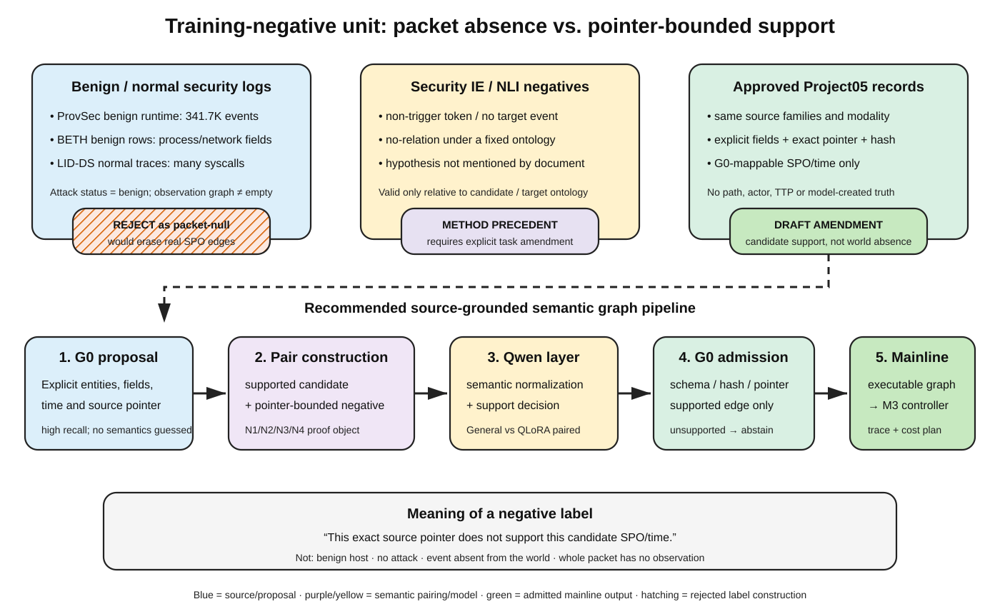

# Project05 observation compiler：train-null 替代来源证据审查 v0.1

状态：`completed_no_external_packet_null_source_candidate_verification_amendment_recommended`  
日期：2026-07-18  
类型：冻结协议下的 rapid evidence review（非绝对穷尽、非效果量 meta-analysis）  
训练/模型边界：未下载新语料、tokenizer 或模型，未安装训练环境，未训练或运行正式推理

## 1. 结论先行

**在当前“给定 packet，输出其中所有可支撑 process/file/network/system observation”的无条件编译任务下，本轮没有找到一个能同时通过真值、许可、来源独立性、泄漏隔离和 478 条数量潜力的外部 `packet=null` 来源。**

这不是简单的“候选还不够多”，而是统计单位冲突：

- ProvSec、BETH、LID-DS 的 benign/normal 标签能够说明“没有注入攻击”或“该事件未被判恶意”，但其记录本身正是系统调用、进程、文件和网络事件；把它们标为编译器空输出会产生错误监督。[Shrestha et al., 2023](https://doi.org/10.1007/s44227-023-00014-9) [Highnam et al., 2021](https://doi.org/10.14469/hpc/9422) [Grimmer et al., 2023](https://doi.org/10.1007/978-3-031-35190-7_6)
- 安全事件/关系抽取数据的负类通常只表示“这个 token 不是某个事件 trigger”或“这个实体对没有某个已标注关系”，不能推出 packet 中不存在任何 Project05 observation。[Trong et al., 2020](https://doi.org/10.18653/v1/2020.emnlp-main.433) [Sun et al., 2026](https://doi.org/10.1038/s41597-026-07487-7)
- 关系抽取与知识图谱文献明确警告：未标注、未入库或腐化 triple 可能是假阴性；不能靠缺失事实制造世界级负例。[Xie et al., 2021](https://doi.org/10.18653/v1/2021.acl-long.277) [Tan et al., 2022](https://doi.org/10.18653/v1/2022.emnlp-main.580)

因此，**继续搜索“良性日志来补 478 条空 packet”不应再作为默认路线。** 推荐的科学修订是把训练负例单位改为：

> `evidence record + exact source pointer + candidate SPO → supported / unsupported / abstain`

负例只声称“这个具体指针不支持这个候选关系”，不声称真实世界中该事件没有发生。ContractNLI 的 hypothesis-conditioned `not mentioned` + evidence spans、ANLI 的独立验证，以及 AT4CTIRE 的候选 threat-triple discriminator 都为这一任务形态提供相邻方法依据。[Koreeda & Manning, 2021](https://doi.org/10.18653/v1/2021.findings-emnlp.164) [Nie et al., 2020](https://doi.org/10.18653/v1/2020.acl-main.441) [Han et al., 2025](https://doi.org/10.3390/electronics14020324)

该修订目前只是 **non-authorizing amendment draft**：它不授权 packet 构建、tokenizer/Qwen 下载、环境安装、QLoRA 或正式推理。

## 2. 为什么 benign/normal 不能救现有 Gate

### 2.1 ProvSec

ProvSec 为 11 个攻击案例分别采集 benign runtime 与 adversary runtime，并报告 34.17 万条 benign events；但每条事件包含 syscall、当前/父进程、文件名或网络 IP/端口字段。论文还说明 sysdig 可能漏掉启动前的进程创建，并用人工 fork 补齐部分缺失。[Shrestha et al., 2023](https://doi.org/10.1007/s44227-023-00014-9)

所以其 benign 标签是“本 runtime 没有执行攻击”，不是“本记录没有可抽取关系”。对于 Project05 compiler，`process → opens → file` 即使完全良性，仍是合法 observation。

### 2.2 BETH

BETH 含 800 万余条 kernel-process/network events。每条 process event 包含 `processId`、`parentProcessId`、`processName`、`eventName`、参数等字段；`sus` 和 `evil` 是异常/恶意标签。论文明确说明这些标签由一名 reviewer 给出，不应被单独用于工业系统；其 benign training rows 仍是 OS 和云管理活动。[Highnam et al., 2021](https://doi.org/10.14469/hpc/9422)

因此 BETH 可以训练异常检测，却不能把 benign row 转成“空图”。它恰好提供了反证：benign process event 仍有完整 subject-action-object 语义。

### 2.3 LID-DS

LID-DS 的 7000 条 normal traces 来自模拟的正常应用行为；每条约 30 秒，可含数万 system calls，并保留 syscall 参数、返回值、进程 ID、进程名和时间戳。[Grimmer et al., 2023](https://doi.org/10.1007/978-3-031-35190-7_6)

`normal` 只用于攻击/正常分类。它不能证明 trace 中没有文件访问、进程创建或网络连接。

### 2.4 时间窗标签也不等于空图

Kairos 等 provenance IDS 把时间窗标成 benign/attack，是为了计算异常检测 TP/TN/FP/FN；每个窗仍由 provenance edges 组成。其结果还显示，攻击结束后被影响的实体可能继续活动，窗口边界与因果污染边界并不一致。[Cheng et al., 2024](https://arxiv.org/abs/2308.05034)

同时 E3/E5/OpTC 已在 Project05 排除锁中，不能因为它们提供 benign windows 就重新进入训练。

## 3. 安全 IE/NLI 候选为什么仍未通过

### 3.1 CySecED/CASIE：负的是 token，不是 packet

CySecED 将 30 类网络安全事件 trigger 之外的词作为 negative examples；292 篇文档由两名安全专业学生标注，Cohen's κ=0.79，分歧由专家解决。这是合格的 token-level event-detection 监督，但“非 trigger 词”不等于“整段材料没有 Project05 observation”。[Trong et al., 2020](https://doi.org/10.18653/v1/2020.emnlp-main.433)

CASIE 仓库公开 1000 份 annotation/source files，但本轮没有在仓库根验证到覆盖数据的明确许可证；即使许可补齐，其五类事件/argument 标签也不直接给出 packet-null 真值。

### 3.2 APTIE：显式人工标注，但单位与许可均不匹配

APTIE 有 808 个中文 CTI 句子、2574 个实体、1506 个关系和 139 个 event instances。没有 event trigger 的句子仍可能含多个实体和关系；其事件/关系本体也偏 APT actor/TTP，而 Project05 当前禁止把 actor/TTP 当 observation target。论文与 Zenodo 工件标为 CC BY-NC-ND 4.0，亦不适合在未作专项许可解释时直接进入衍生训练流水线。[Sun et al., 2026](https://doi.org/10.1038/s41597-026-07487-7) [APTIE dataset](https://doi.org/10.5281/zenodo.17129303)

### 3.3 “negative documents”说明正确方向，但不能直接搬数据

Mutlu 在 ACL CASE 2021 protest-event 数据中使用 717 份 negative documents；这些文档从 7412 份在事件标注流程中判定为“没有目标 protest event”的文档中抽取。论文证明，**相对于一个冻结、封闭的目标事件本体，人工/流程确认的无事件文档可以改进 event extraction**。[Mutlu, 2023](https://aclanthology.org/2023.case-1.17/)

但这些是 protest news，不是安全日志；将其作为 Project05 正式训练 null 会形成极强的来源模态 shortcut。它只能作为“如何定义 ontology-relative negative”的方法证据，不能贡献 478 条 Gate 计数。

### 3.4 冻结检索范围内未找到可直接复用的安全 NLI gold

本轮专门检索 cybersecurity NLI、CTI non-entailment、claim verification 和 no-relation dataset，未找到一个同时具备：安全域、人工显式 non-entailment、来源跨度、开放许可、与 Project05 SPO 单位匹配的数据集。该结论仅限 2026-07-18 的冻结 rapid-review 范围，不是绝对不存在声明。

## 4. 受控反事实：什么成立，什么不成立

### 4.1 不能直接采用的做法

- **随机 head/tail corruption**：知识图谱不完整时会生成真实但未记录的 false negative。[Xie et al., 2021](https://doi.org/10.18653/v1/2021.acl-long.277)
- **只做 type constraint**：同类型实体交换会让负例更难，但不能保证事实为假；KGRL 综述把 false negative 列为核心未解风险。[Madushanka & Ichise, 2024](https://arxiv.org/abs/2402.19195)
- **CovEReD 实体替换**：该方法的目标是让关系在替换实体后仍由上下文支持；这些是反事实正例，不是空 packet。论文报告约 90% 的替换 triple 仍正确表达，亦说明其不适合作为无审计负例。[Modarressi et al., 2024](https://doi.org/10.18653/v1/2024.findings-emnlp.672)
- **GPT/LLM 生成 ground truth**：ClaimVer 等工作显示候选 claim + triples 验证结构有用，但其初始标签由 GPT-4 生成，并假设 KG 覆盖充分，不能替代 Project05 的形式真值。[ClaimVer, 2024](https://arxiv.org/abs/2403.09724)

### 4.2 可以成立的局部合同

Project05 可以不回答“世界中这个关系是否为假”，只回答：

> `pointer P` 指向的冻结记录是否逐字段支持 candidate `(S, R, O, T)`？

以下负例可在 **bound-record local closed world** 内机械证明：

1. 同类型 object swap：候选 object 来自同 packet 的另一条记录，且与 P 的冻结 object 字段不同；
2. pointer swap：candidate 正例保持不变，但 pointer 改指同 packet 中另一条明确不含该字段组合的记录；
3. predicate-field mismatch：候选 predicate 要求的字段映射与 P 的 source schema 不相容；
4. timestamp mismatch：候选时间与 P 的显式时间字段不一致。

这些标签的语义只能写成 `unsupported_by_bound_pointer`，不得写 `world_false`、`benign` 或 `event_absent`。ContractNLI 的固定 hypothesis + evidence span + `not mentioned` 任务，是最接近这一合同的高质量同行评审先例。[Koreeda & Manning, 2021](https://doi.org/10.18653/v1/2021.findings-emnlp.164)

## 5. 推荐的训练接口修订



图 1：良性日志仍含可抽取边，因此不能生成无条件 packet-null；安全 IE 的 `no event/no relation` 只对其冻结本体成立。推荐路线在已批准、同模态的 Project05 source record 上生成候选 SPO，并把负标签限制为“绑定指针不支持候选”。

### 5.1 新训练单位

```text
visible source record
+ exact source pointer
+ candidate SPO/time
→ supported | unsupported_by_bound_pointer | abstain
```

只有 `supported` 可输出 normalized edge；其他条件必须弃权，不得由模型补写缺失字段。

### 5.2 推理时仍是“原始证据 → 图”

这不是把 LLM 从主线拿掉，而是把自由生成收成可审计的语义链接器：

```text
原始日志 / CTI
→ G0 高召回实体与 pointer 候选
→ Qwen General / QLoRA 对候选 SPO 做语义归一与来源支撑判断
→ G0 schema/hash/pointer admission
→ 可执行溯源图
→ M3 调查控制与最小成本取证顺序
```

AT4CTIRE 也采用 CTI context 中“actual vs wrong/generated threat triple”的 discriminator，因此候选 triple verifier 不是无先例拼接；Project05 的区别应写成：**负例不用 GAN 或缺失 KG 猜测，而由具体来源指针的字段不相容证明，并与主线控制器的图接口贯通。**[Han et al., 2025](https://doi.org/10.3390/electronics14020324)

### 5.3 数量可行性

现有排除审计后的 train 候选有 2394 条 observation proposals。若严格的 G0 field mapping 最终保留至少 600 条，每条生成 1 条同模态 positive candidate 与 1 条 pointer-bounded negative candidate，即有潜力构造 1200 个平衡训练 pair；原“缺 478 个 packet-null”的算术不再适用于新统计单位。

这只是 **数量可行性上界**，不是 data-gate 通过：必须先冻结 amendment、source-specific field maps、负例 proof schema、近重复排除、family split 和 1024-token Gate，再重新计算。

## 6. 候选裁决

| 候选 | 当前裁决 | 是否计入原 478 缺口 |
|---|---|---:|
| ProvSec benign runtime | reject | 0 |
| BETH benign events | reject | 0 |
| LID-DS normal traces | reject | 0 |
| DARPA TC/Kairos benign windows | hard reject（blocked + 单位不符） | 0 |
| CySecED/CASIE token negatives | reject | 0 |
| APTIE no-event sentences | reject | 0 |
| ACL CASE negative protest documents | method precedent / smoke-only | 0 |
| ContractNLI / ANLI | amendment precedent | 0 |
| AT4CTIRE wrong triples | architecture precedent | 0 |
| Project05 pointer-bounded candidate negatives | **draft amendment recommended** | 原 Gate 不适用 |

详细逐项证据见 `candidate-source-matrix.csv` 与 `paper-evidence-matrix.csv`。

## 7. 检索与筛选记录

- 冻结协议：`search-protocol.md`；写入后才执行本轮外部检索。
- Parallel Web 搜索：16 个 JSON，180 个结果，去重后 150 个 URL。
- 定向全文/官方页面提取：26 个 JSON；包含数据论文、PDF、官方 repository/data page 和方法论文。
- 检索主题：benign/provenance windows、安全 NLI/IE negatives、candidate verification、controlled counterfactual/KG negative sampling。
- 证据优先级：官方数据协议/同行评审原论文 > 官方仓库/数据卡 > 预印本 > 搜索摘要。
- 所有原始检索和提取 JSON 保存在 `sources/search/` 与 `sources/extract/`，未把语料 payload 下载到训练目录。

本审查没有用“没有搜索到”证明绝对不存在；它给出的是：在冻结范围内没有候选通过全部 Gate，而且现有 packet-null 定义与通用日志 observation extraction 存在结构性冲突。

## 8. 对主线的决策影响

1. CISA KEV 的 `diagnostic_only` 裁决保持不变；它不重新进入训练。
2. 停止把外部 benign/normal logs 当作补齐 packet-null 的默认路线。
3. 生成候选边验证 amendment 草案；在用户审阅批准前不改正式数据合同。
4. Qwen General vs QLoRA 的配对比较保持，但 adapter 的训练目标拟从空 packet 生成改为 pointer-bounded candidate verification。
5. LLM 仍是“原始安全证据 → 可执行溯源图”的语义建图层，输出继续交给 M3；不恢复独立 Paper B，也不把未出结果写进摘要。
6. 任何正式论文措辞仍禁止声称“减少幻觉已获人类验证”，除非后续 G2 或等价独立评价通过。

## 9. 当前硬停

以下动作仍未授权：

- 下载新训练语料、tokenizer 或 Qwen 权重；
- 安装/修改训练环境；
- 构建正式 candidate-pair 数据、训练 QLoRA 或运行正式推理；
- 修改 `run_mvp.py`、冻结案例或旧实验结果；
- 把 amendment 当作已验证贡献写入论文正向摘要；
- 生成 DOCX/PPT/PDF。

## 10. 限制

- 这是 rapid review，不是跨所有数字图书馆的系统综述；搜索范围和日期已冻结并保留原始 JSON。
- 部分数据许可存在 article license 与 payload license 分离；因科学 Gate 已失败，本轮没有下载 payload 做 nested-notice 法务核查。
- `pointer-bounded` 负例的可靠性取决于 source-specific field map 是否真的封闭、显式且可测试；这必须在 amendment 实施前用 dependency-free tests 证明。
- 新训练单位会使旧 `40%–60% packet role` 指标失效，必须明确版本化，不能静默重解释旧 Gate。

## Sources

### Peer-reviewed / academic

- [Shrestha et al. — ProvSec](https://doi.org/10.1007/s44227-023-00014-9) (2023)
- [Highnam et al. — BETH dataset deposit](https://doi.org/10.14469/hpc/9422) (2021)
- [Grimmer et al. — LID-DS 2021 dataset report](https://doi.org/10.1007/978-3-031-35190-7_6) (2023)
- [Cheng et al. — Kairos](https://arxiv.org/abs/2308.05034) (2024)
- [Trong et al. — CySecED](https://doi.org/10.18653/v1/2020.emnlp-main.433) (2020)
- [Sun et al. — APTIE](https://doi.org/10.1038/s41597-026-07487-7) (2026)
- [Han et al. — AT4CTIRE](https://doi.org/10.3390/electronics14020324) (2025)
- [Mutlu — Negative documents are positive](https://aclanthology.org/2023.case-1.17/) (2023)
- [Koreeda & Manning — ContractNLI](https://doi.org/10.18653/v1/2021.findings-emnlp.164) (2021)
- [Nie et al. — ANLI](https://doi.org/10.18653/v1/2020.acl-main.441) (2020)
- [Modarressi et al. — CovEReD](https://doi.org/10.18653/v1/2024.findings-emnlp.672) (2024)
- [Xie et al. — DS-RE negative data](https://doi.org/10.18653/v1/2021.acl-long.277) (2021)
- [Tan et al. — Revisiting DocRED](https://doi.org/10.18653/v1/2022.emnlp-main.580) (2022)

### Dataset / preprint / official

- [APTIE dataset](https://doi.org/10.5281/zenodo.17129303)
- [CASIE repository](https://github.com/Ebiquity/CASIE)
- [ContractNLI repository](https://github.com/stanfordnlp/contract-nli)
- [ClaimVer](https://arxiv.org/abs/2403.09724)
- [Negative Sampling in Knowledge Graph Representation Learning](https://arxiv.org/abs/2402.19195)

原始 Parallel Web 结果：`sources/search/*.json`；定向提取：`sources/extract/*.json`。
