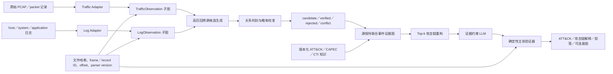
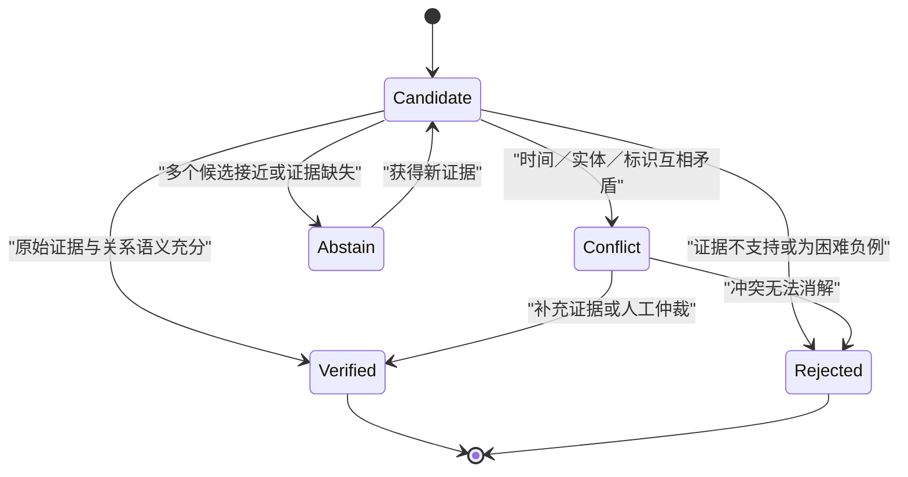
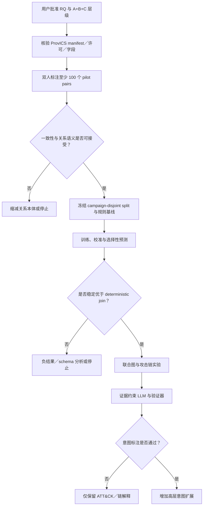

# P05-L2 多模态威胁追踪线：当前方案、技术细节与方法流程审核稿 v0.1

> 文档状态：**待用户审核，不代表选题已冻结，不授权下载数据或实现模型**  
> 编制日期：2026-07-15  
> 研究线：P05-L2 / Traffic-Log Evidence Graph + LLM Threat Tracing  
> 上游批次：Git commit `810f37a`，`research: complete dual-source attribution collision study`  
> 当前门禁：G2 已通过，G3 条件通过，G1 等待用户批准研究层级与主研究问题  
> 推荐层级：**Candidate A 作为论文叙事，Candidate B 作为必做科学核心，Candidate C 作为可选扩展**

## 0. 本审核稿需要确认什么

本文件把 P05-L2 当前分散在候选题、撞题检索、数据集审计、Project03 复用审计和反方审查中的内容合并为一份可执行但尚未授权执行的技术方案。审核重点不是具体选择哪一个神经网络，而是确认研究对象、主要研究问题、证据边界、方法模块、实验因果链和失败回退是否成立。

建议本轮审核回答五个问题。第一，是否批准“Candidate A 叙事 + Candidate B 核心 + Candidate C 可选”的贡献层级。第二，是否接受将“多模态”严格定义为具有互补信息并存在可审计对齐关系的流量与日志证据，而不是把 IPv4、IPv6、MPLS、GeoNetworking 和 SCION 当成五种独立模态。第三，是否接受将“可校准的多候选 traffic-log 观测关系”作为论文成败所依赖的核心创新单元。第四，是否同意 LLM 只作为证据约束的下游解释与拒答模块，而不作为核心关系真值的生成器。第五，是否接受所有实施均受数据许可、双人标注一致性、campaign-disjoint 拆分和 kill criteria 约束。

## 1. 方案摘要

真实安全事件的网络流量和主机日志通常由不同传感器独立产生。PCAP 可以证明某一时刻发生了网络通信，但通常不能直接证明是哪个进程、账号或文件触发了通信；主机或应用日志可以记录进程、文件、socket、认证和操作行为，但可能缺失完整网络上下文。时间漂移、NAT、共享 IP、端口复用、并发进程、背景流量和单侧证据缺失会使简单时间窗、五元组或 PID 关联产生错误或虚假的唯一匹配。

本方案拟先分别构建保留原始记录锚点的流量观测子图和日志观测子图，再为跨源观测生成高召回候选关系。关系模型不强制输出唯一匹配，而是保留多个候选、关系类型、校准概率以及 `candidate/verified/rejected/conflict` 证据状态。联合事件证据图引用而不覆盖两个原始子图，在此基础上重构若干条时间与证据一致的攻击链。LLM 只接收受限候选子图和带 ID 的证据表，输出带引用的 ATT&CK/攻击链解释和可选目标意图候选；确定性验证器拒绝不存在的 ID、方向不成立的边和缺少最低证据的主张。

论文总体叙事由 Candidate A 承担，Candidate B 是必须独立成立的科学核心，Candidate C 只有在图、关系和标注门禁通过后才进入。即使 LLM 或高层意图实验失败，只要可校准跨源关系在 campaign shift、时钟漂移、歧义标识和缺失来源条件下表现出可复现价值，论文仍可以围绕 Candidate B 收缩并成立。

## 2. 研究对象与术语边界

### 2.1 当前研究对象

当前研究对象是一个**源保持、证据落地、显式表达不确定性的流量—日志联合事件证据图**。它将 PCAP 派生的流量观测、主机/系统/应用日志观测以及可选的上游检测器输出组织为可审计事件证据，并将事件证据与 ATT&CK/CAPEC/CTI 等静态知识分层连接，最终约束攻击链重构和 LLM 解释。

这里的“源保持”具有四个不可删减的含义。每个观测必须保留原始文件哈希、记录编号或偏移、原始时间戳和解析器版本；模型生成的跨源边不能覆盖原始观测边；知识假设不能伪装为事件事实；任何攻击链或 LLM 主张都必须能够回放到原始记录。

### 2.2 多模态的操作性定义

本线仅将具有非冗余信息且存在可记录对齐关系的证据视图称为模态。当前主要模态是原始 packet/PCAP 及协议会话信息，与独立产生的 host/system/application/audit 日志。流统计、上游检测器输出、CAPEC/ATT&CK/CTI 检索证据可以作为附加视图，但必须说明它们是否由同一原始数据派生，不能用重复字段制造伪多模态增益。

IPv4、IPv6、MPLS、GeoNetworking 和 SCION 在当前方案中是协议或网络环境分层变量。只有当选定数据真实包含这些环境，并能证明其提供独立观测信息时，才进入分层实验；本论文不承诺为五种环境分别开发五套系统。

### 2.3 明确排除的范围

本线不研究 CENI controller、网络节点部署、隧道/代理兼容或网元工程；不把 broad multi-source graph construction、确定性五元组关联、图补边、LLM/Agent 调查和流畅报告生成重新包装为首次创新；不在缺少独立标签时声称 APT 组织、国家或行为体归因；不把 ATT&CK tactic、恶意事件标签、攻击目标和行为体动机混为同一个“意图”；不允许自主 Agent 成为论文主要创新点。

## 3. 候选题层级与推荐决策

| 层级 | 角色 | 当前题名方向 | 成败条件 | 风险定位 |
|---|---|---|---|---|
| Candidate A | 完整论文叙事 | 源保持流量—日志双线事件证据图与证据约束 LLM 攻击链推理 | B 必须成立；LLM 至少完成受控下游验证 | 容易范围膨胀 |
| Candidate B | 必做科学核心 | 可校准 traffic-log 跨源关系学习与不确定性传播 | 关系标签有效、校准可信、下游影响可测 | 最稳妥、最可证伪 |
| Candidate C | 可选扩展 | 可信 LLM 攻击链解释与高层攻击意图感知 | 图和双人意图/主张标注均通过 | 构念效度和标注成本高 |

推荐采用 Candidate A 作为题名和研究故事，用 Candidate B 决定论文是否成功，把 Candidate C 限制为门禁通过后的扩展。这样既保留“LLM + threat tracing”的用户主线，又避免把论文价值押在主观意图标签或 LLM 文本质量上。

推荐的贡献因果链为：可校准的跨源关系使源保持联合图成为可能；关系质量改善后，攻击链的边、顺序和 campaign 覆盖应发生可测变化；联合图再为 LLM 提供受限、可引用和可拒答的证据上下文。任何下游收益都必须沿这条链逐级验证，不能因为最终文本看起来合理就反推跨源关系正确。

## 4. 主要研究问题与可证伪假设

### 4.1 建议冻结的 Primary RQ

> 在 campaign shift、时钟漂移、标识歧义、背景流量交织和单侧证据缺失条件下，如何对独立流量与日志观测之间的多候选关系进行可靠识别和概率校准；这种关系质量是否能够在控制证据预算后改善源保持联合图的攻击链保真度，并降低证据约束 LLM 的无支撑主张风险？

该 RQ 将 Candidate B 置于因果链中心，同时允许攻击链和 LLM 成为下游验证，而不是把关系学习、图构建和文本生成并列成三个互不依赖的任务。

### 4.2 预注册假设

| 假设 | 内容 | 反证条件 |
|---|---|---|
| H1 | campaign-disjoint 测试下，校准后的学习式关系模型在 AUPRC、Brier/ECE 或风险—覆盖上优于确定性 join | 学习模型不能稳定优于简单规则或优势仅来自泄漏 |
| H2 | 跨源关系质量提升可在等证据预算下改善 chain-edge F1、阶段顺序或 campaign recall | 关系指标改善但链指标无变化 |
| H3 | 显式 conflict/abstention 可在保留可用覆盖率时降低错误链风险 | 拒答仅通过大幅丢弃样本获得表面低风险 |
| H4 | 证据约束和确定性验证器可降低 unsupported-claim rate、提高 replay success | 支撑率不升，或召回下降到失去实用价值 |

H1 和 H2 是核心假设，H3 是可信性增强假设，H4 是下游扩展假设。高层意图不进入首轮核心假设，除非后续本体和双人标注达到预设一致性。

## 5. 总体技术架构



该架构故意保持三类对象分离：原始观测事实、跨源关系推断和高层知识/语义假设。联合图不是把两个数据表简单拼接，也不是把所有特征压成无法回放的向量。LLM 位于证据图和验证器之后，不能创建或修改原始事实层。

## 6. 方法流程与技术细节

### M0. 数据清单、许可与可复现锚点

任何数据处理开始前，必须记录数据集名称、来源 URL、版本、许可、文件清单、字节大小、SHA-256、选定 campaign、解压命令、解析器版本和处理时间。原始 PCAP、恶意样本、私有日志、受限 PDF 和大规模派生缓存不得进入 Git。Git 中只保存模式定义、脚本、无敏感的小型示例、校验清单和聚合结果。

时间同步方式、时区、原始时间精度、时钟漂移修正、缺失记录和 parser drift 必须进入 Material Passport。任何无法追溯到原始数据版本的结果均不能进入主结果表。

### M1. 独立源适配器

Traffic Adapter 复用 Project03 的 PCAP 解析和基础流统计思想，但需要修复统一观测模式与证据锚点。每个 `TrafficObservation` 至少应包含 `observation_id`、`pcap_sha256`、`frame_start/frame_end`、原始时间范围、五元组、协议、方向、packet/byte 统计、可选 payload 派生指针、parser 名称与版本。上游分类器输出只能作为派生证据视图，不能默认成为真值或回流为输入标签。

Log Adapter 是本线需要新实现的核心基础设施。每个 `LogObservation` 至少应包含 `observation_id`、`source_file_sha256`、`record_id/offset`、原始时间、host、account、process、PID/PPID、file、socket、action、parser 名称与版本。auditd、Sysmon、系统日志和应用日志可以使用不同 parser，但必须归一到显式、可扩展且不丢失原字段指针的模式。

两个适配器必须独立运行，分别产生源内图。不得先使用 campaign 标签、攻击阶段或未来已知关系对解析器进行条件化处理，以避免目标泄漏和自证式推理。

### M2. 源保持证据模式

建议节点类别如下：

| 节点类 | 含义 | 是否允许模型创建 | 必须锚定原始记录 |
|---|---|---:|---:|
| `TrafficObservation` | packet、会话或流量侧观测 | 否，由 adapter 创建 | 是 |
| `LogObservation` | 日志侧进程、文件、socket、认证或应用观测 | 否，由 adapter 创建 | 是 |
| `Entity` | host、process、file、socket、account、endpoint | 可归一化，但需记录来源 | 是/部分 |
| `AttackEvent` | 跨记录聚合的事件候选 | 是 | 必须引用观测集合 |
| `TechniqueHypothesis` | ATT&CK/CAPEC 技术或模式候选 | 是 | 必须引用证据路径 |
| `IntentHypothesis` | 可选高层目标候选 | 是 | 必须引用证据且允许拒答 |

边分为四层。第一层是源内观测边，例如进程创建、文件写入或通信方向；第二层是待判断的跨源候选边；第三层是经过标注、规则或模型处理的 `verified/rejected/conflict` 关系边；第四层是面向 ATT&CK/CAPEC/CTI 的知识假设边。边必须携带来源、生成方法、模型/规则版本、概率、证据状态和时间有效范围。

### M3. 跨源候选生成

候选生成目标是高召回，而不是提前得到高精度唯一匹配。候选窗口可由时间、host/IP、port、五元组、PID/socket、协议、进程和场景上下文构成，但这些字段只用于召回候选，不自动构成关系真值。

对每个 traffic observation `t_i`，候选器返回一个日志观测集合 `C(t_i)={l_j}`。候选特征 `x_ij` 可以包含时间差、端点一致性、端口/协议一致性、进程—socket 一致性、方向一致性、主机映射、上下文邻域和缺失指示变量。候选器必须保留形成候选的规则及其字段，便于后续判断模型是否只是复现确定性 join。

困难负样本必须覆盖相同五元组但不同进程/时间段、NAT 或共享 IP、并发正常通信、相邻攻击阶段、单侧记录缺失、矛盾时间戳以及标识复用。随机抽取大量明显无关 pair 不能代替困难负样本。

### M4. 关系本体与标注协议

首选关系本体暂定为 `same-action`、`causal-support`、`context-only`、`conflict` 和 `unrelated`。其中 `same-action` 表示两条观测直接描述同一底层动作；`causal-support` 表示存在可辩护的触发或支持关系但并非同一记录；`context-only` 表示属于同一上下文但不足以建立直接动作关系；`conflict` 表示候选字段或证据互相矛盾；`unrelated` 表示无可支持关联。若 pilot 一致性不足，回退为 `same-action/supports/unrelated`，并将冲突作为证据状态而非关系类别。

核心标注单元建议包含：

```yaml
traffic_observation_id: traffic-000123
log_observation_id: log-000987
relation_type: same-action | causal-support | context-only | conflict | unrelated
evidence_state: candidate | verified | rejected | conflict
time_delta_ms: 520
shared_keys: [host, ip, port, pid, socket, protocol]
annotator_confidence: 0.0-1.0
adjudication_note: "human-readable justification"
campaign_id: campaign-xx
raw_evidence_ids: [pcap-frame-22871, audit-record-1048]
```

标签定义必须在标注者查看模型输出之前冻结。至少 100 个分层 pilot pair 由两名标注者独立标注，再计算 Cohen's kappa 或 Krippendorff's alpha；分歧由第三步仲裁并保留原始意见。不能使用与基线完全相同的时间/五元组/PID 规则直接生成正例，否则中心贡献将形成标签循环。

### M5. 关系模型与概率校准

模型比较遵循“简单方法优先，复杂模型后置”的阶梯。第一层是时间窗、五元组和 PID/socket 等确定性规则；第二层是 logistic regression、gradient boosting 等可解释特征模型；第三层可比较 dual encoder 或轻量 cross-encoder；只有前述方法建立可信基线且图上下文显示独立价值时，才考虑轻量 GNN 关系评分器。

模型输出不是单一硬标签，而是多类关系后验或正关系概率 `p_ij=P(y_ij | x_ij)`。校准方法根据模型和数据量选择 Platt scaling、isotonic regression 或 temperature scaling，但校准集必须按 campaign 与训练集、测试集分离。模型选择不能使用最终测试 campaign。

系统按风险—覆盖关系选择是否接受一条边，而不是使用未经验证的固定阈值。对于同一 traffic observation，可以保留 top-k competing edges；当多个候选概率接近、字段矛盾或证据不足时，输出 `candidate`、`conflict` 或 abstention，而不是强制唯一匹配。

### M6. 不确定性传播与联合图构建

联合图通过引用两个源内子图构建，不把 `TrafficObservation` 和 `LogObservation` 压平为一个事件表。候选边的概率、校准版本和证据状态被显式保留，源内观测边与知识假设边使用不同命名空间和可视样式。

事件聚合和链重构需要传播跨源边的不确定性。初始实现可使用可解释的路径评分，例如将关系边对数概率、源内证据置信度、时间一致性惩罚和冲突惩罚组合为 chain score；具体权重只能在训练/校准数据上确定，并通过消融报告各项影响。系统输出 top-k 时间有效链和边级证据，不把最高分链自动称为事实。

关系质量对链质量的作用必须通过 controlled link corruption 验证：在保持观测数量相同的情况下，分别注入错误边、删除真边、改变校准概率，并绘制 relation quality 到 chain fidelity 的响应曲线。这样才能排除“双源系统只是因为看到了更多信息”这一替代解释。

### M7. 攻击链与知识对齐

攻击链重构首先依赖事件证据图的时间、实体和关系边，再使用版本化 ATT&CK/CAPEC/CTI 知识提供技术或阶段候选。知识库中的 `CanPrecede` 或相似语义只能作为结构先验，不能证明某项技术真实发生。

输出应区分 observed、linked、inferred 和 knowledge-supported 四类状态。攻击阶段、技术和链说明必须引用产生它们的观测或关系边。actor attribution 默认排除；如果未来增加 actor 标签数据，必须另设独立 RQ、数据门禁和泄漏审计。

### M8. 证据约束 LLM 与确定性验证器

LLM 输入限定为一个有大小上限的候选子图、ID 索引证据表、知识版本和结构化任务指令。不得让 LLM 直接读取训练/测试 campaign 标签或把完整事件报告当作隐式答案。模型、版本、prompt、采样参数和结构化输出必须冻结并留档。

建议的输出模式如下：

```json
{
  "claims": [
    {
      "claim_id": "claim-01",
      "claim_type": "attack_stage | technique | chain_explanation | optional_intent",
      "statement": "PowerShell initiated an outbound connection.",
      "supporting_node_ids": ["log-000987", "traffic-000123"],
      "supporting_edge_ids": ["cross-edge-00042"],
      "raw_evidence_ids": ["audit-record-1048", "pcap-frame-22871"],
      "confidence": 0.84,
      "abstain": false,
      "alternatives": []
    }
  ]
}
```

确定性验证器检查引用 ID 是否存在、边方向和时间是否成立、主张是否跨越未经支持的关系、是否满足最低证据要求，以及 ATT&CK tactic 是否被误写为高层目标。验证失败的主张被拒绝、降级或要求 abstention，不能仅由另一个 LLM 充当唯一裁判。



## 7. 数据集与实验分期

| 阶段 | 数据集 | 目的 | 当前限制 |
|---|---|---|---|
| Stage A | ProvICS 小型 pilot | 关系本体、双人标注、适配器与基线可行性 | 需核验 manifest、checksum、许可和实际字段 |
| Stage B | ProvICS 选定 campaigns | 核心关系学习、校准、联合图和链实验 | ICS 域，不能直接外推一般企业环境 |
| Stage C | AIT Log Dataset 2.0 | 跨环境 parser、时钟漂移、缺失来源和迁移验证 | 约 130.6 GB，关系真值仍需推导/标注 |
| 条件扩展 | CICAPT-IIoT 或 ProvCon | provenance-heavy 比较 | 许可和同步关系未最终核实 |
| 辅助对照 | DARPA OpTC | flow/log 或 log-only 消融 | 无原始 PCAP，不能证明 packet-level RQ |

ProvICS 当前排序第一，因为其报告同时提供原始 PCAP、解码 Modbus、主机/PLC provenance、物理状态和同步 ICS 场景。AIT v2 用于检查方法是否只在 ICS 中成立。任何下载都必须在本审核稿获批后进行，并先下载单个 pilot campaign，而不是直接获取全部数据。

## 8. 实验设计

### 8.1 数据拆分与统计单位

训练、校准和测试必须按 campaign/scenario 完全分离，禁止随机 record-pair 拆分。数百万个 pair 并不等于数百万个独立样本；主要置信区间和显著性分析应以 campaign/scenario 为聚类单位进行 bootstrap，并同时报告 pooled 与 per-campaign 指标。若 campaign 数量不足以支持可靠的校准比较，必须下调结论强度或停止相应主张。

### 8.2 基线阶梯

| 编号 | 基线/模型 | 用途 |
|---|---|---|
| B0 | traffic-only graph | 测量日志线的增量价值 |
| B1 | log-only provenance graph | 测量流量线的增量价值 |
| B2 | fixed-window/early concatenation | 对照简单融合 |
| B3 | time + five-tuple deterministic join | 回答“简单规则是否已足够” |
| B4 | PID/socket deterministic join | 可用字段下的更强规则基线 |
| B5 | heuristic multi-key association | 对照传统多字段关联 |
| B6 | uncalibrated feature model | 分离判别能力与校准贡献 |
| B7 | calibrated feature model | Candidate B 最小可发表核心 |
| B8 | dual/cross encoder | 比较表示学习是否提供增益 |
| B9 | optional lightweight GNN | 仅在图上下文确有独立价值时进入 |
| B10 | oracle links | 估计关系误差的理论下游上限 |
| B11 | unconstrained LLM/RAG | 对照证据约束与验证器 |

### 8.3 指标

| 层级 | 主要指标 | 必须回答的问题 |
|---|---|---|
| 源内子图 | node/edge precision、recall、raw-anchor survival | 解析是否正确且保留原证据 |
| 跨源关系 | AUPRC、macro-F1、Hits@k、MRR | 能否识别正确关系和正确候选排序 |
| 概率校准 | Brier、ECE、reliability diagram | 置信度是否可信 |
| 选择性预测 | risk-coverage、abstention accuracy、conflict recall | 拒答是否真正降低风险 |
| 攻击链 | edge F1、stage order、campaign recall、graph edit distance | 关系改善是否传递到链质量 |
| LLM | supported-claim precision、unsupported-claim rate、entailment、replay success | 文本主张是否可由记录验证 |
| 可选意图 | 双人一致性、macro-F1、calibration、abstention | 意图构念是否可稳定标注 |
| 运行成本 | latency、memory、graph size、alerts/campaign、verification time | 方法是否具有可操作性 |

### 8.4 必做消融与压力测试

必须分别去掉 traffic line、log line、关系校准、conflict 状态、raw anchor 和 LLM verifier。还要对 missing traffic、missing logs、clock drift、NAT/shared IP、benign interleaving、相邻攻击阶段困难负样本、parser-version drift 和 campaign shift 进行压力测试。只有数据真实包含相应协议环境时，才增加 IPv4/IPv6/MPLS/Geo/SCION 分层。

为了证明联合图收益不只是“信息更多”，需要控制候选证据预算，比较 deterministic、uncalibrated、calibrated 和 oracle links，并进行边删除、错误边注入和概率扰动。主结果必须同时呈现关系层和链层，不能只报告最终 LLM 文本指标。

## 9. 建议的软件模块边界

以下只是待批准后的目录和接口蓝图，不代表已实现：

```text
09-experiments/
  configs/
    dataset_manifest.yaml
    split_manifest.yaml
    relation_ontology.yaml
  src/
    adapters/
      traffic_adapter.py
      log_adapter.py
    schema/
      observations.py
      evidence_graph.py
    candidates/
      cross_source_candidates.py
    annotation/
      export_pairs.py
      agreement.py
    relations/
      deterministic.py
      feature_model.py
      representation_model.py
      calibration.py
      selective_prediction.py
    graph/
      joint_graph.py
      uncertainty.py
      chain_reconstruction.py
    llm/
      evidence_pack.py
      structured_reasoner.py
      claim_verifier.py
    evaluation/
      relation_metrics.py
      graph_metrics.py
      chain_metrics.py
      claim_metrics.py
  tests/
    test_anchor_survival.py
    test_no_label_leakage.py
    test_campaign_disjoint.py
    test_claim_id_validation.py
```

接口优先于具体框架。第一轮应先完成 schema、manifest、适配器、标注导出、确定性基线和泄漏测试，再决定是否需要深度模型。图存储可以先使用可测试的内存/文件表示，只有查询规模或分析需求明确后再选择 Neo4j 等后端。

## 10. 泄漏、伦理与可复现控制

特征、标签和派生主张必须分区管理。campaign ID、攻击阶段、actor 名称、报告摘要和上游模型的真值字段不得意外进入关系模型输入。Project03 中可能同时携带 `True_Attack`、`Predicted_Class` 和 `Technique` 的接口必须经过字段级审计，不能直接复用为训练样本。

公开 PCAP 仍可能包含载荷、账号或设备信息，应遵循最小化处理，只保存研究所需字段并记录脱敏规则。所有模型、prompt、知识库版本、parser、随机种子和参数锁定点必须留档。LLM 输出不能替代人工安全判断，论文应明确它是受限分析辅助而非自动归因裁决器。

## 11. Gate、kill criteria 与回退

| Gate | 通过条件 | Kill criterion | 回退方案 |
|---|---|---|---|
| G1 选题 | 用户批准单一 Primary RQ 与 A/B/C 层级 | 研究范围继续摇摆 | 不下载数据、不实现模型 |
| D0 数据 | manifest、checksum、许可和字段存在性核实 | 无法合法使用或缺少跨源锚点 | 更换数据集或缩小到 flow/log 边界 |
| A0 标注 | 本体可解释，双人 pilot 一致性可接受 | 关系语义不可稳定复现 | 缩减为 `same-action/supports/unrelated` |
| M0 基线 | campaign-disjoint 基线可运行且无标签泄漏 | ground truth 依赖基线规则生成 | 重做标注；无法修复则停止核心主张 |
| M1 校准 | 学习模型在判别或校准上稳定优于规则 | 不能优于 deterministic joins | 仅在数据/schema/负结果足够强时写作，否则停止 |
| G4 链增益 | 关系改善引起链指标可测变化 | 关系好转但链质量不变 | 收缩为校准图构建与失败分析 |
| L0 LLM | 支撑率或 replay 改善且召回可接受 | verifier 只降低召回而无可信性收益 | LLM 降级为诊断附录 |
| I0 意图 | 本体明确、类别充分、双人一致性可接受 | 低一致性或类别过稀 | 删除高层意图，保留 ATT&CK/链解释 |
| X0 外部验证 | AIT v2 或替代集完成受控迁移 | 许可/字段/锚点不足 | 限定为 ICS 内部结论并明示边界 |



## 12. 预期成果与最低可发表版本

最低可发表版本不要求高层意图，也不要求复杂 GNN。它至少需要一套具有原始锚点的 traffic/log 观测模式，一套独立于基线规则定义并经过 pilot 双标的关系任务，一组 campaign-disjoint 的确定性与学习式关系基线，一项可信的概率校准/选择性预测分析，以及关系质量对联合图或攻击链的受控下游实验。

完整 Candidate A 版本在上述核心之上增加证据约束 LLM，证明主张引用、确定性验证和冲突感知拒答能够降低无支撑解释风险。Candidate C 只有在意图本体和标注一致性通过后才成为论文贡献；否则它被删除或转为未来工作。

预期工程产物包括数据与 split manifest、统一观测 schema、跨源关系本体与标注指南、确定性和学习式基线、校准与风险—覆盖评估、联合证据图构建器、攻击链重构器、证据包与主张验证器、实验配置、测试、聚合结果和可复现运行说明。原始数据和受限材料不进入仓库。

## 13. 本轮审核后的立即行动

若本审核稿获批，下一步依次为：冻结最终中文/英文题目与 Primary RQ；把本文件状态从“待用户审核”改为“范围批准”；编写正式 relation ontology 和 annotation guideline；核验 ProvICS 远端 manifest、精确许可、checksum 与可下载的最小 campaign；制定 campaign-level 样本量和算力预算；下载一个 pilot campaign；完成适配器最小闭环；导出并双标至少 100 个分层 pair；根据一致性结果决定是否进入模型实施。

在以上批准前，不下载数据、不选定最终模型、不生成实验结果、不把本方案写成论文已完成方法。

## 14. 用户审核清单

- [ ] 批准 Candidate A 作为论文叙事。
- [ ] 批准 Candidate B 作为不可撤销的必做科学核心。
- [ ] 同意 Candidate C 仅作为门禁通过后的可选扩展。
- [ ] 批准本文件第 4.1 节 Primary RQ，或提出修改。
- [ ] 接受 traffic/log 为主要模态，协议类型仅作环境分层。
- [ ] 接受 actor/nation attribution、CENI 部署和 Agent novelty 不进入主线。
- [ ] 接受双人 pilot 标注、campaign-disjoint 拆分和 campaign-level 统计。
- [ ] 接受关系标签循环、简单规则充分性和“双源只是信息更多”作为必须正面回答的反方假设。
- [ ] 批准核验并下载单个 ProvICS pilot campaign；在此项单独勾选前不获取数据。
- [ ] 批准按照 Gate/kill criteria 收缩或终止失败分支。

## 15. 上游依据与权威入口

本审核稿未引入新的实验结果或未经核验的创新声明，内容来自以下已归档材料：

- [候选题与可行性矩阵](candidate-thesis-topics-and-feasibility-v0.1-20260715.md)
- [Devil's Advocate Checkpoint 2](devils-advocate-checkpoint-2-20260715.md)
- [P05-L2 Workflow State](../04-progress/workflow-state.md)
- [Project03 可复用科研核心审计](../04-progress/project03-reusable-core-audit-20260713.md)
- [数据集可行性审计](../09-experiments/dataset-feasibility-audit-v0.1-20260715.md)
- [Material Passport](../08-writing/MATERIAL-PASSPORT.md)
- [功能级撞题矩阵 v0.2](../02-literature-notes/functional-collision-matrix-v0.2-20260713.md)
- [二次撞题检索](../02-literature-notes/second-collision-search-20260713.md)
- [P05-L2 科研流程](../01-sop/multimodal-research-workflow-v0.1.md)

---

**待审核决定：**批准、修改后批准，或退回重新收缩。用户未作出明确决定前，本文件保持审核稿状态。
